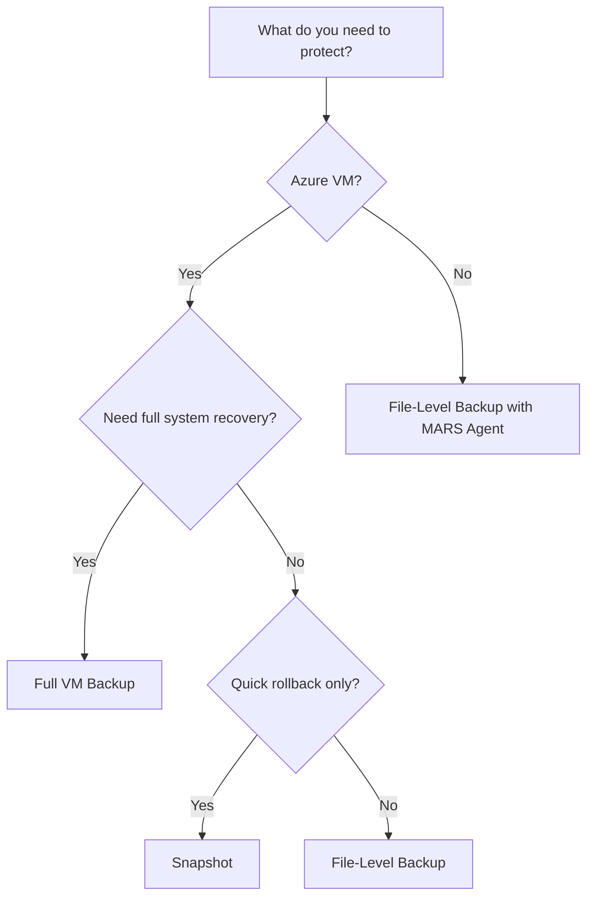

# Backup Strategies

## Overview

Understanding the different types of backups available in Azure is crucial for implementing an effective data protection strategy. Azure offers multiple backup approaches, each suited for different scenarios and recovery requirements.

## Backup Types

### 1. Full VM Backup

**What it includes:**
- Operating System
- Applications and configurations
- All data disks
- System state and settings

**Use cases:**
- Point-in-time recovery of entire virtual machines
- Disaster recovery scenarios
- Compliance and regulatory requirements
- Production environment protection

**Requirements:**
- Recovery Services Vault
- Backup policy with schedule and retention settings
- Sufficient storage in the vault

**Advantages:**
- Complete system recovery
- Consistent application state
- Automated scheduling
- Cross-region restore capability

**Limitations:**
- Requires Azure-native components (not available for AWS/on-premise VMs)
- Higher storage costs compared to file-level backups
- Longer backup and restore times

### 2. Image Backup (Snapshots)

**What it is:**
A point-in-time copy of a VM disk, stored as a snapshot.

**Differences from Full VM Backup:**
| Feature | Full VM Backup | Snapshot |
|---------|---------------|----------|
| Storage Location | Recovery Services Vault | Same region as source disk |
| Cross-region restore | ✅ Yes | ❌ No |
| Retention policies | Configurable (days to years) | Manual management |
| Automated scheduling | ✅ Yes | ❌ No |
| Use case | Long-term protection | Quick rollback before changes |

**Use cases:**
- Creating a restore point before major updates
- Quick VM cloning
- Testing and development environments
- Short-term backup needs

**How to create:**
```bash
# Azure CLI example
az snapshot create \
  --resource-group myResourceGroup \
  --name mySnapshot \
  --source myVM_OsDisk
```

### 3. File-Level Backup

**What it includes:**
- Specific files and folders
- Selected directories
- Application data folders

**Use cases:**
- Backing up specific application data (e.g., databases, logs)
- On-premise to Azure backup (using MARS agent)
- AWS to Azure backup scenarios
- Selective data protection

**Requirements:**
- Microsoft Azure Recovery Services (MARS) Agent
- Recovery Services Vault
- Vault credentials for agent registration

**Advantages:**
- Lower storage costs (only selected data)
- Faster backup and restore times
- Works with non-Azure VMs (on-premise, AWS)
- Granular recovery options

**Limitations:**
- Doesn't capture full system state
- Requires manual agent installation and configuration
- Not suitable for complete disaster recovery

## Choosing the Right Backup Strategy

### Decision Matrix



### Recommendations by Scenario

#### Production Azure VMs
- **Primary**: Full VM Backup with daily schedule
- **Secondary**: Snapshots before major changes
- **Retention**: 30-90 days based on compliance needs

#### Development/Test Environments
- **Primary**: Snapshots for quick rollback
- **Secondary**: Weekly full backups (optional)
- **Retention**: 7-14 days

#### Hybrid Scenarios (On-Premise/AWS)
- **Primary**: File-level backup using MARS agent
- **Focus**: Critical application data and configurations
- **Retention**: Based on business requirements

#### Disaster Recovery
- **Primary**: Full VM Backup with cross-region restore enabled
- **Secondary**: VM replication to secondary region
- **Retention**: Long-term (1+ years)

## Backup Frequency Guidelines

| Workload Type | Recommended Frequency | Retention Period |
|---------------|----------------------|------------------|
| Production databases | Daily + transaction logs | 30-90 days |
| Application servers | Daily | 30 days |
| File servers | Daily | 14-30 days |
| Development VMs | Weekly | 7-14 days |
| Critical systems | Multiple times daily | 90+ days |

## Point-in-Time Recovery

Point-in-time recovery allows you to restore a VM or files to a specific moment in the past.

**How it works:**
1. Full backup is taken on schedule (e.g., daily)
2. Recovery Services Vault maintains multiple recovery points
3. You can restore from any available recovery point within the retention period

**Example scenario:**
- Daily backups at 2:00 AM
- Retention: 30 days
- You have 30 recovery points available
- Can restore to any of the last 30 days

## Best Practices

1. **Combine strategies**: Use full VM backups for production and snapshots for pre-change protection
2. **Test restores regularly**: Verify that backups can actually be restored
3. **Document recovery procedures**: Ensure team knows how to perform restores
4. **Monitor backup jobs**: Set up alerts for failed backups
5. **Consider costs**: Balance retention periods with storage costs
6. **Use appropriate retention**: Align with compliance and business requirements
7. **Enable cross-region restore**: For critical workloads requiring geographic redundancy

## Next Steps

- Learn about [Recovery Services Vault](./02-RecoveryServicesVault.md) setup and configuration
- Understand [VM Backup](./03-VMBackup.md) implementation details
- Explore [MARS Agent](./04-MARSAgent.md) for hybrid scenarios
