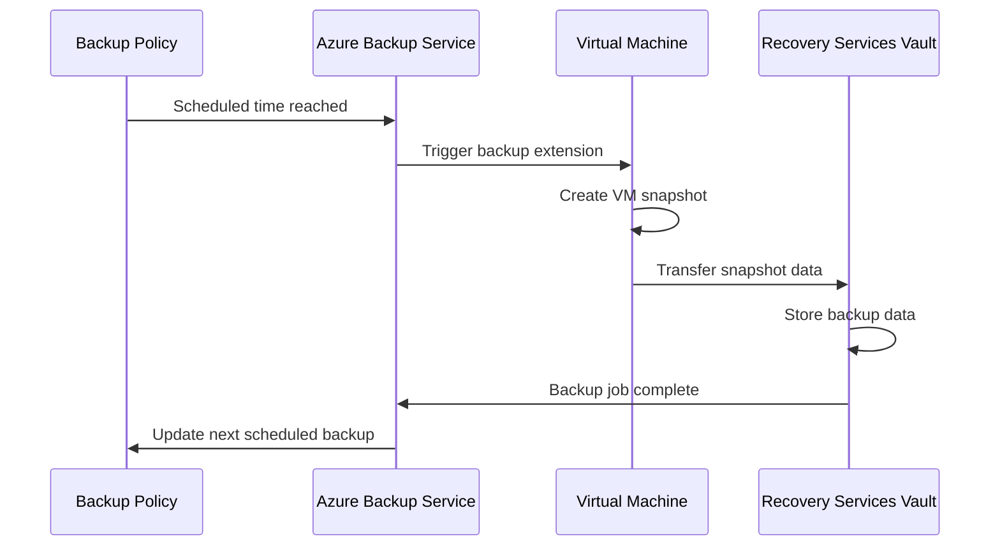

# VM Backup

## Overview

Azure VM Backup provides automated, policy-based backup for Azure virtual machines. It captures the complete VM state including operating system, applications, data, and configurations, enabling point-in-time recovery for disaster recovery and data protection scenarios.

## What's Included in a VM Backup?

A full Azure VM backup captures:

- ✅ **Operating System**: Complete OS disk with all system files
- ✅ **Applications**: All installed applications and their configurations
- ✅ **Data**: All data disks attached to the VM
- ✅ **Configurations**: VM settings, network configurations, extensions
- ✅ **System State**: Registry, system files, boot configuration

**What's NOT included:**
- ❌ Temporary disks (D: drive on Windows)
- ❌ Network-attached storage (unless configured separately)
- ❌ Data in external databases (requires separate backup)

## Setting Up VM Backup

### Prerequisites

1. **Recovery Services Vault** in the same region as the VM
2. **Backup Policy** defining schedule and retention
3. **Sufficient permissions** on the VM and vault
4. **Network connectivity** for the backup extension

### Step-by-Step Configuration

#### 1. Navigate to the VM
```
Azure Portal → Virtual Machines → Select your VM → Backup
```

#### 2. Select or Create Recovery Services Vault
- Choose existing vault in the same region
- Or create new vault with recommended settings:
  - ✅ Cross-region restore enabled
  - ✅ GRS storage redundancy
  - ✅ Soft delete enabled

#### 3. Choose Backup Policy

**Default Policy:**
- Daily backup at 2:00 AM
- Retention: 30 days

**Custom Policy Options:**
- Backup frequency: Daily or weekly
- Backup time: Any time in 24-hour format
- Retention: Days, weeks, months, or years
- Instant restore: 2-5 days (snapshot tier)

#### 4. Enable Backup
- Click "Enable Backup"
- Azure installs the backup extension on the VM
- Initial backup is scheduled based on policy

## Backup Policies

### Policy Components

A backup policy defines:

| Component | Description | Options |
|-----------|-------------|---------|
| **Schedule** | When backups run | Daily, Weekly, or custom |
| **Time** | Backup start time | Any time (24-hour format) |
| **Retention** | How long to keep backups | Daily, Weekly, Monthly, Yearly |
| **Instant Restore** | Fast restore from snapshots | 2-5 days |

### Example Policies

#### Production VM Policy
```
Name: Production-Daily-90Days
Schedule: Daily at 2:00 AM
Retention:
  - Daily: 30 days
  - Weekly: 12 weeks
  - Monthly: 12 months
  - Yearly: 7 years
Instant Restore: 5 days
```

#### Development VM Policy
```
Name: Dev-Weekly-30Days
Schedule: Weekly (Sunday) at 11:00 PM
Retention:
  - Weekly: 4 weeks
Instant Restore: 2 days
```

### Creating a Custom Policy

1. Navigate to **Recovery Services Vault → Backup Policies**
2. Click **+ Add**
3. Select **Azure Virtual Machine**
4. Configure:
   - Policy name
   - Backup schedule
   - Retention ranges
   - Instant restore snapshot retention
5. Click **Create**

## Backup Types

### 1. Scheduled Backup

**Automatic backups** based on the assigned policy.

**Characteristics:**
- Runs at scheduled time
- Managed by Azure Backup service
- Follows retention policy automatically
- No manual intervention required

**When scheduled time is pending:**
The backup will run at the next scheduled time. If you need immediate protection, trigger an on-demand backup.

### 2. On-Demand Backup

**Manual backup** triggered outside the regular schedule.

**Use cases:**
- Initial backup before scheduled time
- Before major changes or updates
- Before VM migration or modification
- Compliance or audit requirements

**How to trigger:**

```
VM → Backup → Backup Now
```

**Configuration:**
- Select retention period (separate from policy retention)
- Backup starts immediately
- Appears in backup jobs dashboard

> [!TIP]
> Always trigger an on-demand backup after enabling backup for the first time to ensure immediate protection without waiting for the scheduled time.

## Backup Job Monitoring

### Viewing Backup Jobs

**From Recovery Services Vault:**
```
Recovery Services Vault → Backup Jobs
```

**Information displayed:**
- Job status (In Progress, Completed, Failed)
- Start time and duration
- Protected item name
- Job type (Backup, Restore)
- Error details (if failed)

### Job Statuses

| Status | Meaning | Action Required |
|--------|---------|-----------------|
| **In Progress** | Backup currently running | None - wait for completion |
| **Completed** | Backup successful | None |
| **Completed with warnings** | Backup succeeded with minor issues | Review warnings |
| **Failed** | Backup did not complete | Investigate and re-run |

### Backup Job Timeline



**Typical timeline:**
1. **Snapshot creation**: 5-15 minutes (VM remains running)
2. **Data transfer**: 30 minutes to several hours (depends on VM size)
3. **Backup finalization**: 5-10 minutes

## Initial Backup Considerations

### First Backup Behavior

The **initial backup** is always a full backup and typically takes longer than subsequent backups.

**Why it takes longer:**
- All data must be transferred to the vault
- No previous backup to reference for incremental changes
- Network bandwidth limitations

**Subsequent backups:**
- Only changed blocks are transferred (incremental)
- Faster completion times
- Lower network usage

### Initial Backup Best Practices

1. **Trigger on-demand backup** immediately after enabling
2. **Schedule during off-hours** to minimize impact
3. **Monitor the first backup job** to ensure success
4. **Verify recovery points** after completion
5. **Test restore** from the initial backup

## Backup Performance

### Factors Affecting Backup Speed

- **VM size**: Larger VMs take longer
- **Data change rate**: More changes = longer backup
- **Network bandwidth**: Available throughput to vault
- **Disk type**: Premium SSD vs. Standard HDD
- **Backup window**: Time available for backup completion

### Optimization Tips

1. **Use instant restore snapshots** for faster recovery
2. **Schedule backups during low-activity periods**
3. **Exclude temporary disks** (automatically excluded)
4. **Use Premium storage** for better I/O performance
5. **Monitor and adjust backup windows** as needed

## Recovery Points

### What is a Recovery Point?

A recovery point is a specific point in time from which you can restore a VM.

**Types:**
- **Snapshot tier**: Fast restore (2-5 days retention)
- **Vault tier**: Long-term retention (based on policy)

### Viewing Recovery Points

```
VM → Backup → Restore VM → View all restore points
```

**Information shown:**
- Date and time of backup
- Consistency type (Application-consistent, File-system consistent, Crash-consistent)
- Tier (Snapshot, Vault, or Both)

### Consistency Levels

| Level | Description | Use Case |
|-------|-------------|----------|
| **Application-consistent** | Applications in consistent state | Best for databases and stateful apps |
| **File-system consistent** | File system in consistent state | General purpose VMs |
| **Crash-consistent** | Point-in-time snapshot | Last resort if other methods fail |

## Stopping and Resuming Backups

### Stop Backup with Retain Data

**When to use:**
- Temporarily pause backups (e.g., VM being decommissioned soon)
- Reduce costs while keeping existing recovery points
- VM is being migrated or reconfigured

**Effect:**
- No new backups are taken
- Existing recovery points remain available
- Storage costs continue for retained data
- Can resume backups later

### Stop Backup with Delete Data

**When to use:**
- VM is permanently deleted
- No longer need backup protection
- Want to eliminate all storage costs

**Effect:**
- All recovery points are deleted
- Cannot restore from previous backups
- Storage costs stop after deletion completes
- Cannot be undone after soft-delete period

> [!WARNING]
> Deleting backup data is permanent after the soft-delete retention period (14 days). Ensure you no longer need the recovery points before deleting.

## Backup Limitations and Considerations

### VM Size Limitations
- Maximum VM disk size: 32 TB per disk
- Maximum number of data disks: Based on VM size
- Total VM size: Up to 400 TB

### Operating System Support
- **Windows**: Server 2008 R2 and later (2022, 2024 recommended)
- **Linux**: Major distributions (Ubuntu, RHEL, CentOS, etc.)

### Network Requirements
- Outbound connectivity to Azure Backup service
- Access to Azure Storage endpoints
- Proper NSG and firewall rules

### Backup Window
- Ensure sufficient time for backup completion
- Large VMs may require several hours
- Plan backup schedules accordingly

## Best Practices

1. **Enable backup immediately** after VM creation
2. **Trigger initial on-demand backup** for immediate protection
3. **Use appropriate retention policies** based on business requirements
4. **Monitor backup jobs regularly** for failures
5. **Test restore procedures** periodically
6. **Use instant restore** for faster recovery
7. **Enable cross-region restore** for critical VMs
8. **Document backup and restore procedures**
9. **Implement proper RBAC** for backup operations
10. **Review and optimize policies** quarterly

## Troubleshooting Common Issues

### Backup Extension Installation Failed
- Verify VM has internet connectivity
- Check NSG and firewall rules
- Ensure VM agent is running and up to date

### Backup Job Timeout
- Increase backup window
- Reduce data change rate during backup
- Check network bandwidth

### Snapshot Creation Failed
- Verify sufficient disk space
- Check VM agent status
- Review VM resource health

## Next Steps

- Learn about [MARS Agent](./04-MARSAgent.md) for hybrid backup scenarios
- Understand [Backup Policies](./05-BackupPolicies.md) in detail
- Explore [Data Recovery](./06-DataRecovery.md) procedures
- Plan [Disaster Recovery](./07-DisasterRecovery.md) with replication
