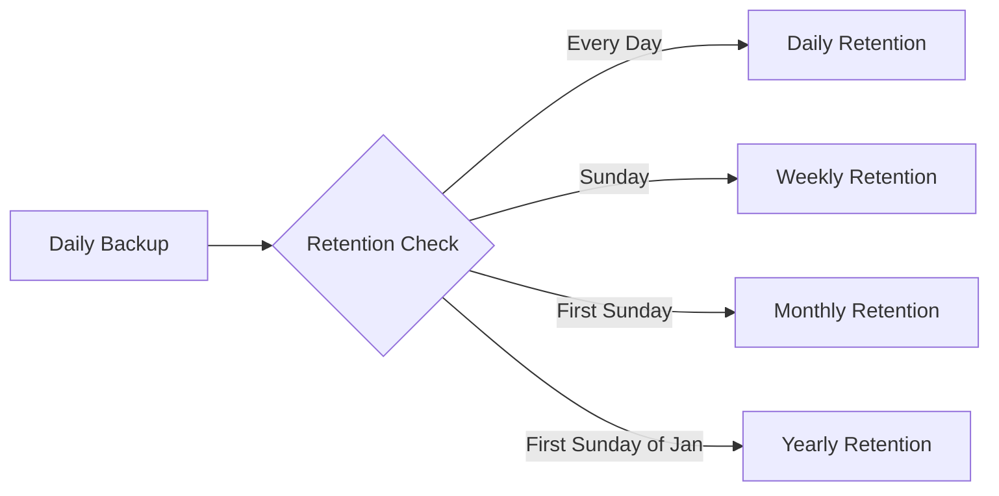

# Backup Policies

## Overview

Backup policies define the schedule, retention, and behavior of backup operations in Azure. They provide a centralized way to manage backup configurations across multiple protected items, ensuring consistent data protection aligned with business requirements and compliance needs.

## What is a Backup Policy?

A backup policy is a configuration template that specifies:
- **When** backups occur (schedule)
- **How long** backups are retained (retention)
- **What type** of backup is performed
- **Where** backups are stored

**Benefits of policies:**
- Consistent backup configuration across VMs
- Centralized management
- Easy compliance with retention requirements
- Simplified backup administration

## Policy Components

### 1. Backup Schedule

Defines when backups are triggered.

**Options:**
- **Daily**: Backup every day at specified time
- **Weekly**: Backup on selected days of the week
- **Custom**: Advanced scheduling options

**Example configurations:**

```
Daily Schedule:
- Frequency: Daily
- Time: 2:00 AM UTC
- Runs: Every day at 2:00 AM

Weekly Schedule:
- Frequency: Weekly
- Days: Sunday, Wednesday
- Time: 11:00 PM UTC
- Runs: Every Sunday and Wednesday at 11:00 PM
```

### 2. Retention Policy

Defines how long backup recovery points are kept.

**Retention tiers:**
- **Daily**: Keep daily backups for X days
- **Weekly**: Keep weekly backups for X weeks
- **Monthly**: Keep monthly backups for X months
- **Yearly**: Keep yearly backups for X years

**Example retention configuration:**

```
Retention Policy:
├── Daily: 30 days (last 30 daily backups)
├── Weekly: 12 weeks (every Sunday backup for 12 weeks)
├── Monthly: 12 months (first Sunday of month for 12 months)
└── Yearly: 7 years (first Sunday of January for 7 years)
```

### 3. Instant Restore

**Snapshot tier retention** for fast recovery.

**How it works:**
- Snapshots stored locally with the VM (faster access)
- Retained for 2-5 days
- Enables rapid restore without downloading from vault
- Automatically promoted to vault tier for long-term retention

**Configuration:**
```
Instant Restore Retention: 5 days
- Day 0-5: Available in snapshot tier (fast restore)
- Day 5+: Available in vault tier (standard restore)
```

## Default Backup Policies

Azure provides default policies for common scenarios:

### DefaultPolicy (Azure VM)

```
Schedule: Daily at 2:00 AM
Retention:
  - Daily: 30 days
  - Weekly: Not configured
  - Monthly: Not configured
  - Yearly: Not configured
Instant Restore: 2 days
```

**Use case:** Standard protection for non-critical VMs

### Enhanced Policy (Production)

```
Schedule: Daily at 2:00 AM
Retention:
  - Daily: 30 days
  - Weekly: 12 weeks
  - Monthly: 12 months
  - Yearly: 7 years
Instant Restore: 5 days
```

**Use case:** Production VMs with compliance requirements

## Creating Custom Policies

### Step-by-Step Guide

1. **Navigate to Recovery Services Vault**
   ```
   Azure Portal → Recovery Services Vault → Backup Policies
   ```

2. **Click "+ Add"**

3. **Select policy type:**
   - Azure Virtual Machine
   - SQL Server in Azure VM
   - SAP HANA in Azure VM
   - Azure File Share
   - Azure Backup Agent (MARS)

4. **Configure policy settings:**

   **Basic Information:**
   - Policy name (e.g., `Production-VM-Policy`)
   - Policy type: Azure Virtual Machine

   **Backup Schedule:**
   - Frequency: Daily or Weekly
   - Time: Select backup time
   - Timezone: Select appropriate timezone

   **Retention:**
   - Daily retention: 7-9999 days
   - Weekly retention: 1-5163 weeks
   - Monthly retention: 1-1188 months
   - Yearly retention: 1-99 years

   **Instant Restore:**
   - Snapshot retention: 2-5 days

5. **Review and create**

### Policy Examples by Workload

#### Development/Test VMs
```yaml
Name: Dev-Weekly-Policy
Schedule:
  Frequency: Weekly
  Days: Sunday
  Time: 11:00 PM
Retention:
  Weekly: 4 weeks
Instant Restore: 2 days
```

#### Production Application Servers
```yaml
Name: Prod-App-Daily-Policy
Schedule:
  Frequency: Daily
  Time: 2:00 AM
Retention:
  Daily: 30 days
  Weekly: 12 weeks
  Monthly: 12 months
Instant Restore: 5 days
```

#### Critical Database Servers
```yaml
Name: Critical-DB-Policy
Schedule:
  Frequency: Daily
  Time: 1:00 AM
Retention:
  Daily: 60 days
  Weekly: 24 weeks
  Monthly: 24 months
  Yearly: 10 years
Instant Restore: 5 days
```

#### Compliance-Driven Policy
```yaml
Name: Compliance-7Year-Policy
Schedule:
  Frequency: Daily
  Time: 3:00 AM
Retention:
  Daily: 90 days
  Weekly: 52 weeks
  Monthly: 84 months
  Yearly: 7 years
Instant Restore: 5 days
```

## Retention Policy Deep Dive

### How Retention Works

**Retention points are created based on the schedule:**



**Example scenario:**

```
Policy: Daily backup at 2:00 AM
Retention: Daily (30d), Weekly (12w), Monthly (12m), Yearly (7y)

Backup on: January 1, 2024 (Sunday, First Sunday of January)
This backup creates recovery points in:
  ✓ Daily retention (kept for 30 days)
  ✓ Weekly retention (kept for 12 weeks)
  ✓ Monthly retention (kept for 12 months)
  ✓ Yearly retention (kept for 7 years)

Backup on: January 15, 2024 (Monday)
This backup creates recovery points in:
  ✓ Daily retention only (kept for 30 days)
```

### Retention Calculation

**Total recovery points** = Sum of all retention tiers

**Example:**
```
Daily: 30 days = 30 recovery points
Weekly: 12 weeks = 12 recovery points
Monthly: 12 months = 12 recovery points
Yearly: 7 years = 7 recovery points
Total: 61 recovery points available
```

## Pricing and Cost Considerations

### Pricing Factors

Backup costs are based on:

1. **Protected Instance Size**
   - Charged per protected VM
   - Based on VM size (small, medium, large)

2. **Storage Consumed**
   - Actual backup data stored in vault
   - Charged per GB per month
   - Varies by retention duration

3. **Retention Duration**
   - Longer retention = more storage = higher cost
   - Each retention tier adds to total storage

4. **Data Transfer**
   - Backup: Data uploaded to Azure
   - Recovery: Data downloaded from Azure

### Cost Optimization Strategies

1. **Right-size retention policies**
   ```
   Don't use: Daily (365 days) if not needed
   Use instead: Daily (30 days) + Monthly (12 months)
   Savings: Fewer recovery points = lower storage costs
   ```

2. **Use instant restore wisely**
   ```
   2 days: Sufficient for most scenarios
   5 days: Only for critical VMs requiring faster recovery
   ```

3. **Tier retention appropriately**
   ```
   Daily: Short-term (7-30 days)
   Weekly: Medium-term (12-24 weeks)
   Monthly: Long-term (12-24 months)
   Yearly: Compliance (3-10 years)
   ```

4. **Stop backups for decommissioned VMs**
   - Delete backup data to stop storage charges
   - Review protected items quarterly

### Pricing Based on Retention Duration

| Retention Period | Relative Cost | Use Case |
|------------------|---------------|----------|
| 7-30 days | Low | Development, testing |
| 30-90 days | Medium | Standard production |
| 90-365 days | High | Critical systems |
| 1-7 years | Very High | Compliance, regulatory |

> [!TIP]
> Review retention policies quarterly to ensure they still align with business needs. Reducing unnecessary retention can significantly lower costs.

## Data Transfer Charges

### Backup (Upload)

**Charges apply for:**
- Initial full backup (all data)
- Incremental backups (changed data only)
- On-demand backups

**Cost factors:**
- Amount of data transferred
- Source location (on-premise, AWS, other regions)
- Network bandwidth used

**Example:**
```
Initial backup: 500 GB → Full data transfer charge
Daily incremental: 10 GB → Incremental data transfer charge
Monthly total: 500 GB + (10 GB × 30) = 800 GB transferred
```

### Recovery (Download)

**Charges apply for:**
- File-level restore
- Full VM restore
- Cross-region restore (higher charges)

**Cost factors:**
- Amount of data restored
- Destination location
- Restore method (instant vs. vault tier)

> [!IMPORTANT]
> **Data transfer charges apply for both backup and recovery operations.** Factor these costs into your backup strategy, especially for large datasets or frequent restores.

## Managing Backup Items

### Viewing Protected Items

```
Recovery Services Vault → Backup Items → Azure Virtual Machine
```

**Information displayed:**
- Protected item name
- Backup policy assigned
- Last backup status
- Last recovery point
- Backup health

### Changing Backup Policy

**When to change:**
- Business requirements change
- Compliance needs update
- Cost optimization needed

**How to change:**

1. Navigate to **Backup Items**
2. Select the protected item
3. Click **Backup Policy**
4. Choose different policy or create new
5. Click **Save**

> [!NOTE]
> Policy changes apply to future backups. Existing recovery points follow the original policy retention.

### Stopping Backups

#### Option 1: Stop Backup and Retain Data

**Use case:**
- Temporarily pause backups
- VM being decommissioned soon
- Cost reduction while keeping existing backups

**Effect:**
- No new backups taken
- Existing recovery points retained
- Storage costs continue
- Can resume backups later

**How to:**
```
Backup Items → Select item → Stop Backup → Retain Backup Data
```

#### Option 2: Stop Backup and Delete Data

**Use case:**
- VM permanently deleted
- No longer need backup protection
- Eliminate all storage costs

**Effect:**
- All recovery points deleted (after soft-delete period)
- Cannot restore from previous backups
- Storage costs stop
- Cannot be undone

**How to:**
```
Backup Items → Select item → Stop Backup → Delete Backup Data
```

> [!WARNING]
> **Before shutting down a VM**, consider stopping backups to avoid failed backup jobs and unnecessary costs.

## File-Level Backup Policies (MARS Agent)

### Policy Configuration

For MARS Agent backups, policies are configured during schedule setup:

**Schedule options:**
- Daily: Once or multiple times per day
- Weekly: Selected days of the week

**Retention options:**
- Daily: 7-180 days
- Weekly: 4-104 weeks
- Monthly: 1-60 months
- Yearly: 1-10 years

### Example MARS Policy

```
Backup Items: C:\Software\, C:\Data\
Schedule: Daily at 11:00 PM
Retention:
  - Daily: 30 days
  - Weekly: 12 weeks
  - Monthly: 6 months
Initial Backup: Over network
```

## Best Practices

1. **Align policies with business requirements**
   - Understand recovery time objectives (RTO)
   - Understand recovery point objectives (RPO)
   - Meet compliance and regulatory needs

2. **Use descriptive policy names**
   ```
   Good: Prod-SQL-Daily-7Year
   Bad: Policy1, MyPolicy
   ```

3. **Create policies by workload type**
   - Separate policies for dev, test, prod
   - Different policies for different application tiers
   - Compliance-specific policies

4. **Review and optimize quarterly**
   - Assess if retention is still needed
   - Identify cost optimization opportunities
   - Update policies based on changing requirements

5. **Test restore from different retention tiers**
   - Verify daily recovery points work
   - Test monthly/yearly recovery points
   - Ensure instant restore functions correctly

6. **Document policy rationale**
   - Why specific retention periods chosen
   - Business justification for costs
   - Compliance requirements met

7. **Monitor policy compliance**
   - Ensure VMs are assigned correct policies
   - Verify backup jobs complete successfully
   - Alert on policy violations

8. **Use instant restore appropriately**
   - 5 days for critical VMs
   - 2 days for standard VMs
   - Balance speed vs. cost

## Policy Comparison Table

| Policy Type | Schedule | Daily | Weekly | Monthly | Yearly | Instant Restore | Use Case |
|-------------|----------|-------|--------|---------|--------|-----------------|----------|
| **Minimal** | Weekly | - | 4w | - | - | 2d | Dev/Test |
| **Standard** | Daily | 30d | - | - | - | 2d | Standard prod |
| **Enhanced** | Daily | 30d | 12w | 12m | - | 5d | Critical prod |
| **Compliance** | Daily | 90d | 52w | 84m | 7y | 5d | Regulated data |

## Next Steps

- Learn about [Data Recovery](./06-DataRecovery.md) procedures
- Understand [Disaster Recovery](./07-DisasterRecovery.md) strategies
- Review [Monitoring and Alerts](./09-MonitoringAndAlerts.md) for policy compliance
- Explore [Best Practices](./10-BestPractices.md) for comprehensive guidance
