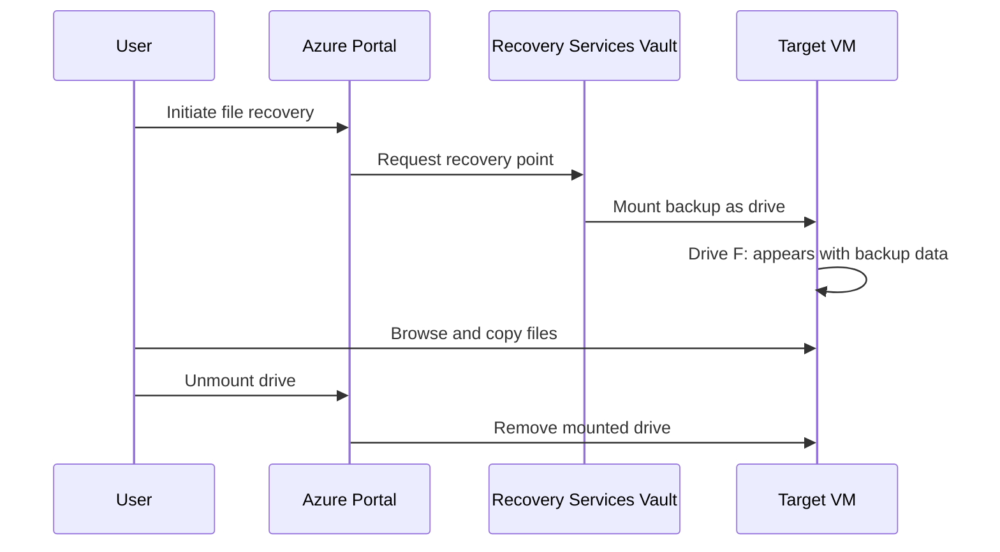

# Data Recovery

## Overview

Data recovery in Azure allows you to restore backed-up files, folders, or entire virtual machines from recovery points stored in the Recovery Services Vault. Understanding the recovery process is essential for effective disaster recovery and business continuity planning.

## Recovery Options

Azure provides multiple recovery options depending on your backup type and needs:

### 1. File-Level Recovery
- Restore specific files and folders
- Mount backup as a drive
- Copy needed files
- Works for both VM backups and MARS Agent backups

### 2. VM-Level Recovery
- Restore entire virtual machine
- Create new VM from backup
- Replace existing VM disks
- Cross-region restore capability

### 3. Disk Recovery
- Restore individual VM disks
- Attach to existing or new VMs
- Selective disk restoration

## File-Level Recovery Process

### Overview

File-level recovery allows you to browse backup contents and selectively restore files without recovering the entire VM.

**Key advantage:** Fast, granular recovery of specific files or folders

### Recovery Workflow



### Step-by-Step: File Recovery from VM Backup

#### 1. Navigate to Recovery Point

```
Azure Portal → Virtual Machines → Select VM → Backup
→ File Recovery
```

Or:

```
Recovery Services Vault → Backup Items → Azure Virtual Machine
→ Select VM → File Recovery
```

#### 2. Select Recovery Point

- Choose the date/time of the backup to restore from
- View available recovery points
- Select appropriate recovery point

#### 3. Download and Run Script

**Azure generates a PowerShell script** that:
- Authenticates to the vault
- Mounts the backup as a local drive
- Makes backup contents accessible

**Steps:**
1. Click **Download Script**
2. Save the script to the target machine
3. Run the script with administrator privileges

**Script execution:**
```powershell
# Example script execution
.\IaaSVMFilesRecovery_<timestamp>.ps1

# Output:
Connecting to recovery services...
Mounting backup as drive F:...
Backup mounted successfully
```

#### 4. Browse Mounted Drive

**After script completes:**
- A new drive appears (e.g., **F:** drive)
- Contains complete backup contents
- Browse folders and files as normal
- All files are read-only

**Example from session:**
```
F:\
├── C\
│   ├── Software\
│   │   ├── Tomcat\
│   │   ├── Jenkins\
│   │   └── Other files\
│   ├── Program Files\
│   └── Users\
└── Data Disks\
```

#### 5. Copy Required Files

**Copy files from mounted drive to desired location:**

```powershell
# Example: Copy entire folder
Copy-Item -Path "F:\C\Software\*" -Destination "C:\Restored\" -Recurse

# Example: Copy specific files
Copy-Item -Path "F:\C\Software\config.xml" -Destination "C:\Config\"
```

**Best practices:**
- Verify file integrity after copying
- Check file sizes match
- Test restored files work correctly

#### 6. Unmount the Drive

**After copying all needed files:**

```
Azure Portal → File Recovery → Unmount Disks
```

Or wait for automatic unmount (after 12 hours)

> [!IMPORTANT]
> Always unmount the drive after recovery to free up resources and maintain security.

### Step-by-Step: File Recovery from MARS Agent Backup

#### 1. Open MARS Agent Console

```
Start → Microsoft Azure Backup
```

#### 2. Initiate Recovery

Click **Recover Data** in the Actions pane

#### 3. Select Recovery Location

**Option 1: This server**
- Restore to the same server where backup was taken
- Original file paths available

**Option 2: Another server**
- Restore to different server
- Requires vault credentials and encryption passphrase

#### 4. Select Recovery Point

- Choose date/time of backup
- View available recovery points
- Select appropriate point

#### 5. Select Items to Recover

- Browse backup contents
- Select specific files/folders
- Or select entire backup

#### 6. Specify Recovery Options

**Recovery location:**
- Original location
- Alternate location (specify path)

**Conflict resolution:**
- Create copies (keep both versions)
- Overwrite existing files
- Skip existing files

**Security:**
- Restore ACL permissions
- Restore file attributes

#### 7. Complete Recovery

- Click **Recover**
- Monitor progress
- Verify files after completion

## VM-Level Recovery

### Recovery Options

#### Option 1: Create New VM

**When to use:**
- Original VM is deleted
- Want to test restore without affecting production
- Creating VM in different region

**Process:**
1. Navigate to VM backup
2. Click **Restore VM**
3. Select **Create new**
4. Configure:
   - VM name
   - Resource group
   - Virtual network
   - Subnet
   - Storage account
5. Click **Restore**

**Timeline:** 5-10 minutes after synchronization completes

#### Option 2: Replace Existing Disks

**When to use:**
- VM still exists but needs rollback
- Faster than creating new VM
- Maintain same VM configuration

**Process:**
1. Navigate to VM backup
2. Click **Restore VM**
3. Select **Replace existing**
4. Select staging location for disks
5. Click **Restore**

**Effect:**
- VM disks replaced with backup disks
- VM configuration unchanged
- Requires VM shutdown during replacement

#### Option 3: Restore Disks Only

**When to use:**
- Need flexibility in VM creation
- Want to attach disks to different VM
- Custom VM configuration needed

**Process:**
1. Navigate to VM backup
2. Click **Restore VM**
3. Select **Restore disks**
4. Choose storage account
5. Click **Restore**

**Result:**
- Disks restored to storage account
- Can create VM manually from disks
- Can attach to existing VM

## Cross-Region Restore

### Overview

Cross-region restore allows you to restore VMs and files in the **secondary Azure region** when the primary region is unavailable.

**Requirements:**
- Cross-region restore enabled on vault
- GRS storage redundancy
- Recovery points replicated to secondary region

### When to Use

- **Primary region outage**: Azure region experiencing downtime
- **Disaster recovery drill**: Testing DR procedures
- **Compliance testing**: Verifying cross-region capabilities
- **Migration**: Moving workloads to different region

### Cross-Region Restore Process

#### 1. Navigate to Secondary Region

```
Recovery Services Vault → Backup Items
→ Toggle: Secondary Region
```

#### 2. Select Recovery Point

- View recovery points available in secondary region
- May have slight delay vs. primary region
- Select appropriate recovery point

#### 3. Restore in Secondary Region

**Options:**
- Create new VM in secondary region
- Restore disks to secondary region storage
- File-level recovery in secondary region

**Configuration:**
- Select secondary region resources:
  - Resource group (in secondary region)
  - Virtual network (in secondary region)
  - Subnet
  - Storage account

#### 4. Complete Restore

- Click **Restore**
- VM created in secondary region
- Can be used while primary region recovers

### Cross-Region Restore Considerations

> [!WARNING]
> Cross-region restore may have **higher data transfer costs** due to inter-region data movement.

**Important notes:**
- Recovery points may lag behind primary region
- First restore from secondary region may take longer
- Network configuration must exist in secondary region
- Additional data transfer charges apply

## Recovery Point Selection

### Understanding Recovery Points

**Recovery point types:**

| Type | Description | Retention | Speed |
|------|-------------|-----------|-------|
| **Snapshot** | Local snapshot with VM | 2-5 days | Fastest |
| **Vault** | Backup in Recovery Services Vault | Based on policy | Standard |
| **Both** | Available in both tiers | First 2-5 days | Fastest initially |

### Choosing the Right Recovery Point

**For fastest recovery (within 2-5 days):**
- Use snapshot tier recovery points
- Instant restore capability
- Minimal data transfer

**For older recovery points:**
- Use vault tier recovery points
- Standard restore speed
- May take longer for large VMs

**For compliance/audit:**
- Use specific date/time recovery point
- Verify recovery point meets requirements
- Document recovery point used

## Recovery Time Expectations

### File-Level Recovery

| Step | Time |
|------|------|
| Script download | < 1 minute |
| Drive mount | 2-5 minutes |
| File copy | Depends on size |
| Unmount | < 1 minute |
| **Total** | **5-30 minutes** (typical) |

### VM Recovery

| Method | Time |
|--------|------|
| Create new VM (snapshot tier) | 5-10 minutes |
| Create new VM (vault tier) | 30-60 minutes |
| Replace disks | 15-30 minutes |
| Restore disks only | 20-40 minutes |

### Factors Affecting Recovery Time

- **VM size**: Larger VMs take longer
- **Recovery point tier**: Snapshot faster than vault
- **Region**: Cross-region slower than same region
- **Network**: Bandwidth affects transfer speed
- **Disk type**: Premium SSD faster than Standard HDD

## Recovery Scenarios

### Scenario 1: Accidental File Deletion

**Problem:** User accidentally deleted important files

**Solution:**
1. Use file-level recovery
2. Mount backup from yesterday
3. Copy deleted files
4. Unmount drive

**Time:** 10-15 minutes

### Scenario 2: Ransomware Attack

**Problem:** VM encrypted by ransomware

**Solution:**
1. Isolate affected VM
2. Create new VM from backup (before infection)
3. Verify new VM is clean
4. Delete infected VM

**Time:** 30-60 minutes

### Scenario 3: Failed Update

**Problem:** Windows update caused VM boot failure

**Solution:**
1. Replace existing disks with backup from before update
2. VM boots with previous configuration
3. Investigate update issue

**Time:** 15-30 minutes

### Scenario 4: Regional Outage

**Problem:** Primary Azure region unavailable

**Solution:**
1. Use cross-region restore
2. Create VM in secondary region
3. Update DNS/traffic routing
4. Operate from secondary region

**Time:** 30-60 minutes (after replication complete)

### Scenario 5: AWS to Azure Migration (from session)

**Problem:** Need to restore files backed up from AWS VM to Azure VM

**Solution:**
1. Install MARS Agent on Azure VM
2. Register with same vault
3. Use "Recover to another server"
4. Provide encryption passphrase
5. Select files to restore
6. Complete recovery

**Time:** 20-40 minutes

## Best Practices

1. **Test recovery procedures regularly**
   - Quarterly restore tests
   - Verify files can be recovered
   - Document recovery time

2. **Use appropriate recovery method**
   - File-level for specific files
   - VM-level for complete recovery
   - Cross-region for DR scenarios

3. **Verify recovered data**
   - Check file integrity
   - Test applications work
   - Validate data completeness

4. **Document recovery procedures**
   - Step-by-step instructions
   - Required credentials
   - Contact information

5. **Maintain encryption passphrases**
   - Store securely
   - Document location
   - Test passphrase works

6. **Plan for recovery time**
   - Understand RTO requirements
   - Choose appropriate recovery tier
   - Have resources ready in secondary region

7. **Monitor recovery jobs**
   - Track progress
   - Alert on failures
   - Document completion

8. **Clean up after recovery**
   - Unmount drives
   - Delete temporary resources
   - Update documentation

## Troubleshooting Recovery Issues

### Script Fails to Mount Drive

**Possible causes:**
- Insufficient permissions
- Network connectivity issues
- Antivirus blocking script

**Solutions:**
- Run as administrator
- Check firewall rules
- Temporarily disable antivirus

### Recovery Point Not Available

**Possible causes:**
- Backup job failed
- Retention period expired
- Replication not complete

**Solutions:**
- Check backup job status
- Use different recovery point
- Wait for replication to complete

### Slow Recovery Performance

**Possible causes:**
- Large data size
- Network bandwidth limitations
- Vault tier recovery (not snapshot)

**Solutions:**
- Use snapshot tier if available
- Schedule during off-peak hours
- Restore only necessary files

## Next Steps

- Understand [Disaster Recovery](./07-DisasterRecovery.md) strategies
- Learn about [Failover and Failback](./08-FailoverAndFailback.md) operations
- Review [Monitoring and Alerts](./09-MonitoringAndAlerts.md) for recovery jobs
- Explore [Best Practices](./10-BestPractices.md) for comprehensive guidance
