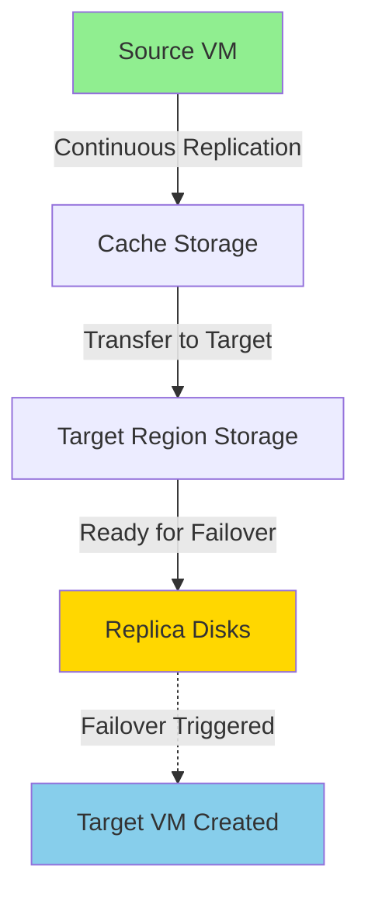

# Disaster Recovery (DR)

## Overview

Disaster Recovery in Azure enables business continuity by replicating virtual machines to a secondary region. In the event of a regional outage or disaster, you can failover to the replicated VMs, ensuring minimal downtime and data loss.

## What is Disaster Recovery?

Disaster Recovery (DR) is the process of:
- Replicating VMs from a primary region to a secondary region
- Maintaining synchronized copies of production workloads
- Enabling rapid failover during disasters
- Ensuring business continuity during regional outages

**Key difference from backup:**
- **Backup**: Point-in-time recovery, restore from vault
- **DR**: Continuous replication, near-real-time failover

## Why Disaster Recovery is Critical

### Protection Against Regional Outages

**Scenarios requiring DR:**
- Natural disasters (earthquakes, floods, hurricanes)
- Power outages affecting entire datacenters
- Network failures at regional scale
- Cyberattacks targeting infrastructure
- Human errors causing widespread impact

### Business Continuity Requirements

**DR enables:**
- Minimal downtime (RTO: Recovery Time Objective)
- Minimal data loss (RPO: Recovery Point Objective)
- Compliance with SLA commitments
- Regulatory compliance
- Customer trust and satisfaction

> [!IMPORTANT]
> **Geo-replication is critical** to protect backups and workloads during regional outages. Without it, both primary VMs and backups could be unavailable simultaneously.

## Azure Site Recovery (ASR)

Azure Site Recovery is the service that enables disaster recovery:

**Capabilities:**
- VM replication between Azure regions
- On-premise to Azure replication
- Automated failover and failback
- Recovery plan orchestration
- Testing without production impact

## Setting Up Disaster Recovery

### Prerequisites

1. **Source VM** in primary region
2. **Recovery Services Vault** (can be same as backup vault)
3. **Target region** (Azure paired region recommended)
4. **Network resources** in target region (created automatically)
5. **Sufficient permissions** for replication

### Initiating Replication

#### Step-by-Step Process

**1. Navigate to Source VM**
```
Azure Portal → Virtual Machines → Select VM → Disaster Recovery
```

**2. Configure Target Settings**

**Target region:**
- Select secondary region
- Azure recommends paired regions (e.g., East US → West US)
- Can choose any region

**Advanced settings:**
- Target subscription (usually same as source)
- Target resource group (auto-created or select existing)
- Target virtual network (auto-created or select existing)
- Availability options (availability sets, zones)

**3. Review Replication Settings**

**Automatically created resources:**
- ✅ Recovery Services Vault (if not exists)
- ✅ Target resource group
- ✅ Target virtual network
- ✅ Target subnet
- ✅ Cache storage account
- ✅ Replica managed disks

**Naming convention:**
```
Source VM: prod-web-01
Target resources:
  - Resource Group: prod-web-01-asr
  - VNet: prod-web-01-asr-vnet
  - VM: prod-web-01 (created during failover)
```

**4. Enable Replication**

- Click **Enable replication**
- Azure begins initial replication
- Monitor progress in Site Recovery

### Automatic Resource Creation

When you enable replication, Azure automatically creates:

#### In Target Region

| Resource | Purpose |
|----------|---------|
| **Resource Group** | Contains all DR resources |
| **Virtual Network** | Network for failover VMs |
| **Subnets** | Matching source network topology |
| **Storage Account** | Cache for replication data |
| **Managed Disks** | Replica disks (created during replication) |
| **Network Security Groups** | Copied from source (optional) |

#### In Source Region

| Resource | Purpose |
|----------|---------|
| **Cache Storage Account** | Temporary storage for replication data |
| **Site Recovery Extension** | Installed on source VM |

> [!NOTE]
> The **failover VM is NOT created** until you initiate failover. Only the infrastructure and replicated disks are prepared.

## Replication Process

### Initial Replication

**What happens:**
1. Site Recovery extension installed on source VM
2. VM snapshot taken
3. Data transferred to target region
4. Replica disks created in target region
5. Replication status shows progress

**Timeline:**
- **Small VMs** (< 100 GB): 2-4 hours
- **Medium VMs** (100-500 GB): 4-8 hours
- **Large VMs** (> 500 GB): 8+ hours

**Example from session:**
```
VM Size: Large (500+ GB)
Initial Replication Time: ~8 hours
Status: "0% synchronized" → "100% synchronized"
```

### Ongoing Replication

**After initial replication:**
- Continuous replication of changes
- Near-real-time synchronization
- Minimal impact on source VM performance

**Replication frequency:**
- Changes replicated every 30-60 seconds
- RPO: Typically 5-15 minutes
- Depends on change rate and network

### Replication Status

**Monitoring replication:**
```
Recovery Services Vault → Site Recovery → Replicated Items
```

**Status indicators:**

| Status | Meaning | Action |
|--------|---------|--------|
| **Enabling protection** | Initial setup in progress | Wait for completion |
| **Initial replication** | First full replication | Monitor progress (can take hours) |
| **Protected** | Replication healthy | No action needed |
| **Warning** | Minor issues detected | Review and address |
| **Critical** | Replication failing | Immediate attention required |

### Replication Health Monitoring



## Cross-Region Replication Strategy

### Paired Regions

Azure provides **paired regions** for optimal DR:

| Primary Region | Paired Region |
|----------------|---------------|
| East US | West US |
| East US 2 | Central US |
| North Europe | West Europe |
| Southeast Asia | East Asia |
| UK South | UK West |

**Benefits of paired regions:**
- Optimized network connectivity
- Coordinated updates (one region at a time)
- Data residency compliance
- Priority recovery during outages

### Regional Redundancy Best Practices

1. **Use paired regions** for primary-secondary setup
2. **Enable geo-redundant storage** for Recovery Services Vault
3. **Replicate critical VMs** to secondary region
4. **Test failover regularly** to verify DR readiness
5. **Document network dependencies** for failover

## Replication Policies

### Default Replication Policy

```
Recovery point retention: 24 hours
App-consistent snapshot frequency: 60 minutes
Crash-consistent snapshot frequency: 5 minutes
```

### Custom Replication Policy

**Configurable options:**
- **Recovery point retention**: 0-72 hours
- **App-consistent snapshot frequency**: 1-12 hours
- **Multi-VM consistency**: Enable for application groups

**Creating custom policy:**
```
Recovery Services Vault → Site Recovery → Replication Policies
→ + Replication Policy
```

## Recovery Plans

### What is a Recovery Plan?

A recovery plan orchestrates failover of multiple VMs in a coordinated manner.

**Use cases:**
- Multi-tier applications (web, app, database)
- Dependent VMs that must start in order
- Automated failover procedures
- Consistent DR across application stack

### Creating a Recovery Plan

**1. Navigate to Recovery Plans**
```
Recovery Services Vault → Site Recovery → Recovery Plans
→ + Recovery Plan
```

**2. Configure Plan**
- Name: Descriptive name (e.g., `Production-Web-App-DR`)
- Source: Primary region
- Target: Secondary region
- Select VMs to include

**3. Organize VM Groups**

**Example for 3-tier application:**
```
Group 1: Database VMs (start first)
  - prod-db-01
  - prod-db-02

Group 2: Application VMs (start after DB)
  - prod-app-01
  - prod-app-02

Group 3: Web VMs (start last)
  - prod-web-01
  - prod-web-02
```

**4. Add Scripts/Manual Actions**
- Pre-failover scripts
- Post-failover scripts
- Manual intervention steps
- Health checks

## Failover VM Creation

### When is the VM Created?

> [!IMPORTANT]
> The VM in the DR region is **only created when failover is initiated**. Until then, only replica disks and infrastructure exist.

**Before failover:**
- ✅ Replica disks exist
- ✅ Virtual network exists
- ✅ Resource group exists
- ❌ VM does not exist

**After failover:**
- ✅ VM created from replica disks
- ✅ VM started in target region
- ✅ Network configured
- ✅ Ready for use

### Failover Timeline

**From session:**
```
Replication Status: 100% synchronized
Failover Initiated: Click "Failover"
VM Creation Time: 5-10 minutes
Total Failover Time: 10-15 minutes (typical)
```

## Testing Disaster Recovery

### Test Failover

**Purpose:**
- Verify DR readiness
- Test recovery procedures
- Validate application functionality
- No impact on production

**How it works:**
1. Creates isolated test VM in target region
2. Uses replica disks (no impact on replication)
3. Test VM in separate network (no conflict with production)
4. Can be cleaned up after testing

**Running test failover:**
```
Replicated Items → Select VM → Test Failover
→ Select recovery point
→ Select test network
→ Click OK
```

**After testing:**
```
Replicated Items → Select VM → Cleanup Test Failover
→ Confirm cleanup
→ Test VM and resources deleted
```

> [!TIP]
> Perform test failovers **quarterly** to ensure DR readiness and familiarize teams with procedures.

## Replication Considerations

### Performance Impact

**On source VM:**
- Minimal CPU impact (< 5%)
- Minimal memory impact
- Network bandwidth for replication
- Disk I/O for snapshots

**Optimization:**
- Schedule initial replication during off-hours
- Use premium storage for better performance
- Monitor VM performance during replication

### Cost Considerations

**DR costs include:**
- Site Recovery licensing (per VM)
- Storage for replica disks
- Network bandwidth (replication traffic)
- Cache storage account
- Target region resources (when VM created)

**Cost optimization:**
- Replicate only critical VMs
- Use appropriate disk types
- Clean up test failover resources
- Review DR scope quarterly

### Network Requirements

**Connectivity needed:**
- Source VM to Azure Site Recovery service
- Source region to target region
- Outbound HTTPS (443) access
- Access to Azure Storage endpoints

**Firewall rules:**
- Allow Azure Site Recovery service tags
- Allow Azure Storage service tags
- Allow specific IP ranges if required

## Geo-Replication Importance

### Why Geo-Replication is Critical

**Scenario without geo-replication:**
```
Primary Region: East US (outage)
  - VMs: Unavailable ❌
  - Backups: Stored in East US ❌
  - Result: Complete data unavailability ❌
```

**Scenario with geo-replication:**
```
Primary Region: East US (outage)
  - VMs: Unavailable ❌
  - Backups: Replicated to West US ✅
  - DR VMs: Can failover to West US ✅
  - Result: Business continuity maintained ✅
```

> [!WARNING]
> Without geo-replication, a regional disaster could make both your VMs **and** your backups unavailable simultaneously.

### Enabling Geo-Replication

**For Recovery Services Vault:**
```
Recovery Services Vault → Properties → Backup Configuration
→ Storage Replication Type: Geo-redundant storage (GRS)
```

**For VM Replication:**
```
Enable Site Recovery replication to secondary region
```

## Best Practices

1. **Enable replication for all critical VMs**
   - Identify business-critical workloads
   - Prioritize based on RTO/RPO requirements

2. **Use Azure paired regions**
   - Optimal network performance
   - Coordinated updates

3. **Create recovery plans for applications**
   - Group related VMs
   - Define startup order
   - Include scripts for automation

4. **Test failover quarterly**
   - Verify DR readiness
   - Train teams on procedures
   - Document lessons learned

5. **Monitor replication health**
   - Set up alerts for replication issues
   - Review replication status regularly
   - Address warnings promptly

6. **Document DR procedures**
   - Failover steps
   - Failback steps
   - Contact information
   - Decision criteria

7. **Plan for initial replication time**
   - Large VMs may take 8+ hours
   - Schedule during maintenance windows
   - Monitor progress

8. **Maintain network parity**
   - Ensure target network matches source
   - Configure NSGs appropriately
   - Plan IP addressing

9. **Review and update DR scope**
   - Quarterly review of protected VMs
   - Add new critical VMs
   - Remove decommissioned VMs

10. **Understand cost implications**
    - Budget for DR licensing
    - Account for storage costs
    - Plan for failover resource costs

## Next Steps

- Learn about [Failover and Failback](./08-FailoverAndFailback.md) operations
- Understand [Monitoring and Alerts](./09-MonitoringAndAlerts.md) for replication
- Review [Best Practices](./10-BestPractices.md) for comprehensive DR strategy
