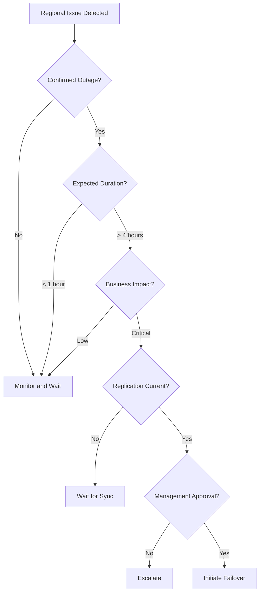

# Failover and Failback

## Overview

Failover and failback are critical disaster recovery operations that enable business continuity during regional outages. Understanding these processes, their requirements, and best practices is essential for effective disaster recovery management.

## What is Failover?

**Failover** is the process of switching operations from the primary region to the secondary (DR) region when the primary region becomes unavailable.

**Key characteristics:**
- **Not automatic** - Requires manual initiation
- **Creates VM** in secondary region from replica disks
- **Requires special access privileges**
- **Typically takes 5-10 minutes** after synchronization is complete
- **Should be carefully planned and executed**

## What is Failback?

**Failback** is the process of returning operations from the secondary region back to the primary region after the primary region is restored.

**Key characteristics:**
- **Not automatic** - Requires manual initiation
- **Reverse replication** must be configured first
- **Requires special access privileges**
- **More complex than failover**
- **Should be executed during maintenance window**

## Failover vs. Failback

| Aspect | Failover | Failback |
|--------|----------|----------|
| **Direction** | Primary → Secondary | Secondary → Primary |
| **Trigger** | Regional outage, disaster | Primary region restored |
| **VM Creation** | Creates VM in secondary region | Re-creates VM in primary region |
| **Complexity** | Moderate | Higher |
| **Typical Duration** | 5-10 minutes | 30-60 minutes |
| **Frequency** | Rare (actual disasters) | After each failover |
| **Testing** | Quarterly DR drills | Part of DR drill |

## When to Perform Failover

### Actual Disaster Scenarios

1. **Regional Outage**
   - Azure region completely unavailable
   - Extended downtime expected
   - Microsoft confirms regional issue

2. **Natural Disaster**
   - Earthquake, flood, hurricane affecting datacenter
   - Physical infrastructure damage
   - Prolonged recovery expected

3. **Cyberattack**
   - Ransomware affecting primary region resources
   - Security breach requiring isolation
   - Forensic investigation needed

4. **Critical Infrastructure Failure**
   - Power outage affecting entire region
   - Network connectivity loss
   - Cooling system failure

### DR Drill Scenarios

> [!IMPORTANT]
> Businesses typically perform DR drills **quarterly** to ensure readiness and train teams on procedures.

**DR drill purposes:**
- Verify replication health
- Test failover procedures
- Train teams on operations
- Validate recovery time objectives
- Identify gaps in documentation

## Access Control and Permissions

### Special Access Privileges Required

> [!WARNING]
> Failover and failback operations are **not automatic** and require **special access privileges**. Not all administrators have these rights.

**Required permissions:**
- Site Recovery Contributor (or higher)
- Virtual Machine Contributor (target region)
- Network Contributor (target region)
- Storage Account Contributor

**Why restricted access:**
- Prevents accidental failover
- Ensures proper authorization
- Maintains audit trail
- Requires deliberate decision-making

### Team Responsibilities

**From session insights:**

**Dedicated Backup and DR Team:**
- Manages Recovery Services Vaults
- Monitors replication health
- Initiates failover/failback
- Owns DR procedures
- Conducts DR drills

**Other Teams:**
- Assist during scheduled DR drills
- Provide application expertise
- Validate application functionality
- Support testing and verification

**Typical structure:**
```
DR Team (3-5 people)
  ├── DR Manager (decision authority)
  ├── DR Engineers (execute operations)
  └── DR Analysts (monitoring, reporting)

Application Teams (as needed)
  ├── Database Admins
  ├── Application Owners
  └── Network Engineers
```

## Failover Process

### Pre-Failover Checklist

**Before initiating failover:**

1. ✅ **Verify replication status** is 100% synchronized
2. ✅ **Confirm regional outage** is confirmed and prolonged
3. ✅ **Get management approval** for failover
4. ✅ **Notify stakeholders** of impending failover
5. ✅ **Verify target resources** are ready
6. ✅ **Review recovery plan** if using multi-VM failover
7. ✅ **Document decision** and timeline

### Step-by-Step Failover

#### Single VM Failover

**1. Navigate to Replicated Item**
```
Recovery Services Vault → Site Recovery → Replicated Items
→ Select VM
```

**2. Verify Replication Status**
- Ensure status is "Protected"
- Verify synchronization is current
- Check for any warnings

**3. Initiate Failover**
```
Click "Failover" button
```

**4. Configure Failover Options**

**Recovery point selection:**
- **Latest processed** (lowest RPO, recommended)
- **Latest app-consistent** (application consistency)
- **Latest crash-consistent** (fastest)
- **Custom** (specific point in time)

**Options:**
- ☑ Shut down source VM before failover (if accessible)
- ☑ Synchronize latest data before failover

**5. Confirm Failover**
- Review settings
- Click "OK" to proceed
- Monitor failover job

**6. Wait for Completion**
- VM creation: 5-10 minutes
- VM startup: 2-5 minutes
- Total: 10-15 minutes (typical)

**7. Verify VM**
- Check VM is running
- Verify network connectivity
- Test application functionality

**8. Commit Failover**
```
Replicated Items → Select VM → Commit
```

This finalizes the failover and removes the option to use alternative recovery points.

#### Multi-VM Failover (Recovery Plan)

**1. Navigate to Recovery Plan**
```
Recovery Services Vault → Site Recovery → Recovery Plans
→ Select plan
```

**2. Initiate Failover**
```
Click "Failover" button
```

**3. Configure and Execute**
- Select recovery point
- Configure options
- Click "OK"

**4. Monitor Progress**
- VMs fail over in groups (as defined in plan)
- Scripts execute between groups
- Manual actions may be required

**5. Verify All VMs**
- Check each VM in the plan
- Verify application stack
- Test end-to-end functionality

**6. Commit Failover**
```
Recovery Plan → Commit
```

### Post-Failover Actions

**Immediate actions:**
1. **Verify application functionality**
   - Test critical workflows
   - Check database connectivity
   - Verify external integrations

2. **Update DNS/Traffic routing**
   - Point DNS to secondary region IPs
   - Update load balancer configurations
   - Redirect user traffic

3. **Monitor performance**
   - Check VM performance
   - Monitor application logs
   - Watch for errors

4. **Communicate status**
   - Notify stakeholders of successful failover
   - Update status pages
   - Inform support teams

**Ongoing actions:**
1. **Monitor primary region** for restoration
2. **Plan failback** when primary is ready
3. **Document lessons learned**
4. **Review and update procedures**

## Failback Process

### When to Failback

**Criteria for failback:**
- ✅ Primary region fully restored
- ✅ Root cause of outage identified and resolved
- ✅ Sufficient testing completed in primary region
- ✅ Management approval obtained
- ✅ Maintenance window scheduled
- ✅ Stakeholders notified

> [!CAUTION]
> Do not rush failback. Ensure primary region is stable and the issue is fully resolved to avoid repeated failovers.

### Failback Preparation

**1. Enable Reverse Replication**

After failover, you must configure replication from secondary back to primary:

```
Replicated Items → Select VM → Re-protect
```

**Configuration:**
- Source: Secondary region (current running location)
- Target: Primary region (original location)
- Resource group: Original or new
- Virtual network: Original or new

**2. Wait for Initial Replication**

- Reverse replication takes time (similar to initial DR setup)
- Monitor synchronization status
- Ensure 100% synchronized before failback

**3. Schedule Maintenance Window**

- Coordinate with stakeholders
- Plan for potential downtime
- Have rollback plan ready

### Step-by-Step Failback

**1. Verify Reverse Replication**
- Status: Protected
- Synchronization: 100%
- No warnings or errors

**2. Initiate Failback**
```
Replicated Items → Select VM → Failover
(Now failing back from secondary to primary)
```

**3. Configure Failback Options**
- Select recovery point (usually latest)
- Choose to shut down secondary VM
- Synchronize latest data

**4. Execute Failback**
- Click "OK"
- Monitor failback job
- Wait for completion (30-60 minutes typical)

**5. Verify Primary Region VM**
- Check VM is running in primary region
- Verify application functionality
- Test all critical workflows

**6. Commit Failback**
```
Replicated Items → Select VM → Commit
```

**7. Re-enable DR Replication**

After failback, re-configure replication from primary to secondary:

```
Primary VM → Disaster Recovery → Enable replication
→ Configure target region (secondary)
```

### Post-Failback Actions

**Immediate:**
1. **Update DNS/Traffic routing** back to primary region
2. **Verify application functionality**
3. **Monitor performance and logs**
4. **Communicate completion** to stakeholders

**Cleanup:**
1. **Delete secondary region resources** (if no longer needed)
2. **Review and optimize** DR configuration
3. **Update documentation** with lessons learned
4. **Conduct post-mortem** meeting

## DR Drill Timeline

### Quarterly DR Drill Schedule

**From session insights:**

**Typical business practice:**
- **Frequency**: Quarterly (every 3 months)
- **Duration**: 36-48 hours for complete drill
- **Scope**: All critical VMs and applications

**Example quarterly schedule:**
```
Q1 (January): DR Drill - Web Application Stack
Q2 (April): DR Drill - Database Infrastructure
Q3 (July): DR Drill - Full Production Environment
Q4 (October): DR Drill - Critical Business Applications
```

### DR Drill Timeline (36-48 Hours)

**Day 1: Preparation and Failover (8-12 hours)**
```
Hour 0-2:   Pre-drill checklist and team briefing
Hour 2-4:   Verify replication status for all VMs
Hour 4-6:   Initiate failover for VM groups
Hour 6-8:   Monitor failover completion
Hour 8-10:  Verify VMs and basic connectivity
Hour 10-12: Initial application testing
```

**Day 2: Testing and Validation (12-24 hours)**
```
Hour 12-18: Comprehensive application testing
Hour 18-24: Performance testing and monitoring
Hour 24-30: User acceptance testing (if applicable)
Hour 30-36: Documentation and issue tracking
```

**Day 2-3: Failback (12-24 hours)**
```
Hour 36-38: Prepare for failback (reverse replication check)
Hour 38-40: Initiate failback
Hour 40-44: Monitor failback and verify primary region
Hour 44-46: Final testing and validation
Hour 46-48: Post-drill review and documentation
```

> [!NOTE]
> **36-48 hours** is the typical timeline for completing failover and failback activities for a set of VMs, including testing and validation.

## Failover Decision Criteria

### When to Failover

**Failover is appropriate when:**

| Criteria | Threshold |
|----------|-----------|
| **Outage duration** | > 4 hours expected |
| **Business impact** | Critical services affected |
| **Microsoft confirmation** | Regional issue confirmed |
| **Recovery uncertainty** | No clear timeline for restoration |
| **Data loss risk** | Minimal (replication current) |

### When NOT to Failover

**Avoid failover when:**
- Outage is brief (< 1 hour expected)
- Issue is isolated to specific services
- Primary region is partially functional
- Replication is significantly behind
- Failover would cause more disruption than waiting

### Decision-Making Process



## Best Practices

### Planning and Preparation

1. **Document procedures thoroughly**
   - Step-by-step failover instructions
   - Step-by-step failback instructions
   - Decision criteria and escalation paths
   - Contact information for all stakeholders

2. **Define roles and responsibilities**
   - Who initiates failover
   - Who approves failover
   - Who communicates with stakeholders
   - Who performs technical steps

3. **Create runbooks**
   - Automated scripts where possible
   - Manual steps clearly documented
   - Verification steps included
   - Rollback procedures defined

4. **Maintain current documentation**
   - Update after each DR drill
   - Incorporate lessons learned
   - Reflect infrastructure changes
   - Review quarterly

### Testing and Drills

5. **Perform quarterly DR drills**
   - Test failover procedures
   - Test failback procedures
   - Involve all relevant teams
   - Document results and issues

6. **Use test failover for validation**
   - No impact on production
   - Verify application functionality
   - Train new team members
   - Test procedure updates

7. **Measure and improve RTO/RPO**
   - Track actual vs. target RTO
   - Monitor replication lag (RPO)
   - Identify bottlenecks
   - Optimize procedures

### Execution

8. **Never rush failover decisions**
   - Verify outage is confirmed
   - Assess expected duration
   - Get proper approvals
   - Communicate clearly

9. **Monitor replication health continuously**
   - Set up alerts for replication issues
   - Review status regularly
   - Address warnings promptly
   - Ensure synchronization before failover

10. **Coordinate with stakeholders**
    - Notify before failover
    - Provide status updates during failover
    - Communicate completion
    - Conduct post-event reviews

### Post-Event

11. **Conduct post-mortem reviews**
    - What went well
    - What could be improved
    - Action items for improvement
    - Update documentation

12. **Update procedures based on learnings**
    - Incorporate new insights
    - Fix identified gaps
    - Improve automation
    - Enhance monitoring

## Common Challenges and Solutions

### Challenge 1: Replication Lag

**Problem:** Replication not current when failover needed

**Solutions:**
- Monitor replication health proactively
- Set up alerts for lag > 15 minutes
- Investigate and resolve replication issues immediately
- Consider accepting some data loss in true emergencies

### Challenge 2: Network Configuration

**Problem:** Network connectivity issues after failover

**Solutions:**
- Document network dependencies thoroughly
- Pre-create network resources in target region
- Test network connectivity during DR drills
- Have network team involved in failover

### Challenge 3: Application Dependencies

**Problem:** Application doesn't work after failover due to dependencies

**Solutions:**
- Use recovery plans to group dependent VMs
- Define proper startup order
- Include scripts to update configurations
- Test end-to-end during drills

### Challenge 4: DNS and Traffic Routing

**Problem:** Users still directed to primary region after failover

**Solutions:**
- Document DNS update procedures
- Use Traffic Manager for automated failover
- Pre-configure secondary region endpoints
- Test DNS updates during drills

### Challenge 5: Data Consistency

**Problem:** Data inconsistency between VMs after failover

**Solutions:**
- Enable multi-VM consistency for application groups
- Use app-consistent recovery points
- Test data integrity after failover
- Have database team validate consistency

## Troubleshooting

### Failover Fails to Complete

**Possible causes:**
- Insufficient resources in target region
- Network configuration issues
- Replication not synchronized

**Solutions:**
- Verify target region quotas
- Check network security rules
- Wait for synchronization to complete
- Review failover job logs

### VM Doesn't Start After Failover

**Possible causes:**
- Boot configuration issues
- Disk attachment problems
- Network connectivity issues

**Solutions:**
- Check boot diagnostics
- Verify all disks attached
- Review NSG rules
- Check VM size compatibility

### Application Not Accessible After Failover

**Possible causes:**
- DNS not updated
- Load balancer not configured
- Firewall rules blocking traffic

**Solutions:**
- Update DNS records
- Configure load balancer in target region
- Review and update firewall rules
- Test connectivity from client locations

## Next Steps

- Review [Monitoring and Alerts](./09-MonitoringAndAlerts.md) for tracking failover operations
- Explore [Best Practices](./10-BestPractices.md) for comprehensive DR strategy
- Understand [Data Recovery](./06-DataRecovery.md) for file-level restore options
