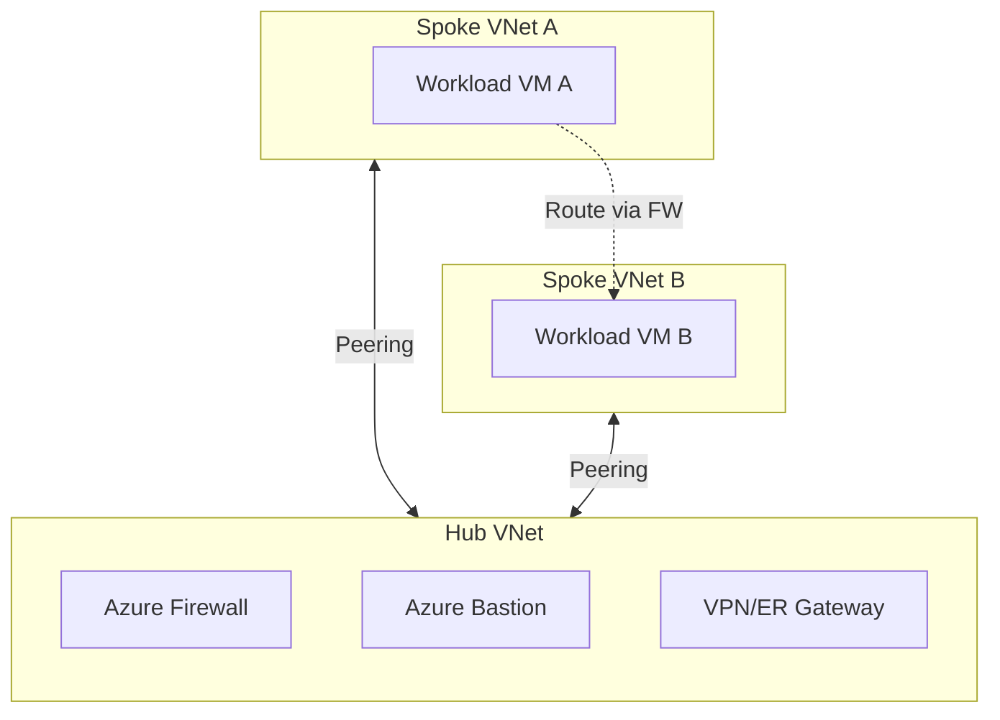

# Hub and Spoke Architecture

The **Hub and Spoke** topology is a standard networking pattern in Azure that isolates workloads while sharing common services.

## Overview

- **Hub**: A central Virtual Network (VNet) that acts as the point of connectivity to your on-premises network and the internet. It hosts shared services.
- **Spoke**: VNets that connect to the Hub via **VNet Peering**. Spokes host workloads (VMs, Apps) and consume services from the Hub.

## Architecture Diagram

## Hub Concepts

The hub virtual network is the central point of connectivity. It enables:

- **Cross-premise Gateway**: Connects different network environments (e.g., On-premises to Azure) using VPN Gateway or ExpressRoute.
- **Egress Control**: Centralized management of outbound traffic from all spokes (e.g., via Azure Firewall).
- **Ingress Control**: Management of inbound traffic to endpoints in spokes.
- **Remote Access**: Centralized entry point for RDP/SSH (e.g., Azure Bastion) to manage VMs in spokes.

## Spoke Concepts

Spoke virtual networks isolate and manage workloads separately.

- **Isolation**: Each spoke can represent a different environment (Production, Dev, Test) or workload tier.
- **Connectivity**: Spokes are peered to the Hub but typically not to each other (unless routed through the Hub).
- **Default Outbound Access**: Spokes follow default outbound access rules, but in this topology, outbound traffic is usually directed through the Hub's control mechanisms.

## Key Components

### Azure Virtual Network & Peering
The fundamental building block. Peering provides low-latency, high-bandwidth connections between the Hub and Spokes using the Azure backbone.

### Azure Firewall
A managed security service in the Hub that:
- Acts as the primary egress point for internet traffic.
- Inspects inbound traffic.
- Can function as a DNS proxy.

### VPN Gateway / ExpressRoute
- **VPN Gateway**: Sends encrypted traffic between Azure and on-premises over the public internet.
- **ExpressRoute**: Establishes a private, dedicated connection to Azure (higher reliability and speed).
*Spokes typically use the Hub's gateway (Gateway Transit) instead of deploying their own.*

### Azure Bastion
Provides secure RDP/SSH access to VMs in spokes without exposing public IPs.

### Azure Monitor
Collects telemetry from Hub and Spoke resources to maximize performance and availability.

## Recommendations

### Spoke Network Connectivity
- **Spoke-to-Spoke**: If spokes need to communicate, use **User Defined Routes (UDRs)** to force traffic through the Azure Firewall (or NVA) in the Hub. This provides security and logging.
- **Direct Peering**: For high-bandwidth, low-latency needs (e.g., database replication), you can directly peer two spokes, bypassing the Hub Firewall, but this bypasses central inspection.

### Gateway Transit
- Configure peering to **"Allow gateway transit"** in the Hub and **"Use remote gateways"** in the Spoke. This allows spokes to use the Hub's VPN/ExpressRoute gateway to reach on-premises networks.

## Cost Optimization

- **Shared Resources**: Deploying Azure Firewall and Gateways only in the Hub saves significant costs compared to deploying them in every spoke.
- **Direct Peering**: Use direct peering between spokes for massive data transfers to avoid Azure Firewall data processing costs, if security requirements permit.
