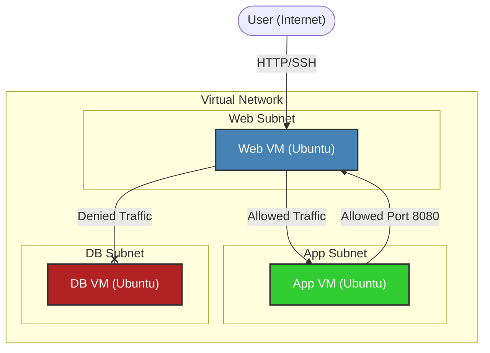

# Project 2: NetShield - ASG-NSG Driven Multi-Tier Security in Azure

## Project Overview
**NetShield** demonstrates a layered security approach in Azure using Network Security Groups (NSGs) and Application Security Groups (ASGs). The goal is to enforce strict network segmentation across a multi-tier architecture (Web, App, DB) and validate traffic flow rules.

## Architecture



## Prerequisites
- Active Azure Subscription
- Azure CLI or Cloud Shell (optional, for verification)

## Step-by-Step Instructions

### 1. Infrastructure Setup

#### 1. Create a Resource Group
1. Search for "Resource groups" in the Azure Portal.
2. Click **Create**.
3. **Resource group**: `rg-netshield-01`.
4. **Region**: `East US`.
5. Click **Review + create** -> **Create**.

#### 2. Create a Virtual Network
1. Search for "Virtual networks".
2. Click **Create**.
3. **Resource Group**: `rg-netshield-01`.
4. **Name**: `vnet-netshield`.
5. Move to the **IP Addresses** tab.
6. Delete the default subnet if present.
7. Click **+ Add subnet** and create three subnets:
   - **Name**: `web-subnet`, **Address range**: `10.0.1.0/24`
   - **Name**: `app-subnet`, **Address range**: `10.0.2.0/24`
   - **Name**: `db-subnet`,  **Address range**: `10.0.3.0/24`
8. Click **Review + create** -> **Create**.

#### 3. Deploy Virtual Machines
Create three Ubuntu VMs, one in each subnet.

**Generic Steps for each VM:**
1. Search for "Virtual machines" -> **Create** -> **Azure virtual machine**.
2. **Resource Group**: `rg-netshield-01`.
3. **Image**: `Ubuntu Server 20.04 LTS` (or 22.04).
4. **Size**: `Standard_B1s`.
5. **Authentication type**: `Password` (create a username/password, e.g., `azureuser` / `SecurePassword123!`).
6. **Networking** tab:
   - **Virtual network**: `vnet-netshield`.
   - **Public IP**: Create new (Basic SKU is fine).
7. **Select specific Subnet for each VM**:

   | VM Name | Subnet |
   | :--- | :--- |
   | `web-vm` | `web-subnet` |
   | `app-vm` | `app-subnet` |
   | `db-vm` | `db-subnet` |

8. Click **Review + create** -> **Create** for each.

#### 4. Initial Connectivity Check
1. SSH into `web-vm` using its Public IP.
2. Try to ping the internal IP of `app-vm` and `db-vm`.
   - *Note: Ping might fail initially if ICMP is blocked by default OS firewalls or NSGs, but for now we confirm VM status.*

---

### 2. NSG Rules Setup
**Goal**: Restrict traffic so `web-vm` can talk to `app-vm`, but NOT `db-vm`.

1. Go to the **Network Security Group** associated with the **web-subnet** (or create one if not auto-created, and associate it). 
   - *Best Practice*: It's cleaner to apply NSGs at the Subnet level.
2. Open the NSG for `web-subnet` (e.g., `nsg-web`).
3. **Outbound security rules**:
   - **Add Rule**: Deny traffic to DB.
     - **Source**: `Any` (or `10.0.1.0/24`)
     - **Destination**: `IP Addresses` -> `10.0.3.0/24` (DB Subnet)
     - **Port**: `*`
     - **Action**: `Deny`
     - **Priority**: `100`
     - **Name**: `Deny-Web-to-DB`
   - **Add Rule**: Allow traffic to App.
     - **Source**: `Any`
     - **Destination**: `IP Addresses` -> `10.0.2.0/24` (App Subnet)
     - **Action**: `Allow`
     - **Priority**: `110`
     - **Name**: `Allow-Web-to-App`

#### NSG Test
1. SSH into `web-vm`.
2. Ping `app-vm` (Private IP, e.g., 10.0.2.4). -> **Should Succeed** (if ICMP allowed).
3. Ping `db-vm` (Private IP, e.g., 10.0.3.4). -> **Should Fail/Timeout**.

---

### 3. ASG Rules Setup
**Goal**: Use Application Security Groups (ASGs) to allow specific traffic (Port 8080) between specific groups of VMs regardless of IP.

#### 1. Create ASGs
1. Search for "Application security groups".
2. Create `asg-web` in `rg-netshield-01`.
3. Create `asg-app` in `rg-netshield-01`.

#### 2. Associate ASGs to VMs
1. Go to `web-vm` -> **Networking** -> **Application security groups** -> **Configure the application security groups** -> Select `asg-web` -> Save.
2. Go to `app-vm` -> **Networking** -> **Application security groups** -> **Configure the application security groups** -> Select `asg-app` -> Save.

#### 3. Create NSG Rule using ASGs
1. Go to the NSG associated with the **app-subnet**.
2. **Inbound security rules** -> **Add**:
   - **Source**: `Application security group` -> `asg-web`.
   - **Source port ranges**: `*`
   - **Destination**: `Application security group` -> `asg-app`.
   - **Destination port ranges**: `8080`
   - **Protocol**: `TCP`
   - **Action**: `Allow`
   - **Priority**: `100`
   - **Name**: `Allow-ASG-Web-to-App-8080`

#### 4. ASG Testing
1. **On `app-vm` (Server side)**:
   - SSH into `app-vm`.
   - Start a simple Python HTTP server on port 8080:
     ```bash
     python3 -m http.server 8080
     ```
2. **On `web-vm` (Client side)**:
   - SSH into `web-vm`.
   - Use `curl` to test connectivity:
     ```bash
     curl <app-vm-private-ip>:8080
     ```
   - **Result**: You should see the directory listing HTML from the Python server.

---

### 4. Monitoring and Alerting
**Goal**: Monitor VM performance and set up alerts for high CPU usage.

#### 1. Generate Load on DB VM
1. SSH into `db-vm`.
2. Install `stress` tool:
   ```bash
   sudo apt-get update
   sudo apt-get install stress -y
   ```
3. Run stress test to spike CPU:
   ```bash
   stress --cpu 2 --timeout 300
   ```

#### 2. Configure Alert
1. In Azure Portal, go to `db-vm`.
2. Select **Alerts** (under Monitoring) -> **Create alert rule**.
3. **Signal name**: `Percentage CPU`.
4. **Condition**: Host Percentage CPU > 60% (Aggregation type: Average).
5. **Actions**: Create a new Action Group.
   - **Notification type**: Email/SMS/Push/Voice.
   - **Email**: Enter your Gmail address.
6. **Review + create** to create the alert rule.

#### 3. Monitor Metrics & Logs
1. While `stress` is running, go to **Metrics** on the `db-vm` blade.
   - Select **Scope**: `db-vm`.
   - **Metric Namespace**: `Virtual Machine Host`.
   - **Metric**: `Percentage CPU`.
   - Observe the spike in the graph.
2. Check your email for the triggered alert.
3. **Analyze Logs** (Activity Log):
   - Go to **Activity log** on the `db-vm` blade to see administrative events (start, stop, etc.).
