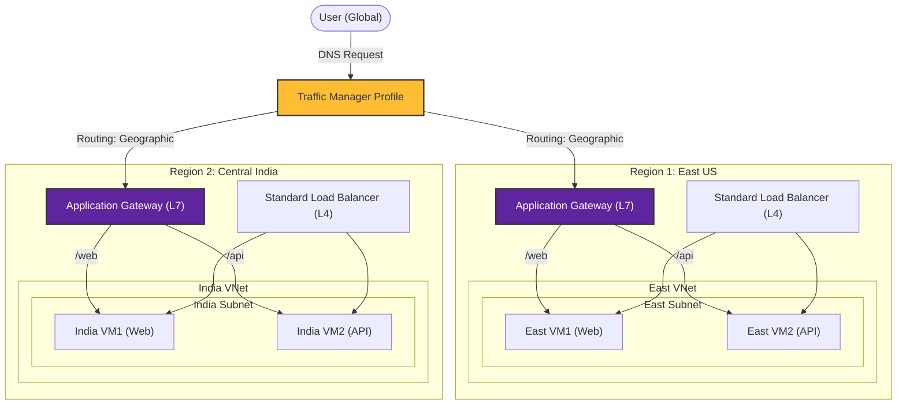

# Project 4: Highly Available Multi-Region Web App

## Project Overview
**Title**: Highly Available Multi-Region Web Application using Azure Traffic Manager, Application Gateway, Standard Load Balancer, and Virtual Machines.

**Objective**: Design and deploy a scalable, highly available web application infrastructure across two Azure regions (**East US** and **Central India**). This project demonstrates global traffic routing, layer 7 load balancing with path-based routing, and regional layer 4 load balancing.

## Architecture



## Step-by-Step Instructions

### Step 1: Resource Group Setup
1. Create a Resource Group in **Canada Central** (as the global management region).
   - Name: `rg-project4-ha`.
   - Assign **Owner** role: Go to IAM -> Add role assignment -> Owner -> Select your user.

---

### Step 2: Network Setup
Create Virtual Networks in two regions.

#### A. East US Region
1. Create Virtual Network:
   - **Name**: `east-vnet`
   - **Region**: `East US`
2. Configure Subnets:
   - Delete default.
   - Create `eastsubnet` (e.g., `10.1.1.0/24`) for VMs.
   - Create `east-apgw-subnet` (e.g., `10.1.2.0/24`) for Application Gateway.

#### B. India Region (Central India)
1. Create Virtual Network:
   - **Name**: `india-vnet`
   - **Region**: `Central India`
2. Configure Subnets:
   - Create `indiasubnet` (e.g., `10.2.1.0/24`) for VMs.
   - Create `india-apgw-subnet` (e.g., `10.2.2.0/24`) for Application Gateway.

---

### Step 3: Virtual Machines Setup

#### A. East US VMs (Ubuntu)
Create two VMs (`eastvm1`, `eastvm2`) in `east-vnet/eastsubnet`.
**For each VM:**
1. **Ports**: Allow SSH (22) and HTTP (80).
2. **Setup Web Server**: SSH into each and run:
   ```bash
   sudo apt-get update
   sudo apt-get install apache2 -y
   ```
3. **Custom Configuration**:
   - **EastVM1**:
     - Create `/web` folder: `sudo mkdir /var/www/html/web`
     - Create `index.html` in `/var/www/html/web`: Content "This is East US VM1 - WEB"
     - Edit default `/var/www/html/index.html`: "This is East US VM1 : Apache Used"
   - **EastVM2**:
     - Create `/api` folder: `sudo mkdir /var/www/html/api`
     - Create `index.html` in `/var/www/html/api`: Content "This is East US VM2 - API"
     - Edit default `/var/www/html/index.html`: "This is East US VM2 : Apache Used"

#### B. India VMs
Repeat the same for `indiavm1` and `indiavm2` in `india-vnet/indiasubnet`.
   - **IndiaVM1**: `/web` folder ("This is India VM1 - WEB").
   - **IndiaVM2**: `/api` folder ("This is India VM2 - API").

**Testing**:
- Browse `http://<eastvm1-ip>/web` -> Should see "This is East US VM1 - WEB"

---

### Step 4: Standard Load Balancer (Regional L4)
Create one SLB per region to load balance traffic across both VMs.

#### A. East US Load Balancer
1. Create **Load Balancer** ("Standard" SKU, "Public"). Region: East US.
2. **Frontend IP**: Create new public IP.
3. **Backend Pool**: Add `eastvm1` and `eastvm2`.
4. **Health Probe**: TCP Port 80.
5. **Load Balancing Rule**: Port 80 -> Port 80. Backend Pool -> EastPool. Probe -> HealthProbe.

#### B. India Load Balancer
Repeat for Central India.

**Test**: Browse SLB Public IP. Refreshing should toggle between VM1 and VM2 default pages.

---

### Step 5: Application Gateway (Regional L7 Path-Based Routing)
Create one App Gateway per region to route `/web` to VM1 and `/api` to VM2.

#### A. East US App Gateway
1. Create **Application Gateway**.
   - Region: East US.
   - Tier: Standard V2.
   - Subnet: `east-apgw-subnet`.
2. **Backends**:
   - `pool-web`: Add `eastvm1`.
   - `pool-api`: Add `eastvm2`.
3. **Routing Rules**:
   - Create a Path-based rule:
     - IF path `/web/*` -> Route to `pool-web`.
     - IF path `/api/*` -> Route to `pool-api`.

#### B. India App Gateway
Repeat for Central India (`india-apgw-subnet`), routing to `indiavm1` (web) and `indiavm2` (api).

**Test**:
- `http://<AppGatewayIP>/web` -> Loads VM1 (Web).
- `http://<AppGatewayIP>/api` -> Loads VM2 (API).

---

### Step 6: Traffic Manager (Global DNS Routing)
1. Create **Traffic Manager Profile**.
   - **Routing method**: `Geographic` (or Performance).
2. **Endpoints**:
   - **Add Endpoint 1**:
     - Type: Azure resource.
     - Resource type: Public IP address (of East App Gateway).
     - Name: `east-endpoint`.
     - Geo-mapping: `United States` / `Canada`.
   - **Add Endpoint 2**:
     - Type: Azure resource.
     - Resource type: Public IP address (of India App Gateway).
     - Name: `india-endpoint`.
     - Geo-mapping: `India` / `Asia`.

**Test**:
1. Browse Traffic Manager URL from your location (Canada). -> Should route to East US App Gateway.
2. Ask a friend in India (or use VPN) to browse same URL. -> Should route to India App Gateway.
