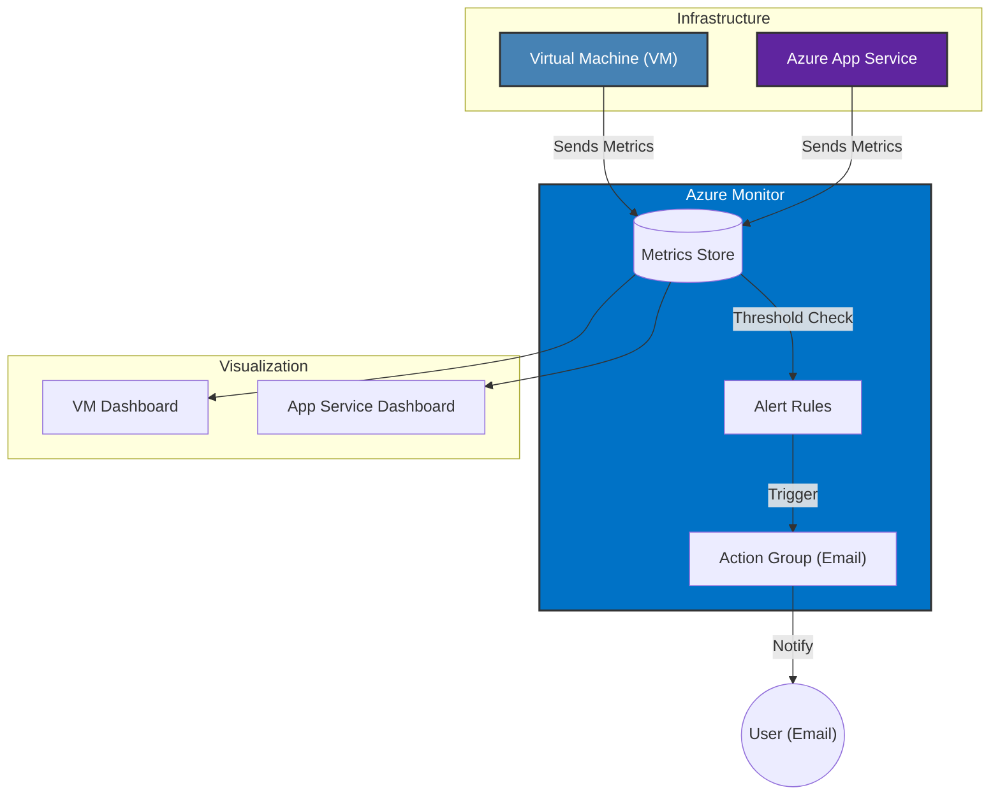

# Project 5: Azure Infrastructure Monitoring and Alerting Setup

## Project Overview
This project focuses on setting up comprehensive monitoring and alerting for Azure infrastructure using **Azure Monitor**. You will deploy a Virtual Machine and an App Service, configure various metrics to track their performance, create dashboards for visualization, and set up alerts for critical conditions (like high CPU usage).

## Architecture

## Step-by-Step Instructions

### Step 1: Create a Resource Group
1. Click on **Create a resource** or search for **Resource groups**.
2. Click **Create**.
3. **Resource Group Name**: `Project4` (or `rg-project5-monitoring`).
4. **Region**: `Canada Central`.
5. Click **Review + Create**, and then click **Create**.

### Step 2: Create a Virtual Machine
1. Click on **Create a resource** -> **Virtual Machine** (or "Add" -> search "Virtual Machine").
2. **Subscription**: Select your subscription.
3. **Resource Group**: Select the one created above.
4. **Virtual machine name**: e.g., `vm-monitor-01`.
5. **Region**: `Canada Central`.
6. **Availability Options**: `No infrastructure redundancy required`.
7. **Size**: `Standard_DS1_v2`.
8. **Authentication type**:
   - **Username**: e.g., `azureuser`.
   - **Password**: Create a secure password.
9. **Inbound port rules**:
   - Allow **SSH (22)** if Linux or **RDP (3389)** if Windows.
10. **Image**: `Ubuntu Server 20.04 LTS` (or Windows Server 2019).
11. **Networking**: Select default NIC/VNet settings.
12. **Public IP**: Ensure one is created (Standard/Basic).
13. Click on **Review + Create** and then **Create**.

### Step 3: Create an Azure App Service
1. Configure **Web App**:
   - Click on **Create a resource** -> **Web App**.
   - **Subscription**: Your subscription.
   - **Resource Group**: Select the same RG.
   - **Name**: e.g., `app-monitor-unique123`.
   - **Runtime stack**: e.g., `Python 3.12` or `.NET 8`.
   - **Region**: `Canada Central`.
   - **Pricing Plan**: Select `Free F1` or `Basic B1`.
2. Click **Review + Create** and then click **Create**.

---

### Step 4: Monitoring Metrics for Virtual Machine
1. Go to **Azure Monitor**: On the left sidebar, click on **Monitor**.
2. Navigate to **Metrics**.
3. **Select Scope**:
   - Select Subscription and the Resource Group.
   - Select your **Virtual Machine** (`vm-monitor-01`).
4. **Add Metrics**:
   - Add the following metrics sequentially (or on same chart if supported):
     - `Percentage CPU`
     - `Inbound Flows`
     - `Outbound Flows`
     - `Disk Read Bytes`
     - `Disk Write Bytes`
     - `VM Availability`
     - `Temp Disk Latency` (if available for the size)
5. **Pin to Dashboard**:
   - After configuring the chart, click **Pin to dashboard** (top right of the chart).
   - Select **Create new** -> Name it `Dashboard Virtual Machine`.
   - Click **Create and pin**.

### Step 5: Monitoring Metrics for App Service
1. Go to **Azure Monitor** -> **Metrics**.
2. **Select Scope**:
   - Select the **App Service** (`app-monitor-unique123`).
3. **Add Metrics**:
   - Add the following:
     - `Response Time` (Average)
     - `Requests`
     - `Data Out`
     - `Data In`
     - `Http 5xx`
     - `Http Server Errors`
     - `CPU Time`
4. **Pin to Dashboard**:
   - Click **Pin to dashboard**.
   - Select **Create new** -> Name it `Dashboard App Service`.
   - Click **Create and pin**.

---

### Step 6: Create Alerts for Azure App Service CPU Usage
1. Go to **Monitor** -> **Alerts**.
2. Click **+ Create** -> **Alert rule**.
3. **Scope**: Select your **App Service**.
4. **Condition**:
   - Signal name: `CPU Time` (or `CPU Percentage` if using an App Service Plan view).
   - Logic: Greater than.
   - Threshold: `4` seconds (or 5 seconds, as per requirement).
5. **Actions**:
   - Click **Create action group** (or select existing).
   - Action Group Name: `ag-email-admin`.
   - **Notification Type**: **Email/SMS message/Push/Voice**.
   - **Email**: Enter your email address.
   - Click **OK/Create**.
6. **Details**:
   - Alert Rule Name: `Alert-AppService-HighCPU`.
   - Severity: Sev 2 (Warning).
7. Click **Create**.

### Step 7: Create Alerts for Azure Virtual Machine CPU Usage
1. Go to **Monitor** -> **Alerts**. (Or from the VM blade -> Alerts).
2. Click **+ Create** -> **Alert rule**.
3. **Scope**: Select your **Virtual Machine**.
4. **Condition**:
   - Signal name: `Percentage CPU`.
   - Logic: Greater than.
   - Threshold: `80` (%).
   - Aggregation granularity/frequency: `5 minutes` (Check "When CPU usage exceeds 80% for 5 minutes").
5. **Actions**:
   - Select the existing Action Group (`ag-email-admin`) created in Step 6.
6. **Details**:
   - Alert Rule Name: `Alert-VM-HighCPU`.
7. Click **Create**.
