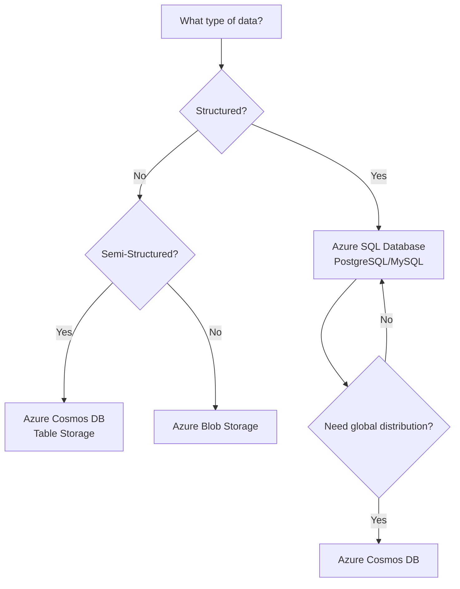

# Data Types in Azure Storage

## Overview

Understanding data types is fundamental to choosing the right Azure storage solution. Azure Storage services are designed to handle different types of data, each with unique characteristics and storage requirements.

## Three Categories of Data

### Structured Data

**Definition**: Data organized in a predefined schema with tables, rows, and columns.

**Characteristics**:
- Fixed schema with defined data types
- Organized in relational databases (SQL)
- Enforces data integrity through constraints
- Supports complex queries and relationships

**Examples**:
- Employee records in SQL databases
- Customer information tables
- Financial transaction records
- Inventory management systems

**Azure Storage Solution**: Azure SQL Database, Azure Database for PostgreSQL/MySQL

**Use Cases**:
- Applications requiring ACID transactions
- Complex reporting and analytics
- Data with well-defined relationships
- Business-critical applications requiring data consistency

---

### Semi-Structured Data

**Definition**: Data that uses tags, keys, or markers to organize information but doesn't conform to rigid table structures.

**Characteristics**:
- Flexible schema that can vary between records
- Self-describing structure using markup or key-value pairs
- Hierarchical or nested organization
- Easier to evolve schema over time

**Common Formats**:
- **JSON** (JavaScript Object Notation)
- **XML** (Extensible Markup Language)
- **YAML** (YAML Ain't Markup Language)
- **CSV** (Comma-Separated Values)

**Examples**:
- Product catalogs with varying attributes
- Configuration files
- API responses
- Log files with structured fields

**Azure Storage Solution**: Azure Cosmos DB, Azure Table Storage, Blob Storage

**Use Cases**:
- Applications with evolving data models
- Document storage systems
- Configuration management
- IoT telemetry data

---

### Unstructured Data

**Definition**: Data without a predefined structure or organization, typically stored as files or binary objects.

**Characteristics**:
- No inherent schema or data model
- Stored in native format
- Requires specialized processing to extract meaning
- Often large in size

**Examples**:
- **Images**: JPG, PNG, GIF, BMP
- **Videos**: MP4, AVI, MOV
- **Audio**: MP3, WAV, AAC
- **Documents**: PDF, Word, PowerPoint
- **Archives**: ZIP, TAR, RAR
- **Logs**: Plain text files

**Azure Storage Solution**: Azure Blob Storage

**Use Cases**:
- Media storage and streaming
- Backup and archival
- Document management systems
- Machine learning datasets
- Website static assets (images, CSS, JavaScript)

---

## Relational Database Management System (RDBMS)

### Understanding Table Relationships

RDBMS organizes structured data into related tables that share common identifiers.

**Key Concepts**:

**Primary Keys**: Unique identifiers for each record in a table
- Example: `EmployeeID` in an Employee table

**Foreign Keys**: References to primary keys in other tables
- Example: `DepartmentID` in Employee table references Department table

**Relationships**:
- **One-to-Many**: One department has many employees
- **Many-to-Many**: Employees can work on multiple projects, projects have multiple employees
- **One-to-One**: Each employee has one unique badge

### RDBMS vs NoSQL

| Aspect | RDBMS | NoSQL |
|--------|-------|-------|
| **Schema** | Fixed, predefined | Flexible, dynamic |
| **Data Type** | Structured | Semi-structured, Unstructured |
| **Scalability** | Vertical (scale up) | Horizontal (scale out) |
| **Transactions** | ACID compliant | Eventually consistent (typically) |
| **Use Cases** | Financial systems, ERP | Social media, IoT, real-time analytics |
| **Query Language** | SQL | Varies (MongoDB Query, Cosmos DB SQL API) |

**When to Use RDBMS**:
- Data has clear relationships and structure
- Need for complex joins and transactions
- Data integrity is critical
- Compliance requirements (GDPR, HIPAA)

**When to Use NoSQL**:
- Rapidly changing data models
- Need for horizontal scalability
- Handling large volumes of unstructured data
- Real-time data processing

---

## Choosing the Right Storage Type

### Decision Matrix

### Quick Reference Guide

| Data Type | Format Examples | Azure Service | Access Pattern |
|-----------|----------------|---------------|----------------|
| Structured | SQL tables, CSV with schema | Azure SQL Database | SQL queries |
| Semi-Structured | JSON, XML, YAML | Cosmos DB, Table Storage | Key-value, document queries |
| Unstructured | Images, videos, PDFs | Blob Storage | Direct file access, streaming |

---

**Key Takeaway**: Match your data type to the right storage solution. Structured data belongs in databases, semi-structured data works well with NoSQL solutions, and unstructured data is best stored in blob storage.

---

## Related Concepts

- [Azure Storage Accounts](01-StorageAccounts.md)
- [Blob Containers and Access Levels](02-BlobContainers.md)
- [Storage Services Overview](03-StorageServices.md)
