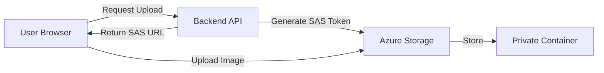

# Blob Containers and Access Levels

## Overview

Blob containers are logical groupings within Azure Storage Accounts that organize and manage blob (Binary Large Object) storage. They function similarly to folders or directories in a file system, providing a way to organize unstructured data like images, videos, documents, and backups.

## What is a Blob Container?

**Definition**: A container is a logical boundary that groups a set of blobs together within a storage account.

**Key Characteristics**:
- Each storage account can have unlimited containers
- Each container can hold unlimited blobs
- Container names must be unique within a storage account
- Containers provide a security boundary for access control

**Naming Rules**:
- 3-63 characters long
- Lowercase letters, numbers, and hyphens only
- Must start with a letter or number
- No consecutive hyphens

**Examples**:
- ✅ `product-images`
- ✅ `user-uploads`
- ✅ `backup2024`
- ❌ `Product-Images` (uppercase)
- ❌ `-backups` (starts with hyphen)
- ❌ `my--container` (consecutive hyphens)

---

## Container Access Levels

Azure Blob Storage provides three access levels that control anonymous (public) access to container data. This is critical for security and determines who can access your blobs without authentication.

> [!IMPORTANT]
> Before setting container-level public access, you must first enable "Allow Blob public access" at the storage account level. This is disabled by default for security.

---

### Private (No Anonymous Access)

**Access Level**: `Private`

**Behavior**:
- ❌ Anonymous users **cannot** access blobs
- ❌ Anonymous users **cannot** list blobs in the container
- ✅ Requires authentication (account key, SAS token, or Azure AD)

**Security**: Highest security level

**Use Cases**:
- User-uploaded content (personal files, documents)
- Sensitive business data
- Internal application data
- Customer information
- Financial records
- Healthcare data (HIPAA compliance)
- Any data requiring authentication

**Example Scenario**:
A healthcare application stores patient medical records. These files must only be accessible to authenticated users with proper permissions.

**Access Methods**:
- Storage account access keys
- Shared Access Signatures (SAS) with appropriate permissions
- Azure Active Directory authentication
- Managed identities for Azure resources

**Error When Accessing Anonymously**:
```
HTTP 404 (ResourceNotFound)
or
HTTP 403 (Public access is not permitted on this storage account)
```

---

### Blob (Anonymous Read Access for Blobs Only)

**Access Level**: `Blob`

**Behavior**:
- ✅ Anonymous users **can** access individual blobs if they know the exact URL
- ❌ Anonymous users **cannot** list blobs in the container
- ✅ Provides "security through obscurity"

**Security**: Medium security level

**Use Cases**:
- Public website assets (images, CSS, JavaScript files)
- Product images for e-commerce sites
- Public documentation files
- Shared media files where listing is not desired
- Content delivery for web applications

**Example Scenario**:
An e-commerce website stores product images. The website needs to display these images publicly, but you don't want users to browse all available images in the container.

**How It Works**:
```
Direct blob URL: ✅ Accessible
https://mystorageacct.blob.core.windows.net/product-images/item123.jpg

Container listing URL: ❌ Not accessible
https://mystorageacct.blob.core.windows.net/product-images?restype=container&comp=list
```

**Security Consideration**: 
While blobs are publicly accessible, users cannot discover blob names without the exact URL. However, if blob names are predictable (e.g., sequential numbers), this provides limited security.

---

### Container (Anonymous Read Access for Containers and Blobs)

**Access Level**: `Container`

**Behavior**:
- ✅ Anonymous users **can** access individual blobs
- ✅ Anonymous users **can** list all blobs in the container
- ✅ Full public read access

**Security**: Lowest security level (fully public)

**Use Cases**:
- Public datasets
- Open-source project assets
- Public documentation repositories
- Shared resources for community access
- Public APIs serving static content
- Research data meant for public consumption

**Example Scenario**:
A government agency publishes public datasets (census data, weather information) that anyone should be able to browse and download.

**How It Works**:
```
Direct blob URL: ✅ Accessible
https://mystorageacct.blob.core.windows.net/public-data/census2024.csv

Container listing URL: ✅ Accessible (returns XML list of all blobs)
https://mystorageacct.blob.core.windows.net/public-data?restype=container&comp=list
```

**Container Listing Response**:
```xml
<?xml version="1.0" encoding="utf-8"?>
<EnumerationResults>
  <Blobs>
    <Blob>
      <Name>census2024.csv</Name>
      <Url>https://...</Url>
      <Properties>...</Properties>
    </Blob>
    <Blob>
      <Name>weather-data.json</Name>
      <Url>https://...</Url>
      <Properties>...</Properties>
    </Blob>
  </Blobs>
</EnumerationResults>
```

---

## Access Level Comparison

| Feature | Private | Blob | Container |
|---------|---------|------|-----------|
| **Anonymous blob access** | ❌ No | ✅ Yes | ✅ Yes |
| **Anonymous container listing** | ❌ No | ❌ No | ✅ Yes |
| **Requires authentication** | ✅ Yes | ❌ No | ❌ No |
| **Blob discoverability** | None | Low (need exact URL) | High (can list all) |
| **Security level** | High | Medium | Low |
| **Best for** | Private data | Public assets | Public datasets |

---

## Shared Access Signatures (SAS)

### What is a SAS Token?

**Definition**: A Shared Access Signature (SAS) is a URI that grants restricted access rights to Azure Storage resources without exposing your account key.

**Key Characteristics**:
- Time-limited access (specify start and expiry times)
- Granular permissions (read, write, delete, list)
- IP address restrictions (optional)
- Protocol restrictions (HTTPS only, optional)
- Can be revoked by changing account keys
- Safer than sharing account keys

### When to Use SAS Tokens

**Use SAS Tokens When**:
- ✅ Providing temporary access to private containers
- ✅ Granting access to external users or applications
- ✅ Mobile or web applications need to access storage
- ✅ Third-party integrations require limited access
- ✅ You need to restrict permissions (read-only, write-only)
- ✅ You want time-limited access that expires automatically

**Don't Use SAS Tokens When**:
- ❌ You can use managed identities (for Azure resources)
- ❌ Access is needed indefinitely (use RBAC instead)
- ❌ You need to frequently rotate tokens (management overhead)

---

### SAS Token vs Access Levels

> [!IMPORTANT]
> SAS tokens and container access levels serve different purposes and can be used together.

**Container Access Levels**: Control anonymous (public) access
- Private: No anonymous access
- Blob: Anonymous read access to blobs
- Container: Anonymous read access to blobs and container listing

**SAS Tokens**: Provide authenticated, time-limited access
- Work with **any** access level (including Private)
- Require authentication (not anonymous)
- Can grant write, delete, and list permissions
- Can be scoped to specific blobs or containers

**Example Scenario**:
```
Container: "user-uploads" (Access Level: Private)
SAS Token: Grants read/write access for 1 hour to a specific user

Result: User can upload/download files for 1 hour, 
        but anonymous users still cannot access anything
```

---

### How SAS Tokens Work

**URL Format**:
```
https://<storage-account>.blob.core.windows.net/<container>/<blob>?<sas-token>
```

**Example**:
```
https://mystorageacct.blob.core.windows.net/private-docs/report.pdf?sv=2021-06-08&ss=b&srt=o&sp=r&se=2024-01-15T18:00:00Z&st=2024-01-15T10:00:00Z&spr=https&sig=abc123...
```

**SAS Token Parameters**:
- `sv` - Storage service version
- `ss` - Storage service (b=blob, t=table, q=queue, f=file)
- `srt` - Resource type (s=service, c=container, o=object)
- `sp` - Permissions (r=read, w=write, d=delete, l=list, a=add, c=create, u=update, p=process)
- `se` - Expiry time (UTC)
- `st` - Start time (UTC, optional)
- `spr` - Protocol (https or https,http)
- `sig` - Signature (cryptographic hash)

> [!NOTE]
> The question mark (`?`) separates the blob URL from the SAS token parameters. This is how Azure knows where the token begins.

---

### Generating SAS Tokens

#### Method 1: Azure Portal

**Steps**:
1. Navigate to Storage Account → **Containers**
2. Select a container or blob
3. Right-click → **Generate SAS**
4. Configure:
   - **Permissions**: Read, Write, Delete, List
   - **Start time**: Now (or future date)
   - **Expiry time**: When access should end
   - **Allowed IP addresses**: Optional restriction
   - **Allowed protocols**: HTTPS only (recommended)
5. Click **Generate SAS token and URL**
6. Copy the **Blob SAS URL** or **Blob SAS token**

---

#### Method 2: Python SDK

```python
from azure.storage.blob import generate_blob_sas, BlobSasPermissions
from datetime import datetime, timedelta

# Generate SAS token for a specific blob
sas_token = generate_blob_sas(
    account_name="mystorageacct",
    container_name="private-container",
    blob_name="document.pdf",
    account_key="your-account-key",
    permission=BlobSasPermissions(read=True),
    expiry=datetime.utcnow() + timedelta(hours=1)
)

# Construct full URL
blob_url = f"https://mystorageacct.blob.core.windows.net/private-container/document.pdf?{sas_token}"
print(f"SAS URL: {blob_url}")
```

**Container-Level SAS** (access to all blobs in container):
```python
from azure.storage.blob import generate_container_sas, ContainerSasPermissions

sas_token = generate_container_sas(
    account_name="mystorageacct",
    container_name="private-container",
    account_key="your-account-key",
    permission=ContainerSasPermissions(read=True, write=True, list=True),
    expiry=datetime.utcnow() + timedelta(hours=24)
)

container_url = f"https://mystorageacct.blob.core.windows.net/private-container?{sas_token}"
```

**Account-Level SAS** (access to multiple services):
```python
from azure.storage.blob import generate_account_sas, ResourceTypes, AccountSasPermissions

sas_token = generate_account_sas(
    account_name="mystorageacct",
    account_key="your-account-key",
    resource_types=ResourceTypes(service=True, container=True, object=True),
    permission=AccountSasPermissions(read=True, write=True, list=True),
    expiry=datetime.utcnow() + timedelta(days=7)
)
```

---

#### Method 3: .NET SDK

**NuGet Package**: `Azure.Storage.Blobs`

```bash
dotnet add package Azure.Storage.Blobs
```

**Blob-Level SAS**:
```csharp
using Azure.Storage.Blobs;
using Azure.Storage.Sas;

// Generate SAS token for a specific blob
var blobClient = new BlobClient(
    new Uri("https://mystorageacct.blob.core.windows.net/private-container/document.pdf"),
    new StorageSharedKeyCredential("mystorageacct", "your-account-key")
);

var sasBuilder = new BlobSasBuilder
{
    BlobContainerName = "private-container",
    BlobName = "document.pdf",
    Resource = "b", // b = blob
    StartsOn = DateTimeOffset.UtcNow,
    ExpiresOn = DateTimeOffset.UtcNow.AddHours(1)
};

sasBuilder.SetPermissions(BlobSasPermissions.Read);

var sasToken = blobClient.GenerateSasUri(sasBuilder);
Console.WriteLine($"SAS URL: {sasToken}");
```

**Container-Level SAS** (access to all blobs in container):
```csharp
using Azure.Storage.Blobs;
using Azure.Storage.Sas;

var containerClient = new BlobContainerClient(
    new Uri("https://mystorageacct.blob.core.windows.net/private-container"),
    new StorageSharedKeyCredential("mystorageacct", "your-account-key")
);

var sasBuilder = new BlobSasBuilder
{
    BlobContainerName = "private-container",
    Resource = "c", // c = container
    StartsOn = DateTimeOffset.UtcNow,
    ExpiresOn = DateTimeOffset.UtcNow.AddHours(24)
};

sasBuilder.SetPermissions(BlobContainerSasPermissions.Read | 
                          BlobContainerSasPermissions.Write | 
                          BlobContainerSasPermissions.List);

var sasUri = containerClient.GenerateSasUri(sasBuilder);
Console.WriteLine($"Container SAS URL: {sasUri}");
```

**Account-Level SAS** (access to multiple services):
```csharp
using Azure.Storage;
using Azure.Storage.Sas;

var credential = new StorageSharedKeyCredential("mystorageacct", "your-account-key");

var sasBuilder = new AccountSasBuilder
{
    Services = AccountSasServices.Blobs,
    ResourceTypes = AccountSasResourceTypes.Service | 
                    AccountSasResourceTypes.Container | 
                    AccountSasResourceTypes.Object,
    StartsOn = DateTimeOffset.UtcNow,
    ExpiresOn = DateTimeOffset.UtcNow.AddDays(7),
    Protocol = SasProtocol.Https
};

sasBuilder.SetPermissions(AccountSasPermissions.Read | 
                          AccountSasPermissions.Write | 
                          AccountSasPermissions.List);

var sasToken = sasBuilder.ToSasQueryParameters(credential).ToString();
var accountSasUrl = $"https://mystorageacct.blob.core.windows.net/?{sasToken}";
Console.WriteLine($"Account SAS URL: {accountSasUrl}");
```

---

#### Method 4: Azure CLI

```bash
# Generate SAS token for a blob
az storage blob generate-sas \
  --account-name mystorageacct \
  --container-name private-container \
  --name document.pdf \
  --permissions r \
  --expiry 2024-01-15T18:00:00Z \
  --https-only \
  --output tsv

# Generate SAS token for a container
az storage container generate-sas \
  --account-name mystorageacct \
  --name private-container \
  --permissions rl \
  --expiry 2024-01-15T18:00:00Z \
  --https-only \
  --output tsv
```

---

### Real-World Use Case: Frontend Image Upload

**Scenario**: A web application allows users to upload profile pictures to a private container.

**Architecture**:


**Backend (Python/Flask)**:
```python
from flask import Flask, jsonify
from azure.storage.blob import generate_blob_sas, BlobSasPermissions
from datetime import datetime, timedelta
import uuid

app = Flask(__name__)

@app.route('/get-upload-url', methods=['POST'])
def get_upload_url():
    # Generate unique blob name
    blob_name = f"profile-pics/{uuid.uuid4()}.jpg"
    
    # Generate SAS token with write permission (1 hour)
    sas_token = generate_blob_sas(
        account_name="mystorageacct",
        container_name="user-uploads",
        blob_name=blob_name,
        account_key="your-account-key",
        permission=BlobSasPermissions(write=True, create=True),
        expiry=datetime.utcnow() + timedelta(hours=1)
    )
    
    # Return SAS URL to frontend
    upload_url = f"https://mystorageacct.blob.core.windows.net/user-uploads/{blob_name}?{sas_token}"
    
    return jsonify({
        "uploadUrl": upload_url,
        "blobName": blob_name
    })
```

**Backend (ASP.NET Core Web API)**:
```csharp
using Microsoft.AspNetCore.Mvc;
using Azure.Storage.Blobs;
using Azure.Storage.Sas;

[ApiController]
[Route("api")]
public class UploadController : ControllerBase
{
    [HttpPost("get-upload-url")]
    public IActionResult GetUploadUrl()
    {
        // Generate unique blob name
        var blobName = $"profile-pics/{Guid.NewGuid()}.jpg";
        
        // Create blob client
        var blobClient = new BlobClient(
            new Uri($"https://mystorageacct.blob.core.windows.net/user-uploads/{blobName}"),
            new StorageSharedKeyCredential("mystorageacct", "your-account-key")
        );
        
        // Generate SAS token with write permission (1 hour)
        var sasBuilder = new BlobSasBuilder
        {
            BlobContainerName = "user-uploads",
            BlobName = blobName,
            Resource = "b",
            StartsOn = DateTimeOffset.UtcNow,
            ExpiresOn = DateTimeOffset.UtcNow.AddHours(1)
        };
        
        sasBuilder.SetPermissions(BlobSasPermissions.Write | BlobSasPermissions.Create);
        
        // Generate SAS URI
        var sasUri = blobClient.GenerateSasUri(sasBuilder);
        
        return Ok(new
        {
            uploadUrl = sasUri.ToString(),
            blobName = blobName
        });
    }
}
```

**Frontend (JavaScript)**:
```javascript
// Request upload URL from backend
async function uploadProfilePicture(file) {
    // Get SAS URL from backend
    const response = await fetch('/get-upload-url', { method: 'POST' });
    const { uploadUrl, blobName } = await response.json();
    
    // Upload directly to Azure Storage using SAS URL
    const uploadResponse = await fetch(uploadUrl, {
        method: 'PUT',
        headers: {
            'x-ms-blob-type': 'BlockBlob',
            'Content-Type': file.type
        },
        body: file
    });
    
    if (uploadResponse.ok) {
        console.log('Upload successful!');
        return blobName;
    } else {
        throw new Error('Upload failed');
    }
}
```

**Benefits**:
- ✅ Frontend uploads directly to Azure (no backend bottleneck)
- ✅ Backend doesn't handle large file transfers
- ✅ Time-limited access (token expires in 1 hour)
- ✅ Write-only permission (user can't read other users' files)
- ✅ Account key never exposed to frontend

---

### Security Best Practices

#### 1. Use HTTPS Only

**Python**:
```python
# Always specify https_only=True
sas_token = generate_blob_sas(
    # ... other parameters
    protocol="https"  # Only allow HTTPS
)
```

**.NET**:
```csharp
var sasBuilder = new BlobSasBuilder
{
    // ... other properties
    Protocol = SasProtocol.Https  // Only allow HTTPS
};
```

#### 2. Set Minimal Permissions

**Python**:
```python
# ❌ Bad: Too many permissions
permission=BlobSasPermissions(read=True, write=True, delete=True, list=True)

# ✅ Good: Only what's needed
permission=BlobSasPermissions(read=True)  # Read-only
```

**.NET**:
```csharp
// ❌ Bad: Too many permissions
sasBuilder.SetPermissions(BlobSasPermissions.Read | BlobSasPermissions.Write | 
                          BlobSasPermissions.Delete | BlobSasPermissions.List);

// ✅ Good: Only what's needed
sasBuilder.SetPermissions(BlobSasPermissions.Read);  // Read-only
```

#### 3. Use Short Expiry Times

**Python**:
```python
# ❌ Bad: 30 days
expiry=datetime.utcnow() + timedelta(days=30)

# ✅ Good: 1 hour for uploads, 15 minutes for downloads
expiry=datetime.utcnow() + timedelta(hours=1)
```

**.NET**:
```csharp
// ❌ Bad: 30 days
ExpiresOn = DateTimeOffset.UtcNow.AddDays(30)

// ✅ Good: 1 hour for uploads, 15 minutes for downloads
ExpiresOn = DateTimeOffset.UtcNow.AddHours(1)
```

#### 4. Restrict IP Addresses (when possible)

**Python**:
```python
from azure.storage.blob import generate_blob_sas

sas_token = generate_blob_sas(
    # ... other parameters
    ip="203.0.113.0/24"  # Only allow from this IP range
)
```

**.NET**:
```csharp
using Azure.Storage.Sas;

var sasBuilder = new BlobSasBuilder
{
    // ... other properties
    IPRange = new SasIPRange(IPAddress.Parse("203.0.113.0"), IPAddress.Parse("203.0.113.255"))
};
```

#### 5. Never Log or Expose SAS Tokens

**Python**:
```python
# ❌ Bad: Logging SAS tokens
print(f"SAS Token: {sas_token}")  # Don't do this!

# ✅ Good: Log only metadata
print(f"Generated SAS for blob: {blob_name}, expires: {expiry}")
```

**.NET**:
```csharp
// ❌ Bad: Logging SAS tokens
Console.WriteLine($"SAS Token: {sasToken}");  // Don't do this!

// ✅ Good: Log only metadata
Console.WriteLine($"Generated SAS for blob: {blobName}, expires: {expiresOn}");
```

#### 6. Use User Delegation SAS (Most Secure)

**Python**:
```python
from azure.identity import DefaultAzureCredential
from azure.storage.blob import BlobServiceClient

# Use Azure AD credentials instead of account key
credential = DefaultAzureCredential()
blob_service = BlobServiceClient(
    account_url="https://mystorageacct.blob.core.windows.net",
    credential=credential
)

# Generate user delegation SAS (secured with Azure AD)
user_delegation_key = blob_service.get_user_delegation_key(
    key_start_time=datetime.utcnow(),
    key_expiry_time=datetime.utcnow() + timedelta(hours=1)
)

# This is more secure than account key-based SAS
```

**.NET**:
```csharp
using Azure.Identity;
using Azure.Storage.Blobs;
using Azure.Storage.Sas;

// Use Azure AD credentials instead of account key
var credential = new DefaultAzureCredential();
var blobServiceClient = new BlobServiceClient(
    new Uri("https://mystorageacct.blob.core.windows.net"),
    credential
);

// Generate user delegation key (secured with Azure AD)
var userDelegationKey = await blobServiceClient.GetUserDelegationKeyAsync(
    startsOn: DateTimeOffset.UtcNow,
    expiresOn: DateTimeOffset.UtcNow.AddHours(1)
);

// Create SAS using user delegation key
var sasBuilder = new BlobSasBuilder
{
    BlobContainerName = "mycontainer",
    BlobName = "myblob",
    Resource = "b",
    StartsOn = DateTimeOffset.UtcNow,
    ExpiresOn = DateTimeOffset.UtcNow.AddHours(1)
};
sasBuilder.SetPermissions(BlobSasPermissions.Read);

var blobClient = blobServiceClient.GetBlobContainerClient("mycontainer").GetBlobClient("myblob");
var sasUri = blobClient.GenerateSasUri(sasBuilder, userDelegationKey);

// This is more secure than account key-based SAS
```

---

### SAS Token Revocation

**Problem**: SAS tokens cannot be directly revoked once generated.

**Solutions**:

1. **Rotate Account Keys** (revokes all SAS tokens):
   ```bash
   az storage account keys renew \
     --account-name mystorageacct \
     --key primary
   ```
   > [!WARNING]
   > This will invalidate ALL SAS tokens generated with that key.

2. **Use Stored Access Policies** (allows revocation):
   
   **Python**:
   ```python
   # Create stored access policy
   from azure.storage.blob import AccessPolicy, ContainerSasPermissions
   
   access_policy = AccessPolicy(
       permission=ContainerSasPermissions(read=True),
       expiry=datetime.utcnow() + timedelta(days=7)
   )
   
   # Set policy on container
   container_client.set_container_access_policy(
       signed_identifiers={'policy1': access_policy}
   )
   
   # Generate SAS using policy
   sas_token = generate_container_sas(
       account_name="mystorageacct",
       container_name="mycontainer",
       account_key="key",
       policy_id="policy1"  # Reference to stored policy
   )
   
   # Revoke by deleting policy
   container_client.set_container_access_policy(signed_identifiers={})
   ```
   
   **.NET**:
   ```csharp
   using Azure.Storage.Blobs;
   using Azure.Storage.Blobs.Models;
   
   var containerClient = new BlobContainerClient(
       new Uri("https://mystorageacct.blob.core.windows.net/mycontainer"),
       new StorageSharedKeyCredential("mystorageacct", "your-account-key")
   );
   
   // Create stored access policy
   var accessPolicy = new BlobSignedIdentifier
   {
       Id = "policy1",
       AccessPolicy = new BlobAccessPolicy
       {
           PolicyStartsOn = DateTimeOffset.UtcNow,
           PolicyExpiresOn = DateTimeOffset.UtcNow.AddDays(7),
           Permissions = "r"  // Read permission
       }
   };
   
   // Set policy on container
   await containerClient.SetAccessPolicyAsync(
       permissions: new[] { accessPolicy }
   );
   
   // Generate SAS using policy
   var sasBuilder = new BlobSasBuilder
   {
       BlobContainerName = "mycontainer",
       Resource = "c",
       Identifier = "policy1"  // Reference to stored policy
   };
   
   var sasToken = sasBuilder.ToSasQueryParameters(
       new StorageSharedKeyCredential("mystorageacct", "your-account-key")
   ).ToString();
   
   // Revoke by deleting policy
   await containerClient.SetAccessPolicyAsync(permissions: Array.Empty<BlobSignedIdentifier>());
   ```

3. **Use Short Expiry Times** (automatic expiration):
   - Best practice: 15 minutes to 1 hour for most use cases

---

### SAS Token Comparison

| Feature | Blob SAS | Container SAS | Account SAS | User Delegation SAS |
|---------|----------|---------------|-------------|---------------------|
| **Scope** | Single blob | All blobs in container | Multiple services | Blob/Container |
| **Permissions** | Granular | Granular | Granular | Granular |
| **Security** | Medium | Medium | Lower | Highest |
| **Based on** | Account key | Account key | Account key | Azure AD |
| **Revocation** | Rotate key | Rotate key | Rotate key | Revoke delegation key |
| **Best for** | Specific file access | Container operations | Multi-service access | Production apps |

---

## Enabling Public Access

### Step 1: Enable at Storage Account Level

Before containers can have public access, you must enable it on the storage account:

**Azure Portal**:
1. Navigate to Storage Account → **Configuration**
2. Find **"Allow Blob public access"**
3. Set to **Enabled**
4. Click **Save**

**Azure CLI**:
```bash
az storage account update \
  --name <storage-account-name> \
  --resource-group <resource-group> \
  --allow-blob-public-access true
```

> [!WARNING]
> This setting is disabled by default for security. Only enable if you have a legitimate business need for public blob access.

### Step 2: Set Container Access Level

**Azure Portal**:
1. Navigate to Storage Account → **Containers**
2. Select a container
3. Click **Change access level**
4. Select: Private, Blob, or Container
5. Click **OK**

**Azure CLI**:
```bash
# Create container with specific access level
az storage container create \
  --name my-container \
  --account-name <storage-account-name> \
  --public-access blob  # or 'container' or 'off'
```

---

## Data Recovery Features

### Soft Delete for Containers

**What it does**: Retains deleted containers for a specified retention period

**Benefits**:
- Recover from accidental deletions
- Protection against malicious deletion
- Configurable retention period (1-365 days)

**How to Enable**:
1. Storage Account → **Data protection**
2. Enable **"Container soft delete"**
3. Set retention period (e.g., 7 days)

**Recovery**:
- Deleted containers appear with a "deleted" marker
- Can be restored within the retention period
- Original container name and contents are preserved

**Use Cases**:
- Protection against accidental deletion
- Compliance requirements for data retention
- Disaster recovery scenarios

---

### Soft Delete for Blobs

**What it does**: Retains deleted blobs and blob snapshots

**Benefits**:
- Recover individual files
- Protection against overwrites
- Snapshot preservation

**Configuration**:
- Retention period: 1-365 days
- Applies to all blobs in the storage account

**Recovery Process**:
1. Navigate to container
2. Enable **"Show deleted blobs"**
3. Select deleted blob
4. Click **Undelete**

---

### Blob Versioning

**What it does**: Automatically maintains previous versions of a blob

**How it works**:
- Each modification creates a new version
- Previous versions are preserved
- Each version has a unique version ID

**Benefits**:
- Complete history of blob changes
- Rollback to any previous version
- Protection against accidental overwrites
- Audit trail for compliance

**Use Cases**:
- Document management systems
- Configuration file management
- Image processing workflows (preserve originals)
- Compliance and regulatory requirements

**Example Scenario**:
A nightly script compresses product images. If the compression algorithm malfunctions, blob versioning allows you to immediately restore the original high-resolution images without needing separate backups.

**Version Management**:
```
Current version: image.jpg (version ID: 2024-01-15T10:30:00Z)
Previous version: image.jpg (version ID: 2024-01-14T09:15:00Z)
Original version: image.jpg (version ID: 2024-01-10T08:00:00Z)
```

**Cost Consideration**: Each version consumes storage space. Use lifecycle policies to automatically delete old versions.

---

## Best Practices

### Security
- **Default to Private**: Only make containers public when absolutely necessary
- **Use SAS Tokens**: For temporary access instead of making containers public
- **Regular Audits**: Review public containers periodically
- **Principle of Least Privilege**: Grant minimum necessary permissions

### Organization
- **Logical Grouping**: Organize blobs by purpose, environment, or data type
- **Naming Conventions**: Use consistent, descriptive container names
- **Separate Environments**: Use different containers for dev, test, and production

### Performance
- **Partition Strategy**: Distribute blobs across multiple containers for high-scale scenarios
- **Blob Naming**: Use random prefixes for high-throughput scenarios to avoid partition hotspots

### Cost Optimization
- **Lifecycle Policies**: Automatically move old data to cooler tiers
- **Delete Unused Containers**: Remove containers that are no longer needed
- **Monitor Access Patterns**: Adjust access tiers based on actual usage

### Data Protection
- **Enable Soft Delete**: Protect against accidental deletion
- **Use Versioning**: For critical data that changes frequently
- **Regular Backups**: Even with redundancy, maintain backups for critical data
- **Test Recovery**: Regularly test your ability to restore deleted data

---

## Common Scenarios

### Scenario 1: Public Website Assets

**Requirement**: Serve images, CSS, and JavaScript files for a public website

**Solution**:
- Container: `website-assets`
- Access Level: **Blob**
- Why: Files need to be publicly accessible, but listing all assets is not necessary

### Scenario 2: User File Uploads

**Requirement**: Store files uploaded by authenticated users

**Solution**:
- Container: `user-uploads`
- Access Level: **Private**
- Access Method: Generate SAS tokens for authenticated users
- Why: User data should never be publicly accessible

### Scenario 3: Public Dataset Distribution

**Requirement**: Share research data with the public

**Solution**:
- Container: `public-datasets`
- Access Level: **Container**
- Why: Users should be able to browse and discover available datasets

### Scenario 4: Image Processing Pipeline

**Requirement**: Vendors upload images, script processes them, website displays optimized versions

**Solution**:
- Container 1: `vendor-uploads` (Private) - Raw uploads
- Container 2: `optimized-images` (Blob) - Processed images for website
- Enable: Blob versioning on both containers
- Why: Separate raw and processed data, protect originals, allow public access to optimized images

---

## Summary

Blob containers are the fundamental organizational unit in Azure Blob Storage. Key takeaways:

1. **Choose the right access level**: Private for sensitive data, Blob for public assets, Container for public datasets
2. **Enable data protection**: Use soft delete and versioning for critical data
3. **Follow security best practices**: Default to private, use SAS tokens, audit public containers
4. **Organize logically**: Use clear naming conventions and separate containers by purpose
5. **Soft Delete for Containers**: Retains deleted containers for a specified retention period
6. **Soft Delete for Blobs**: Retains deleted blobs for a specified retention period
7. **Blob Versioning**: Automatically maintains previous versions of a blob

**Remember**: Storage account-level public access must be enabled before container-level public access works.

---

## Related Concepts
```

> [!WARNING]
> This setting is disabled by default for security. Only enable if you have a legitimate business need for public blob access.

### Step 2: Set Container Access Level

**Azure Portal**:
1. Navigate to Storage Account → **Containers**
2. Select a container
3. Click **Change access level**
4. Select: Private, Blob, or Container
5. Click **OK**

**Azure CLI**:
```bash
# Create container with specific access level
az storage container create \
  --name my-container \
  --account-name <storage-account-name> \
  --public-access blob  # or 'container' or 'off'
```

---

## Best Practices

### Security
- **Default to Private**: Only make containers public when absolutely necessary
- **Use SAS Tokens**: For temporary access instead of making containers public
- **Regular Audits**: Review public containers periodically
- **Principle of Least Privilege**: Grant minimum necessary permissions

### Organization
- **Logical Grouping**: Organize blobs by purpose, environment, or data type
- **Naming Conventions**: Use consistent, descriptive container names
- **Separate Environments**: Use different containers for dev, test, and production

### Performance
- **Partition Strategy**: Distribute blobs across multiple containers for high-scale scenarios
- **Blob Naming**: Use random prefixes for high-throughput scenarios to avoid partition hotspots

### Cost Optimization
- **Lifecycle Policies**: Automatically move old data to cooler tiers
- **Delete Unused Containers**: Remove containers that are no longer needed
- **Monitor Access Patterns**: Adjust access tiers based on actual usage

### Data Protection
- **Enable Soft Delete**: Protect against accidental deletion
- **Use Versioning**: For critical data that changes frequently
- **Regular Backups**: Even with redundancy, maintain backups for critical data
- **Test Recovery**: Regularly test your ability to restore deleted data

---

## Related Concepts

- [Data Types Overview](00-DataTypes.md)
- [Azure Storage Accounts](01-StorageAccounts.md)
- [Storage Services Overview](03-StorageServices.md)
- [Real-World Use Cases](04-UseCases.md)
- [Azure Tables](05-AzureTables.md)
- [Python SDK Guide](07-PythonSDK.md)

## Hands-On Practice

- [Assignment 1: Azure File Shares](../Assignments/Assignment01-AzureFileShares.md) - Learn to create and mount file shares
- [Assignment 2: Add Disk to VM](../Assignments/Assignment02-AddDiskToVM.md) - Add additional storage to VMs
- [Assignment 3: Extend Disk Storage](../Assignments/Assignment03-ExtendDiskStorage.md) - Expand existing disks
```
