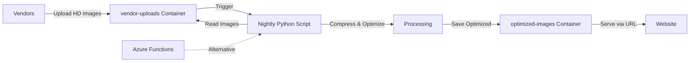
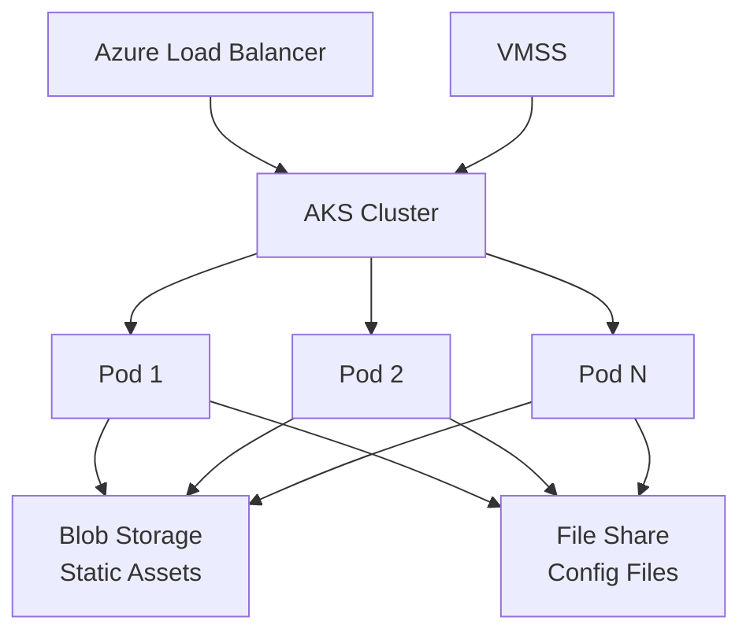
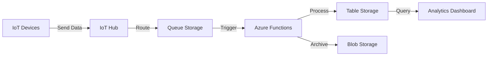
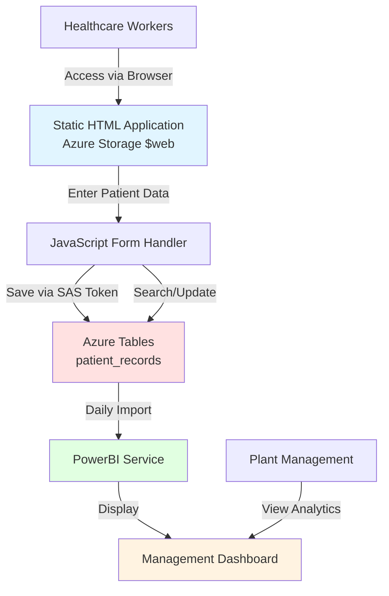

# Real-World Use Cases and Advanced Topics

## Overview

This document covers practical, real-world scenarios where Azure Storage services are used in production environments, along with advanced integration patterns and best practices learned from actual implementations.

---

## Use Case 1: Automated Image Processing Pipeline

### Business Scenario

An e-commerce company receives high-resolution product images from multiple vendors. These images are often 5-10 MB each and need to be optimized for web display (compressed to 100-200 KB) while maintaining visual quality.

### Architecture



### Implementation Details

#### Step 1: Vendor Upload
- **Container**: `vendor-uploads`
- **Access Level**: Private
- **Features Enabled**: Blob versioning, soft delete (7 days)
- **Upload Method**: SAS token with write-only permissions

#### Step 2: Nightly Processing Script
**Python Script Example**:
```python
from azure.storage.blob import BlobServiceClient
from PIL import Image
import io

# Connect to storage account
blob_service = BlobServiceClient.from_connection_string(conn_str)

# Get source and destination containers
source_container = blob_service.get_container_client("vendor-uploads")
dest_container = blob_service.get_container_client("optimized-images")

# Process each blob
for blob in source_container.list_blobs():
    # Download original image
    blob_client = source_container.get_blob_client(blob.name)
    image_data = blob_client.download_blob().readall()
    
    # Optimize image
    image = Image.open(io.BytesIO(image_data))
    image = image.convert('RGB')
    
    # Compress (quality=85, optimize=True)
    output = io.BytesIO()
    image.save(output, format='JPEG', quality=85, optimize=True)
    output.seek(0)
    
    # Upload optimized image
    dest_blob_client = dest_container.get_blob_client(blob.name)
    dest_blob_client.upload_blob(output, overwrite=True)
    
    print(f"Processed: {blob.name}")
```

#### Step 3: Website Integration
- **Container**: `optimized-images`
- **Access Level**: Blob (anonymous read for blobs only)
- **CDN**: Azure CDN enabled for global distribution
- **Website Code**: References blob URLs directly

**HTML Example**:
```html

```

### Benefits

✅ **Scalability**: Handles thousands of images automatically  
✅ **Cost Savings**: Reduces bandwidth costs by 95%  
✅ **Performance**: Faster page load times  
✅ **Data Protection**: Blob versioning preserves originals  
✅ **Disaster Recovery**: Can reprocess if optimization fails  

### Advanced Considerations

**Blob Versioning Advantage**:
If the compression script malfunctions and corrupts images, you can immediately restore previous versions without requiring separate backups.

**Alternative Triggers**:
- **Azure Functions**: Event-driven processing (trigger on blob upload)
- **Azure Logic Apps**: Workflow orchestration with notifications
- **Azure Data Factory**: Scheduled batch processing at scale

---

## Use Case 2: Infrastructure Integration with Kubernetes

### Business Scenario

A SaaS company runs a web application on Azure Kubernetes Service (AKS) with auto-scaling capabilities. The application needs to serve static assets and share configuration files across multiple pods.

### Architecture



### Implementation Details

#### Component 1: Static Asset Delivery
- **Service**: Blob Storage
- **Container**: `static-assets`
- **Access Level**: Blob
- **Content**: CSS, JavaScript, images, fonts
- **CDN**: Azure CDN with custom domain
- **Cache**: Browser caching headers set

#### Component 2: Shared Configuration
- **Service**: Azure File Share
- **Share Name**: `app-config`
- **Mount**: Kubernetes persistent volume
- **Access**: All pods read shared configuration
- **Updates**: Nightly deployment updates config files

**Kubernetes PVC Example**:
```yaml
apiVersion: v1
kind: PersistentVolumeClaim
metadata:
  name: app-config-pvc
spec:
  accessModes:
    - ReadWriteMany
  storageClassName: azurefile
  resources:
    requests:
      storage: 5Gi
```

#### Component 3: Auto-Scaling with VMSS
- **Virtual Machine Scale Sets**: Automatically scale based on load
- **Load Balancer**: Standard Load Balancer distributes traffic
- **Storage Access**: All VMs access same storage account
- **Consistency**: Shared state via blob storage and file shares

### Deployment Workflow

**Nightly Deployment Process**:
1. CI/CD pipeline builds new application version
2. New static assets uploaded to blob storage
3. Configuration files updated in file share
4. Kubernetes rolling update deploys new pods
5. Old pods drained, new pods serve updated content
6. Zero downtime deployment

### Benefits

✅ **High Availability**: Load balancer + auto-scaling  
✅ **Consistency**: All pods access same storage  
✅ **Easy Updates**: Update storage, not individual pods  
✅ **Cost Efficiency**: Pay only for storage used  
✅ **Global Performance**: CDN for static assets  

---

## Use Case 3: IoT Data Ingestion and Processing

### Business Scenario

A manufacturing company has 10,000 IoT sensors sending telemetry data every 30 seconds. Data needs to be ingested, processed, and stored for analytics.

### Architecture



### Implementation Details

#### Ingestion Layer
- **IoT Hub**: Receives device messages
- **Queue Storage**: Buffers messages for processing
- **Scaling**: Multiple queue consumers for parallel processing

#### Processing Layer
- **Azure Functions**: Serverless processing
- **Logic**: Validate, transform, aggregate data
- **Error Handling**: Dead-letter queue for failed messages

#### Storage Layer
- **Table Storage**: Recent data (last 30 days) for quick queries
  - PartitionKey: DeviceID
  - RowKey: Timestamp
  - Properties: Temperature, Humidity, Pressure, etc.
- **Blob Storage**: Long-term archive (Cool tier)
  - Organized by date: `/telemetry/2024/01/15/device-123.json`

### Benefits

✅ **Scalability**: Handles millions of messages per day  
✅ **Cost-Effective**: Table Storage for hot data, Blob for archive  
✅ **Reliability**: Queue ensures no data loss  
✅ **Performance**: Fast queries on recent data  
✅ **Compliance**: Long-term retention for auditing  

---

## Use Case 4: COVID-19 Patient Tracking System

### Business Scenario

During the COVID-19 pandemic (2019-2020), a large fruit processing plant faced an urgent challenge: tracking employee health information for workers who were isolating in dedicated on-site tents. The organization needed to monitor:

- Daily infection rates across the facility
- Treatment status for each patient
- Tent assignments and occupancy
- Food preferences and dietary requirements
- Medication tracking and administration
- Temperature readings and vital signs

**Critical Requirement**: The solution needed to be deployed **immediately** - within days, not weeks.

**Traditional Approach Would Take**:
- 2-3 weeks for backend development (database, API, authentication)
- 1-2 weeks for frontend development
- 1 week for testing and deployment
- **Total: 4-6 weeks minimum**

**Actual Solution**: Static website + Azure Tables = **Deployed in 1 day**

---

### Architecture



---

### Implementation Details

#### Frontend: Static HTML Application

**Deployment**:
- Hosted on Azure Storage Static Website
- No web server required
- Accessible via: `https://fruitplantcovid.z13.web.core.windows.net/`

**Key Features**:
- Patient data entry form
- Search functionality by Employee ID
- Update existing patient records
- View daily statistics
- Simple, intuitive interface for non-technical staff

**Technology Stack**:
- HTML5 for structure
- CSS for styling
- Vanilla JavaScript for logic
- Azure Storage JavaScript SDK for data operations

---

#### Backend: Azure Tables

**Table Name**: `patient_records`

**Partition Strategy**: Date-based partitioning for efficient daily queries

**Entity Structure**:
```python
{
    "PartitionKey": "2024-01-15",           # Date (YYYY-MM-DD)
    "RowKey": "EMP-12345",                  # Employee ID (unique)
    "Name": "John Doe",
    "TentNumber": "T-05",
    "InfectionStatus": "Positive",          # Positive/Negative/Awaiting Results
    "TreatmentStatus": "Under Treatment",   # Under Treatment/Recovered/Monitoring
    "Temperature": 99.5,                    # Fahrenheit
    "FoodPreference": "Vegetarian",         # Regular/Vegetarian/Vegan/Halal
    "Medication": "Paracetamol, Vitamin C",
    "Notes": "Patient responding well to treatment",
    "LastUpdated": "2024-01-15T10:30:00Z",
    "UpdatedBy": "Nurse Sarah"
}
```

**Why This Structure Works**:
- **PartitionKey = Date**: Enables fast queries for daily reports
- **RowKey = Employee ID**: Ensures unique patient records
- **Flexible Schema**: Easy to add new fields as requirements evolve
- **No Joins Needed**: All patient data in single entity

---

#### Data Entry Form

**HTML Structure** (simplified):
```html
<form id="patientForm">
    <h2>COVID-19 Patient Entry</h2>
    
    <!-- Patient Identification -->
    <div class="form-section">
        <label>Employee ID:</label>
        <input type="text" id="employeeId" required>
        
        <label>Name:</label>
        <input type="text" id="name" required>
    </div>
    
    <!-- Location -->
    <div class="form-section">
        <label>Tent Number:</label>
        <select id="tentNumber">
            <option>T-01</option>
            <option>T-02</option>
            <!-- ... T-20 -->
        </select>
    </div>
    
    <!-- Health Status -->
    <div class="form-section">
        <label>Infection Status:</label>
        <select id="infectionStatus">
            <option>Positive</option>
            <option>Negative</option>
            <option>Awaiting Results</option>
        </select>
        
        <label>Treatment Status:</label>
        <select id="treatmentStatus">
            <option>Under Treatment</option>
            <option>Recovered</option>
            <option>Monitoring</option>
        </select>
        
        <label>Temperature (°F):</label>
        <input type="number" id="temperature" step="0.1">
    </div>
    
    <!-- Care Details -->
    <div class="form-section">
        <label>Food Preference:</label>
        <select id="foodPreference">
            <option>Regular</option>
            <option>Vegetarian</option>
            <option>Vegan</option>
            <option>Halal</option>
        </select>
        
        <label>Medication:</label>
        <textarea id="medication" rows="2"></textarea>
        
        <label>Notes:</label>
        <textarea id="notes" rows="3"></textarea>
    </div>
    
    <button type="submit">Save Patient Data</button>
    <button type="button" onclick="searchPatient()">Search</button>
</form>
```

---

#### JavaScript Logic

**Save Patient Data**:
```javascript
// Azure Tables configuration
const accountName = "fruitplantcovid";
const tableName = "patient_records";
const sasToken = "?sv=2021-06-08&ss=t&srt=sco&sp=rwdlacu&se=...";

// Form submission handler
document.getElementById('patientForm').addEventListener('submit', async (e) => {
    e.preventDefault();
    
    // Prepare entity
    const today = new Date().toISOString().split('T')[0];
    const entity = {
        PartitionKey: today,
        RowKey: document.getElementById('employeeId').value,
        Name: document.getElementById('name').value,
        TentNumber: document.getElementById('tentNumber').value,
        InfectionStatus: document.getElementById('infectionStatus').value,
        TreatmentStatus: document.getElementById('treatmentStatus').value,
        Temperature: parseFloat(document.getElementById('temperature').value),
        FoodPreference: document.getElementById('foodPreference').value,
        Medication: document.getElementById('medication').value,
        Notes: document.getElementById('notes').value,
        LastUpdated: new Date().toISOString(),
        UpdatedBy: sessionStorage.getItem('username') || 'Unknown'
    };
    
    try {
        // Save to Azure Tables
        await saveToAzureTables(entity);
        alert('✓ Patient data saved successfully!');
        document.getElementById('patientForm').reset();
    } catch (error) {
        alert('✗ Error saving data: ' + error.message);
        console.error(error);
    }
});

// Helper function to save data
async function saveToAzureTables(entity) {
    const url = `https://${accountName}.table.core.windows.net/${tableName}${sasToken}`;
    
    const response = await fetch(url, {
        method: 'POST',
        headers: {
            'Content-Type': 'application/json',
            'Accept': 'application/json;odata=nometadata',
            'x-ms-version': '2021-06-08'
        },
        body: JSON.stringify(entity)
    });
    
    if (!response.ok) {
        const error = await response.text();
        throw new Error(`Failed to save: ${error}`);
    }
}
```

**Search Patient**:
```javascript
async function searchPatient() {
    const employeeId = document.getElementById('employeeId').value;
    if (!employeeId) {
        alert('Please enter Employee ID');
        return;
    }
    
    try {
        // Query Azure Tables
        const today = new Date().toISOString().split('T')[0];
        const url = `https://${accountName}.table.core.windows.net/${tableName}(PartitionKey='${today}',RowKey='${employeeId}')${sasToken}`;
        
        const response = await fetch(url, {
            headers: {
                'Accept': 'application/json;odata=nometadata'
            }
        });
        
        if (response.ok) {
            const patient = await response.json();
            // Populate form with patient data
            document.getElementById('name').value = patient.Name;
            document.getElementById('tentNumber').value = patient.TentNumber;
            document.getElementById('infectionStatus').value = patient.InfectionStatus;
            document.getElementById('treatmentStatus').value = patient.TreatmentStatus;
            document.getElementById('temperature').value = patient.Temperature;
            document.getElementById('foodPreference').value = patient.FoodPreference;
            document.getElementById('medication').value = patient.Medication;
            document.getElementById('notes').value = patient.Notes;
        } else {
            alert('Patient not found for today');
        }
    } catch (error) {
        alert('Error searching: ' + error.message);
    }
}
```

---

### PowerBI Integration

After data is collected in Azure Tables, it's imported into PowerBI for analytics and visualization.

#### Data Connection

**PowerBI Setup**:
1. Open PowerBI Desktop
2. **Get Data** → **Azure** → **Azure Table Storage**
3. Enter storage account name
4. Authenticate with account key
5. Select `patient_records` table
6. Load data into PowerBI

**Automatic Refresh**:
- Schedule: Every 1 hour during business hours
- Method: PowerBI Service with gateway
- Ensures management sees real-time data

---

#### Dashboard Components

**1. Daily Infection Rate Trend**
```
Line Chart:
- X-axis: Date (PartitionKey)
- Y-axis: Count of Positive cases
- Shows infection trend over time
```

**2. Treatment Status Distribution**
```
Pie Chart:
- Slices: Under Treatment, Recovered, Monitoring
- Shows current treatment breakdown
```

**3. Tent Occupancy Overview**
```
Bar Chart:
- X-axis: Tent Number (T-01 to T-20)
- Y-axis: Number of patients
- Color: Infection Status (Red=Positive, Green=Negative)
```

**4. Temperature Monitoring**
```
Line Chart with Threshold:
- X-axis: Time
- Y-axis: Temperature
- Red line at 100.4°F (fever threshold)
- Alerts for high temperatures
```

**5. Food Preference Summary**
```
Donut Chart:
- Segments: Regular, Vegetarian, Vegan, Halal
- Helps kitchen plan daily meals
```

**6. Medication Tracking**
```
Table Visual:
- Columns: Employee ID, Name, Medication, Last Updated
- Filterable by medication type
- Helps pharmacy manage inventory
```

---

#### Sample PowerBI DAX Measures

**Total Active Cases**:
```dax
Active Cases = 
CALCULATE(
    COUNTROWS(patient_records),
    patient_records[InfectionStatus] = "Positive",
    patient_records[TreatmentStatus] <> "Recovered"
)
```

**Recovery Rate**:
```dax
Recovery Rate = 
DIVIDE(
    CALCULATE(COUNTROWS(patient_records), patient_records[TreatmentStatus] = "Recovered"),
    COUNTROWS(patient_records),
    0
) * 100
```

**Average Temperature**:
```dax
Avg Temperature = 
AVERAGE(patient_records[Temperature])
```

**Daily New Cases**:
```dax
New Cases Today = 
CALCULATE(
    COUNTROWS(patient_records),
    patient_records[PartitionKey] = FORMAT(TODAY(), "YYYY-MM-DD"),
    patient_records[InfectionStatus] = "Positive"
)
```

---

### Benefits Achieved

#### Speed
- ✅ **Developed in 1 day** (vs 4-6 weeks traditional approach)
- ✅ No backend development required
- ✅ No database server setup
- ✅ Immediate deployment to production

#### Cost
- ✅ **~$5/month** for storage and bandwidth
- ✅ No server hosting fees ($100-500/month saved)
- ✅ No database licensing costs
- ✅ Scales automatically with usage

#### Simplicity
- ✅ Simple HTML + JavaScript (no complex frameworks)
- ✅ Easy to update and maintain
- ✅ Non-technical healthcare staff can use without training
- ✅ No installation required (browser-based)

#### Reliability
- ✅ Azure's 99.9% SLA
- ✅ Automatic backups and redundancy
- ✅ No server downtime or maintenance windows
- ✅ Global availability

#### Scalability
- ✅ Handled 500+ employees across multiple shifts
- ✅ Concurrent access by 20+ healthcare workers
- ✅ No performance degradation
- ✅ Could scale to thousands of patients if needed

---

### Real-World Impact

**Quantitative Results**:
- **500+ patient records** tracked daily
- **20+ healthcare workers** using the system
- **100% uptime** during 6-month deployment
- **Zero data loss** incidents
- **<1 second** response time for queries

**Qualitative Feedback**:
- Management praised the **real-time visibility** into infection trends
- Healthcare workers appreciated the **simple interface**
- Kitchen staff used food preference data to **improve meal planning**
- Pharmacy used medication tracking to **optimize inventory**

**Key Success Factor**: The simplicity of static website + Azure Tables allowed the team to focus on solving the business problem rather than wrestling with infrastructure.

---

### Lessons Learned

**What Worked Well**:
1. **Date-based partitioning** enabled fast daily reports
2. **Flexible schema** allowed adding new fields without database migrations
3. **SAS tokens** provided secure access without complex authentication
4. **PowerBI integration** gave management the analytics they needed
5. **Static website** eliminated server management overhead

**Challenges Overcome**:
1. **SAS token expiration**: Implemented automatic token refresh in JavaScript
2. **Concurrent updates**: Used optimistic concurrency with ETags
3. **Data validation**: Added client-side validation to prevent bad data
4. **User training**: Created simple 5-minute video tutorial

**If We Did It Again**:
- Use **Azure Functions** for server-side validation
- Implement **Azure AD B2C** for better authentication
- Add **real-time notifications** using SignalR
- Create **mobile app** for on-the-go access

---

## Advanced Topics

### Accessing Private Containers

#### Method 1: Storage Account Keys

**Pros**: Full access to all resources  
**Cons**: Cannot be scoped, difficult to rotate  

**Usage**:
```python
from azure.storage.blob import BlobServiceClient

blob_service = BlobServiceClient(
    account_url="https://mystorageacct.blob.core.windows.net",
    credential="<account-key>"
)
```

**Best Practice**: Store keys in Azure Key Vault

---

#### Method 2: Shared Access Signatures (SAS)

**Pros**: Granular permissions, time-limited, IP-restricted  
**Cons**: Requires management and renewal  

**Types**:
- **Account SAS**: Access to multiple services
- **Service SAS**: Access to specific service
- **User Delegation SAS**: Secured with Azure AD (most secure)

**Example - Generate SAS Token**:
```python
from azure.storage.blob import generate_blob_sas, BlobSasPermissions
from datetime import datetime, timedelta

sas_token = generate_blob_sas(
    account_name="mystorageacct",
    container_name="private-container",
    blob_name="document.pdf",
    account_key="<account-key>",
    permission=BlobSasPermissions(read=True),
    expiry=datetime.utcnow() + timedelta(hours=1)
)

blob_url = f"https://mystorageacct.blob.core.windows.net/private-container/document.pdf?{sas_token}"
```

**Use Cases**:
- Temporary access for external users
- Mobile app access to user-specific data
- Third-party integrations

---

#### Method 3: Managed Identities

**Pros**: No credentials to manage, Azure AD-based  
**Cons**: Only works for Azure resources  

**Example - Azure Function**:
```python
from azure.identity import DefaultAzureCredential
from azure.storage.blob import BlobServiceClient

# Automatically uses managed identity
credential = DefaultAzureCredential()
blob_service = BlobServiceClient(
    account_url="https://mystorageacct.blob.core.windows.net",
    credential=credential
)
```

**Best Practice**: Use managed identities for Azure resources whenever possible

---

### Mounting File Shares on Virtual Machines

#### Windows VM

**PowerShell Script**:
```powershell
# Set variables
$storageAccount = "mystorageacct"
$fileShare = "myshare"
$storageKey = "<storage-key>"

# Create credential
$securePassword = ConvertTo-SecureString -String $storageKey -AsPlainText -Force
$credential = New-Object System.Management.Automation.PSCredential `
    -ArgumentList "AZURE\$storageAccount", $securePassword

# Mount as Z: drive
New-PSDrive -Name Z -PSProvider FileSystem `
    -Root "\\$storageAccount.file.core.windows.net\$fileShare" `
    -Credential $credential -Persist
```

**Persistent Mount** (via Task Scheduler):
```powershell
# Create scheduled task to mount on startup
$action = New-ScheduledTaskAction -Execute 'PowerShell.exe' `
    -Argument '-File C:\Scripts\mount-share.ps1'
$trigger = New-ScheduledTaskTrigger -AtStartup
Register-ScheduledTask -TaskName "MountAzureFileShare" `
    -Action $action -Trigger $trigger -User "SYSTEM"
```

---

#### Linux VM

**Mount via /etc/fstab** (persistent):
```bash
# Install cifs-utils
sudo apt-get update
sudo apt-get install cifs-utils

# Create mount point
sudo mkdir -p /mnt/myshare

# Create credentials file
sudo bash -c 'cat > /etc/smbcredentials/mystorageacct.cred << EOF
username=mystorageacct
password=<storage-key>
EOF'

# Secure credentials file
sudo chmod 600 /etc/smbcredentials/mystorageacct.cred

# Add to /etc/fstab
sudo bash -c 'cat >> /etc/fstab << EOF
//mystorageacct.file.core.windows.net/myshare /mnt/myshare cifs nofail,credentials=/etc/smbcredentials/mystorageacct.cred,dir_mode=0777,file_mode=0777,serverino
EOF'

# Mount
sudo mount -a
```

**Use Cases**:
- Shared application data across VMs
- Centralized log collection
- Configuration file distribution
- Shared development environments

---

### Batch Operations and Programmatic File Retrieval

#### Batch Download from Blob Storage

**Python Example**:
```python
from azure.storage.blob import BlobServiceClient
import os

blob_service = BlobServiceClient.from_connection_string(conn_str)
container_client = blob_service.get_container_client("documents")

# Download all blobs with specific prefix
for blob in container_client.list_blobs(name_starts_with="reports/2024/"):
    blob_client = container_client.get_blob_client(blob.name)
    
    # Create local directory structure
    local_path = os.path.join("downloads", blob.name)
    os.makedirs(os.path.dirname(local_path), exist_ok=True)
    
    # Download blob
    with open(local_path, "wb") as file:
        file.write(blob_client.download_blob().readall())
    
    print(f"Downloaded: {blob.name}")
```

#### Batch Upload with Metadata

**Python Example**:
```python
import os
from azure.storage.blob import BlobServiceClient

blob_service = BlobServiceClient.from_connection_string(conn_str)
container_client = blob_service.get_container_client("uploads")

# Upload all files from directory
for root, dirs, files in os.walk("local_folder"):
    for file in files:
        local_path = os.path.join(root, file)
        blob_name = os.path.relpath(local_path, "local_folder")
        
        blob_client = container_client.get_blob_client(blob_name)
        
        with open(local_path, "rb") as data:
            blob_client.upload_blob(
                data,
                overwrite=True,
                metadata={
                    "uploaded_by": "batch_script",
                    "source": "local_folder",
                    "upload_date": "2024-01-15"
                }
            )
        
        print(f"Uploaded: {blob_name}")
```

---

### Working with Azure Tables Using Python

#### Basic CRUD Operations

```python
from azure.data.tables import TableServiceClient, TableClient

# Connect to table service
table_service = TableServiceClient.from_connection_string(conn_str)

# Create table
table_service.create_table("products")
table_client = table_service.get_table_client("products")

# Insert entity
product = {
    "PartitionKey": "Electronics",
    "RowKey": "PROD001",
    "Name": "Laptop",
    "Price": 999.99,
    "InStock": True
}
table_client.create_entity(product)

# Query entities
products = table_client.query_entities("PartitionKey eq 'Electronics'")
for product in products:
    print(f"{product['Name']}: ${product['Price']}")

# Update entity
product["Price"] = 899.99
table_client.update_entity(product, mode="replace")

# Delete entity
table_client.delete_entity("Electronics", "PROD001")
```

#### Advanced Querying

```python
# Query with multiple filters
query = "PartitionKey eq 'Electronics' and Price lt 1000"
products = table_client.query_entities(query)

# Select specific properties
products = table_client.query_entities(
    query,
    select=["Name", "Price"]
)

# Pagination
page_size = 100
pages = table_client.list_entities(results_per_page=page_size).by_page()
for page in pages:
    for entity in page:
        print(entity)
```

---

## Integration Patterns

### Pattern 1: Event-Driven Architecture

**Trigger**: Blob upload → Azure Event Grid → Azure Function → Processing

**Benefits**:
- Real-time processing
- Serverless and cost-effective
- Scalable and reliable

---

### Pattern 2: Data Lake Architecture

**Layers**:
1. **Raw Zone**: Blob Storage (Archive tier) - Original data
2. **Curated Zone**: Blob Storage (Cool tier) - Cleaned data
3. **Serving Zone**: Table Storage / Cosmos DB - Query-ready data

**Benefits**:
- Organized data lifecycle
- Cost optimization by tier
- Supports analytics workloads

---

### Pattern 3: Hybrid Cloud Storage

**Components**:
- **On-Premises**: Local file servers
- **Azure File Sync**: Bidirectional sync
- **Azure Files**: Cloud file shares
- **Blob Storage**: Long-term archive

**Benefits**:
- Gradual cloud migration
- Disaster recovery
- Cloud bursting for peak loads

---

## Best Practices Summary

### Security
- Use managed identities over keys
- Implement SAS tokens with minimal permissions
- Enable soft delete and versioning
- Use private endpoints for sensitive data

### Performance
- Choose appropriate performance tiers
- Use CDN for frequently accessed content
- Implement caching strategies
- Design partition keys for even distribution

### Cost Optimization
- Use lifecycle policies for automatic tiering
- Delete unused resources
- Monitor and optimize access patterns
- Use reserved capacity for predictable workloads

### Reliability
- Enable geo-redundancy for critical data
- Implement retry logic in applications
- Monitor storage metrics and set alerts
- Test disaster recovery procedures

---

## Summary

Real-world Azure Storage implementations often combine multiple services and integrate with other Azure resources. Key patterns include:

1. **Image Processing**: Automated workflows with blob versioning
2. **Kubernetes Integration**: Shared storage for containerized apps
3. **IoT Data**: Queue-based ingestion with table storage
4. **COVID-19 Patient Tracking**: Static website + Azure Tables for rapid deployment
5. **PowerBI Integration**: Analytics and dashboards from storage data
6. **Hybrid Cloud**: File sync between on-premises and cloud

**Key Takeaway**: Azure Storage is rarely used in isolation. Successful implementations leverage multiple services, automation, and integration with compute resources. The COVID-19 case study demonstrates how simple architectures (static website + Azure Tables) can deliver production-ready solutions in record time when requirements are urgent.

---

## Related Concepts

- [Data Types Overview](00-DataTypes.md)
- [Azure Storage Accounts](01-StorageAccounts.md)
- [Blob Containers and Access Levels](02-BlobContainers.md)
- [Storage Services Overview](03-StorageServices.md)
- [Azure Tables](05-AzureTables.md)
- [Static Website Hosting](06-StaticWebsiteHosting.md)
- [Python SDK Guide](07-PythonSDK.md)
