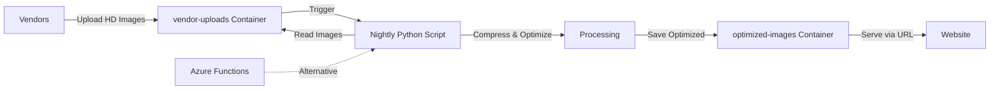
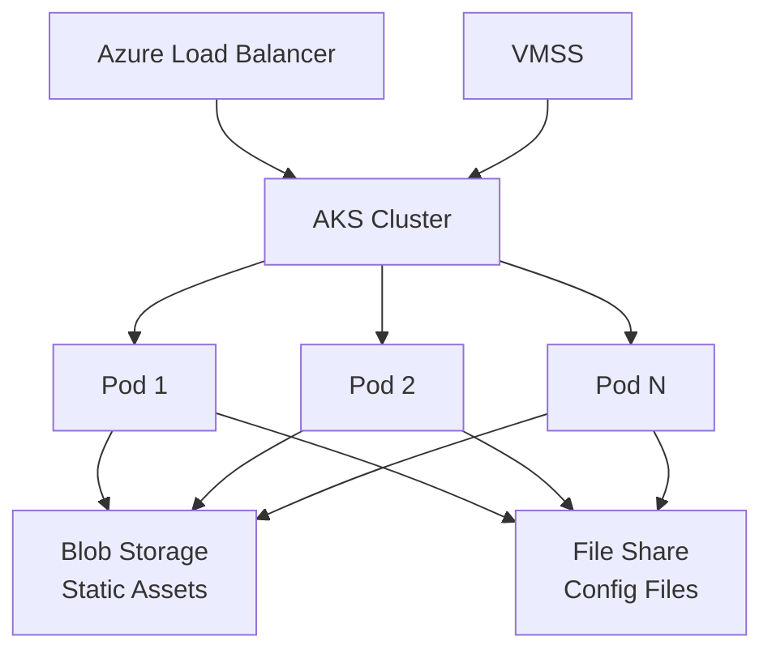
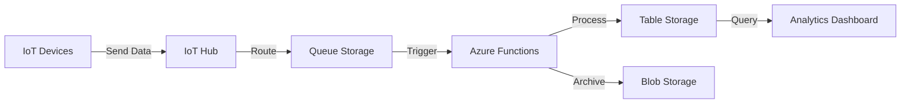

# Real-World Use Cases and Advanced Topics

## Overview

This document covers practical, real-world scenarios where Azure Storage services are used in production environments, along with advanced integration patterns and best practices learned from actual implementations.

---

## Use Case 1: Automated Image Processing Pipeline

### Business Scenario

An e-commerce company receives high-resolution product images from multiple vendors. These images are often 5-10 MB each and need to be optimized for web display (compressed to 100-200 KB) while maintaining visual quality.

### Architecture



### Implementation Details

#### Step 1: Vendor Upload
- **Container**: `vendor-uploads`
- **Access Level**: Private
- **Features Enabled**: Blob versioning, soft delete (7 days)
- **Upload Method**: SAS token with write-only permissions

#### Step 2: Nightly Processing Script
**Python Script Example**:
```python
from azure.storage.blob import BlobServiceClient
from PIL import Image
import io

# Connect to storage account
blob_service = BlobServiceClient.from_connection_string(conn_str)

# Get source and destination containers
source_container = blob_service.get_container_client("vendor-uploads")
dest_container = blob_service.get_container_client("optimized-images")

# Process each blob
for blob in source_container.list_blobs():
    # Download original image
    blob_client = source_container.get_blob_client(blob.name)
    image_data = blob_client.download_blob().readall()
    
    # Optimize image
    image = Image.open(io.BytesIO(image_data))
    image = image.convert('RGB')
    
    # Compress (quality=85, optimize=True)
    output = io.BytesIO()
    image.save(output, format='JPEG', quality=85, optimize=True)
    output.seek(0)
    
    # Upload optimized image
    dest_blob_client = dest_container.get_blob_client(blob.name)
    dest_blob_client.upload_blob(output, overwrite=True)
    
    print(f"Processed: {blob.name}")
```

#### Step 3: Website Integration
- **Container**: `optimized-images`
- **Access Level**: Blob (anonymous read for blobs only)
- **CDN**: Azure CDN enabled for global distribution
- **Website Code**: References blob URLs directly

**HTML Example**:
```html

```

### Benefits

✅ **Scalability**: Handles thousands of images automatically  
✅ **Cost Savings**: Reduces bandwidth costs by 95%  
✅ **Performance**: Faster page load times  
✅ **Data Protection**: Blob versioning preserves originals  
✅ **Disaster Recovery**: Can reprocess if optimization fails  

### Advanced Considerations

**Blob Versioning Advantage**:
If the compression script malfunctions and corrupts images, you can immediately restore previous versions without requiring separate backups.

**Alternative Triggers**:
- **Azure Functions**: Event-driven processing (trigger on blob upload)
- **Azure Logic Apps**: Workflow orchestration with notifications
- **Azure Data Factory**: Scheduled batch processing at scale

---

## Use Case 2: Infrastructure Integration with Kubernetes

### Business Scenario

A SaaS company runs a web application on Azure Kubernetes Service (AKS) with auto-scaling capabilities. The application needs to serve static assets and share configuration files across multiple pods.

### Architecture



### Implementation Details

#### Component 1: Static Asset Delivery
- **Service**: Blob Storage
- **Container**: `static-assets`
- **Access Level**: Blob
- **Content**: CSS, JavaScript, images, fonts
- **CDN**: Azure CDN with custom domain
- **Cache**: Browser caching headers set

#### Component 2: Shared Configuration
- **Service**: Azure File Share
- **Share Name**: `app-config`
- **Mount**: Kubernetes persistent volume
- **Access**: All pods read shared configuration
- **Updates**: Nightly deployment updates config files

**Kubernetes PVC Example**:
```yaml
apiVersion: v1
kind: PersistentVolumeClaim
metadata:
  name: app-config-pvc
spec:
  accessModes:
    - ReadWriteMany
  storageClassName: azurefile
  resources:
    requests:
      storage: 5Gi
```

#### Component 3: Auto-Scaling with VMSS
- **Virtual Machine Scale Sets**: Automatically scale based on load
- **Load Balancer**: Standard Load Balancer distributes traffic
- **Storage Access**: All VMs access same storage account
- **Consistency**: Shared state via blob storage and file shares

### Deployment Workflow

**Nightly Deployment Process**:
1. CI/CD pipeline builds new application version
2. New static assets uploaded to blob storage
3. Configuration files updated in file share
4. Kubernetes rolling update deploys new pods
5. Old pods drained, new pods serve updated content
6. Zero downtime deployment

### Benefits

✅ **High Availability**: Load balancer + auto-scaling  
✅ **Consistency**: All pods access same storage  
✅ **Easy Updates**: Update storage, not individual pods  
✅ **Cost Efficiency**: Pay only for storage used  
✅ **Global Performance**: CDN for static assets  

---

## Use Case 3: IoT Data Ingestion and Processing

### Business Scenario

A manufacturing company has 10,000 IoT sensors sending telemetry data every 30 seconds. Data needs to be ingested, processed, and stored for analytics.

### Architecture



### Implementation Details

#### Ingestion Layer
- **IoT Hub**: Receives device messages
- **Queue Storage**: Buffers messages for processing
- **Scaling**: Multiple queue consumers for parallel processing

#### Processing Layer
- **Azure Functions**: Serverless processing
- **Logic**: Validate, transform, aggregate data
- **Error Handling**: Dead-letter queue for failed messages

#### Storage Layer
- **Table Storage**: Recent data (last 30 days) for quick queries
  - PartitionKey: DeviceID
  - RowKey: Timestamp
  - Properties: Temperature, Humidity, Pressure, etc.
- **Blob Storage**: Long-term archive (Cool tier)
  - Organized by date: `/telemetry/2024/01/15/device-123.json`

### Benefits

✅ **Scalability**: Handles millions of messages per day  
✅ **Cost-Effective**: Table Storage for hot data, Blob for archive  
✅ **Reliability**: Queue ensures no data loss  
✅ **Performance**: Fast queries on recent data  
✅ **Compliance**: Long-term retention for auditing  

---

## Advanced Topics

### Accessing Private Containers

#### Method 1: Storage Account Keys

**Pros**: Full access to all resources  
**Cons**: Cannot be scoped, difficult to rotate  

**Usage**:
```python
from azure.storage.blob import BlobServiceClient

blob_service = BlobServiceClient(
    account_url="https://mystorageacct.blob.core.windows.net",
    credential="<account-key>"
)
```

**Best Practice**: Store keys in Azure Key Vault

---

#### Method 2: Shared Access Signatures (SAS)

**Pros**: Granular permissions, time-limited, IP-restricted  
**Cons**: Requires management and renewal  

**Types**:
- **Account SAS**: Access to multiple services
- **Service SAS**: Access to specific service
- **User Delegation SAS**: Secured with Azure AD (most secure)

**Example - Generate SAS Token**:
```python
from azure.storage.blob import generate_blob_sas, BlobSasPermissions
from datetime import datetime, timedelta

sas_token = generate_blob_sas(
    account_name="mystorageacct",
    container_name="private-container",
    blob_name="document.pdf",
    account_key="<account-key>",
    permission=BlobSasPermissions(read=True),
    expiry=datetime.utcnow() + timedelta(hours=1)
)

blob_url = f"https://mystorageacct.blob.core.windows.net/private-container/document.pdf?{sas_token}"
```

**Use Cases**:
- Temporary access for external users
- Mobile app access to user-specific data
- Third-party integrations

---

#### Method 3: Managed Identities

**Pros**: No credentials to manage, Azure AD-based  
**Cons**: Only works for Azure resources  

**Example - Azure Function**:
```python
from azure.identity import DefaultAzureCredential
from azure.storage.blob import BlobServiceClient

# Automatically uses managed identity
credential = DefaultAzureCredential()
blob_service = BlobServiceClient(
    account_url="https://mystorageacct.blob.core.windows.net",
    credential=credential
)
```

**Best Practice**: Use managed identities for Azure resources whenever possible

---

### Mounting File Shares on Virtual Machines

#### Windows VM

**PowerShell Script**:
```powershell
# Set variables
$storageAccount = "mystorageacct"
$fileShare = "myshare"
$storageKey = "<storage-key>"

# Create credential
$securePassword = ConvertTo-SecureString -String $storageKey -AsPlainText -Force
$credential = New-Object System.Management.Automation.PSCredential `
    -ArgumentList "AZURE\$storageAccount", $securePassword

# Mount as Z: drive
New-PSDrive -Name Z -PSProvider FileSystem `
    -Root "\\$storageAccount.file.core.windows.net\$fileShare" `
    -Credential $credential -Persist
```

**Persistent Mount** (via Task Scheduler):
```powershell
# Create scheduled task to mount on startup
$action = New-ScheduledTaskAction -Execute 'PowerShell.exe' `
    -Argument '-File C:\Scripts\mount-share.ps1'
$trigger = New-ScheduledTaskTrigger -AtStartup
Register-ScheduledTask -TaskName "MountAzureFileShare" `
    -Action $action -Trigger $trigger -User "SYSTEM"
```

---

#### Linux VM

**Mount via /etc/fstab** (persistent):
```bash
# Install cifs-utils
sudo apt-get update
sudo apt-get install cifs-utils

# Create mount point
sudo mkdir -p /mnt/myshare

# Create credentials file
sudo bash -c 'cat > /etc/smbcredentials/mystorageacct.cred << EOF
username=mystorageacct
password=<storage-key>
EOF'

# Secure credentials file
sudo chmod 600 /etc/smbcredentials/mystorageacct.cred

# Add to /etc/fstab
sudo bash -c 'cat >> /etc/fstab << EOF
//mystorageacct.file.core.windows.net/myshare /mnt/myshare cifs nofail,credentials=/etc/smbcredentials/mystorageacct.cred,dir_mode=0777,file_mode=0777,serverino
EOF'

# Mount
sudo mount -a
```

**Use Cases**:
- Shared application data across VMs
- Centralized log collection
- Configuration file distribution
- Shared development environments

---

### Batch Operations and Programmatic File Retrieval

#### Batch Download from Blob Storage

**Python Example**:
```python
from azure.storage.blob import BlobServiceClient
import os

blob_service = BlobServiceClient.from_connection_string(conn_str)
container_client = blob_service.get_container_client("documents")

# Download all blobs with specific prefix
for blob in container_client.list_blobs(name_starts_with="reports/2024/"):
    blob_client = container_client.get_blob_client(blob.name)
    
    # Create local directory structure
    local_path = os.path.join("downloads", blob.name)
    os.makedirs(os.path.dirname(local_path), exist_ok=True)
    
    # Download blob
    with open(local_path, "wb") as file:
        file.write(blob_client.download_blob().readall())
    
    print(f"Downloaded: {blob.name}")
```

#### Batch Upload with Metadata

**Python Example**:
```python
import os
from azure.storage.blob import BlobServiceClient

blob_service = BlobServiceClient.from_connection_string(conn_str)
container_client = blob_service.get_container_client("uploads")

# Upload all files from directory
for root, dirs, files in os.walk("local_folder"):
    for file in files:
        local_path = os.path.join(root, file)
        blob_name = os.path.relpath(local_path, "local_folder")
        
        blob_client = container_client.get_blob_client(blob_name)
        
        with open(local_path, "rb") as data:
            blob_client.upload_blob(
                data,
                overwrite=True,
                metadata={
                    "uploaded_by": "batch_script",
                    "source": "local_folder",
                    "upload_date": "2024-01-15"
                }
            )
        
        print(f"Uploaded: {blob_name}")
```

---

### Working with Azure Tables Using Python

#### Basic CRUD Operations

```python
from azure.data.tables import TableServiceClient, TableClient

# Connect to table service
table_service = TableServiceClient.from_connection_string(conn_str)

# Create table
table_service.create_table("products")
table_client = table_service.get_table_client("products")

# Insert entity
product = {
    "PartitionKey": "Electronics",
    "RowKey": "PROD001",
    "Name": "Laptop",
    "Price": 999.99,
    "InStock": True
}
table_client.create_entity(product)

# Query entities
products = table_client.query_entities("PartitionKey eq 'Electronics'")
for product in products:
    print(f"{product['Name']}: ${product['Price']}")

# Update entity
product["Price"] = 899.99
table_client.update_entity(product, mode="replace")

# Delete entity
table_client.delete_entity("Electronics", "PROD001")
```

#### Advanced Querying

```python
# Query with multiple filters
query = "PartitionKey eq 'Electronics' and Price lt 1000"
products = table_client.query_entities(query)

# Select specific properties
products = table_client.query_entities(
    query,
    select=["Name", "Price"]
)

# Pagination
page_size = 100
pages = table_client.list_entities(results_per_page=page_size).by_page()
for page in pages:
    for entity in page:
        print(entity)
```

---

## Integration Patterns

### Pattern 1: Event-Driven Architecture

**Trigger**: Blob upload → Azure Event Grid → Azure Function → Processing

**Benefits**:
- Real-time processing
- Serverless and cost-effective
- Scalable and reliable

---

### Pattern 2: Data Lake Architecture

**Layers**:
1. **Raw Zone**: Blob Storage (Archive tier) - Original data
2. **Curated Zone**: Blob Storage (Cool tier) - Cleaned data
3. **Serving Zone**: Table Storage / Cosmos DB - Query-ready data

**Benefits**:
- Organized data lifecycle
- Cost optimization by tier
- Supports analytics workloads

---

### Pattern 3: Hybrid Cloud Storage

**Components**:
- **On-Premises**: Local file servers
- **Azure File Sync**: Bidirectional sync
- **Azure Files**: Cloud file shares
- **Blob Storage**: Long-term archive

**Benefits**:
- Gradual cloud migration
- Disaster recovery
- Cloud bursting for peak loads

---

## Best Practices Summary

### Security
- Use managed identities over keys
- Implement SAS tokens with minimal permissions
- Enable soft delete and versioning
- Use private endpoints for sensitive data

### Performance
- Choose appropriate performance tiers
- Use CDN for frequently accessed content
- Implement caching strategies
- Design partition keys for even distribution

### Cost Optimization
- Use lifecycle policies for automatic tiering
- Delete unused resources
- Monitor and optimize access patterns
- Use reserved capacity for predictable workloads

### Reliability
- Enable geo-redundancy for critical data
- Implement retry logic in applications
- Monitor storage metrics and set alerts
- Test disaster recovery procedures

---

## Summary

Real-world Azure Storage implementations often combine multiple services and integrate with other Azure resources. Key patterns include:

1. **Image Processing**: Automated workflows with blob versioning
2. **Kubernetes Integration**: Shared storage for containerized apps
3. **IoT Data**: Queue-based ingestion with table storage
4. **Hybrid Cloud**: File sync between on-premises and cloud

**Key Takeaway**: Azure Storage is rarely used in isolation. Successful implementations leverage multiple services, automation, and integration with compute resources.

---

## Related Concepts

- [Data Types Overview](00-DataTypes.md)
- [Azure Storage Accounts](01-StorageAccounts.md)
- [Blob Containers and Access Levels](02-BlobContainers.md)
- [Storage Services Overview](03-StorageServices.md)
