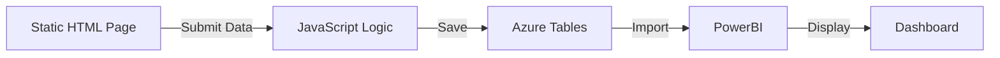

# Azure Tables

## Overview

Azure Table Storage is a NoSQL key-value store service that provides fast and cost-effective storage for structured, non-relational data. It's ideal for storing large amounts of structured data that doesn't require complex joins, foreign keys, or stored procedures.

## What is Azure Table Storage?

**Definition**: A cloud-based NoSQL datastore that stores structured data using a key-value pair model.

**Key Characteristics**:
- Schema-less design (flexible data structure)
- Massive scalability (billions of entities, terabytes of data)
- Fast queries using partition and row keys
- Cost-effective compared to traditional databases
- No complex relationships or joins
- Automatic indexing on PartitionKey and RowKey

**When to Use Azure Tables**:
- ✅ Large volumes of structured data
- ✅ Fast read/write operations needed
- ✅ Simple query patterns
- ✅ Cost-sensitive applications
- ✅ Flexible schema requirements
- ❌ Complex queries with joins
- ❌ Transactional consistency across entities
- ❌ Relational data with foreign keys

---

## Table Structure

### Core Components

Every Azure Table has a hierarchical structure:

```
Storage Account
└── Table
    └── Entities (rows)
        ├── PartitionKey (required)
        ├── RowKey (required)
        ├── Timestamp (automatic)
        └── Custom Properties (up to 252)
```

### Partition Key

**Purpose**: Logical grouping of related entities for scalability and performance

**Characteristics**:
- Required for every entity
- Determines data distribution across storage nodes
- Entities with the same PartitionKey are stored together
- Enables efficient range queries within a partition

**Best Practices**:
- Choose values that distribute data evenly
- Group related entities that are queried together
- Avoid "hot" partitions (too many requests to one partition)

**Examples**:
```
PartitionKey: "Electronics"     → All electronics products
PartitionKey: "2024-01-15"      → All data for a specific date
PartitionKey: "UserID-12345"    → All data for a specific user
PartitionKey: "Region-WestUS"   → All data for a region
```

---

### Row Key

**Purpose**: Unique identifier for an entity within a partition

**Characteristics**:
- Required for every entity
- Must be unique within a partition
- Combined with PartitionKey forms the primary key
- Automatically indexed for fast lookups

**Best Practices**:
- Use meaningful, sortable values when possible
- Consider timestamp-based keys for time-series data
- Use GUIDs for guaranteed uniqueness

**Examples**:
```
RowKey: "PROD-001"              → Product ID
RowKey: "2024-01-15T10:30:00Z"  → Timestamp
RowKey: "user@example.com"      → Email address
RowKey: "550e8400-e29b-41d4"    → GUID
```

---

### Entity Properties

**Characteristics**:
- Up to 252 custom properties per entity
- Maximum entity size: 1 MB
- Flexible schema (different entities can have different properties)
- Supported data types: String, Int32, Int64, Double, Boolean, DateTime, Binary, GUID

**Example Entity**:
```python
{
    "PartitionKey": "Electronics",
    "RowKey": "PROD-001",
    "Name": "Laptop",
    "Price": 999.99,
    "InStock": True,
    "LastUpdated": "2024-01-15T10:30:00Z",
    "Description": "High-performance laptop"
}
```

---

## Python SDK Setup

### Prerequisites

To work with Azure Tables programmatically, you need to set up your Python environment:

#### Step 1: Install Python

**Windows**:
```powershell
# Download from python.org or use winget
winget install Python.Python.3.12
```

**Linux (Ubuntu)**:
```bash
sudo apt update
sudo apt install python3 python3-pip
```

**Verify Installation**:
```bash
python --version
# Output: Python 3.12.x
```

---

#### Step 2: Install pip

**What is pip?**: Python package manager (similar to `apt` for Ubuntu or `npm` for Node.js)

**Verify pip Installation**:
```bash
pip --version
# Output: pip 24.x from ...
```

> [!NOTE]
> pip is usually installed automatically with Python 3.4+

---

#### Step 3: Install Azure Data Tables Package

```bash
pip install azure-data-tables
```

**Verify Installation**:
```bash
pip list | grep azure-data-tables
# Output: azure-data-tables  12.x.x
```

**Additional Useful Packages**:
```bash
# For blob storage operations
pip install azure-storage-blob

# For authentication with Azure AD
pip install azure-identity
```

---

## Connection Strings vs SAS Tokens

### Connection String

**What it is**: A string containing the storage account URL and access credentials

**Format**:
```
DefaultEndpointsProtocol=https;
AccountName=mystorageacct;
AccountKey=abc123...;
EndpointSuffix=core.windows.net
```

**Where to Find**:
1. Azure Portal → Storage Account
2. **Access keys** section
3. Copy **Connection string**

**Security Considerations**:
- ⚠️ Provides full access to the storage account
- ⚠️ Should be stored securely (Azure Key Vault, environment variables)
- ⚠️ Never commit to source control
- ⚠️ Rotate keys regularly

**Use Cases**:
- Backend applications
- Trusted server environments
- Administrative scripts

---

### SAS Token

**What it is**: Shared Access Signature - a time-limited, permission-scoped token

**Advantages**:
- ✅ Granular permissions (read, write, delete, list)
- ✅ Time-limited access
- ✅ IP address restrictions
- ✅ Can be revoked
- ✅ Safer for client applications

**Use Cases**:
- Mobile applications
- Frontend JavaScript applications
- Third-party integrations
- Temporary access for external users

> [!IMPORTANT]
> For programmatic table creation and management, connection strings are typically used. SAS tokens are better for accessing existing tables with limited permissions.

---

## Creating Tables Programmatically

### Basic Table Creation

```python
from azure.data.tables import TableServiceClient

# Connection string (store securely!)
connection_string = "DefaultEndpointsProtocol=https;AccountName=..."

# Create table service client
service_client = TableServiceClient.from_connection_string(connection_string)

# Create table if it doesn't exist
table_name = "user_profiles"
service_client.create_table_if_not_exists(table_name)

print(f"Table '{table_name}' is ready!")
```

### Complete Example: Create Table and Insert Data

```python
from azure.data.tables import TableServiceClient

# Step 1: Connect to storage account
connection_string = "DefaultEndpointsProtocol=https;AccountName=mystorageacct;AccountKey=..."
service_client = TableServiceClient.from_connection_string(connection_string)

# Step 2: Create table
table_name = "user_profiles"
service_client.create_table_if_not_exists(table_name)
print(f"Table '{table_name}' is ready!")

# Step 3: Get table client
table_client = service_client.get_table_client(table_name)

# Step 4: Prepare user data
user_data = {
    "PartitionKey": "Users",           # Logical grouping
    "RowKey": "user001",               # Unique identifier
    "Name": "John Doe",
    "Email": "john.doe@example.com",
    "Status": "Active"
}

# Step 5: Insert entity
table_client.create_entity(entity=user_data)
print(f"Entity created: {user_data['RowKey']}")
```

**Output**:
```
Table 'user_profiles' is ready!
Entity created: user001
```

---

## CRUD Operations

### Create (Insert) Entity

```python
from azure.data.tables import TableClient

table_client = TableClient.from_connection_string(
    conn_str=connection_string,
    table_name="user_profiles"
)

# Insert new entity
new_user = {
    "PartitionKey": "Users",
    "RowKey": "user002",
    "Name": "Jane Smith",
    "Email": "jane.smith@example.com",
    "Status": "Active",
    "Age": 28
}

table_client.create_entity(entity=new_user)
```

---

### Read (Query) Entities

**Get Single Entity**:
```python
# Retrieve by PartitionKey and RowKey
entity = table_client.get_entity(
    partition_key="Users",
    row_key="user001"
)

print(f"Name: {entity['Name']}")
print(f"Email: {entity['Email']}")
```

**Query Multiple Entities**:
```python
# Query all entities in a partition
entities = table_client.query_entities(
    query_filter="PartitionKey eq 'Users'"
)

for entity in entities:
    print(f"{entity['Name']}: {entity['Email']}")
```

**Query with Filters**:
```python
# Query with multiple conditions
query = "PartitionKey eq 'Users' and Status eq 'Active'"
active_users = table_client.query_entities(query_filter=query)

for user in active_users:
    print(f"Active user: {user['Name']}")
```

---

### Update Entity

**Replace (Overwrite)**:
```python
# Get existing entity
entity = table_client.get_entity("Users", "user001")

# Modify properties
entity["Status"] = "Inactive"
entity["LastModified"] = "2024-01-15"

# Replace entity (overwrites all properties)
table_client.update_entity(entity=entity, mode="replace")
```

**Merge (Update specific properties)**:
```python
# Update only specific properties
update_data = {
    "PartitionKey": "Users",
    "RowKey": "user001",
    "Status": "Active"
}

table_client.update_entity(entity=update_data, mode="merge")
```

---

### Delete Entity

```python
# Delete by PartitionKey and RowKey
table_client.delete_entity(
    partition_key="Users",
    row_key="user001"
)

print("Entity deleted successfully")
```

---

## Real-World Use Cases

### Use Case 1: COVID-19 Patient Tracking System

**Business Scenario**: During the COVID-19 pandemic, a fruit processing plant needed to track employee health data for workers isolating in on-site tents.

**Requirements**:
- Track daily infection rates
- Monitor treatment status
- Record tent assignments
- Manage food and medication
- Fast deployment (needed immediately)

**Solution Architecture**:


**Implementation**:
- **Frontend**: Simple HTML form with JavaScript
- **Storage**: Azure Tables (no database server needed)
- **Deployment**: Azure Static Website Hosting
- **Analytics**: PowerBI for dashboards

**Table Structure**:
```python
{
    "PartitionKey": "2024-01-15",      # Date
    "RowKey": "EMP-12345",             # Employee ID
    "Name": "John Doe",
    "TentNumber": "T-05",
    "InfectionStatus": "Positive",
    "TreatmentStatus": "Under Treatment",
    "FoodPreference": "Vegetarian",
    "Medication": "Paracetamol, Vitamin C",
    "Temperature": 99.5,
    "LastUpdated": "2024-01-15T10:30:00Z"
}
```

**Benefits**:
- ✅ Developed and tested in **one day**
- ✅ No server infrastructure required
- ✅ Cost-effective solution
- ✅ Easy to update and maintain
- ✅ Real-time data access
- ✅ PowerBI integration for analytics

---

### Use Case 2: IoT Sensor Data

**Scenario**: Store telemetry data from thousands of IoT devices

**Table Structure**:
```python
{
    "PartitionKey": "DeviceID-12345",  # Device identifier
    "RowKey": "2024-01-15T10:30:00Z",  # Timestamp
    "Temperature": 72.5,
    "Humidity": 45.2,
    "Pressure": 1013.25,
    "BatteryLevel": 87
}
```

**Benefits**:
- Fast writes for high-volume data
- Efficient queries by device
- Cost-effective for massive scale

---

### Use Case 3: User Session Storage

**Scenario**: Store user session data for web applications

**Table Structure**:
```python
{
    "PartitionKey": "SessionID-abc123",
    "RowKey": "UserData",
    "UserID": "user@example.com",
    "LoginTime": "2024-01-15T10:00:00Z",
    "LastActivity": "2024-01-15T10:30:00Z",
    "ShoppingCart": "[item1, item2, item3]"
}
```

---

## Query Patterns and Best Practices

### Efficient Query Patterns

**Point Query (Fastest)**:
```python
# Query by both PartitionKey and RowKey
entity = table_client.get_entity("Users", "user001")
```

**Partition Scan (Fast)**:
```python
# Query all entities in a partition
entities = table_client.query_entities(
    query_filter="PartitionKey eq 'Users'"
)
```

**Table Scan (Slow - Avoid)**:
```python
# Query without PartitionKey (scans entire table)
entities = table_client.query_entities(
    query_filter="Status eq 'Active'"
)
```

> [!WARNING]
> Avoid table scans on large tables. Always include PartitionKey in queries when possible.

---

### Best Practices

#### Partition Key Design
- ✅ Distribute data evenly across partitions
- ✅ Group related entities that are queried together
- ✅ Avoid hot partitions (too many requests to one partition)
- ❌ Don't use a single PartitionKey for all entities

**Good Examples**:
```python
PartitionKey = f"Date-{date}"          # Distributes by date
PartitionKey = f"Region-{region}"      # Distributes by region
PartitionKey = f"UserID-{user_id}"     # Distributes by user
```

**Bad Examples**:
```python
PartitionKey = "AllData"               # Single partition (hot partition)
PartitionKey = "1"                     # Not descriptive
```

---

#### Row Key Design
- ✅ Use meaningful, sortable values
- ✅ Consider reverse timestamp for recent-first ordering
- ✅ Use GUIDs for guaranteed uniqueness

**Examples**:
```python
# Reverse timestamp (recent first)
RowKey = str(9999999999 - int(time.time()))

# Composite key
RowKey = f"{timestamp}_{transaction_id}"

# GUID
RowKey = str(uuid.uuid4())
```

---

#### Performance Optimization
- Use batch operations for multiple inserts (up to 100 entities)
- Select only required properties to reduce bandwidth
- Implement pagination for large result sets
- Cache frequently accessed data

**Batch Insert Example**:
```python
from azure.data.tables import TableTransactionError

batch = []
for i in range(100):
    entity = {
        "PartitionKey": "Users",
        "RowKey": f"user{i:03d}",
        "Name": f"User {i}"
    }
    batch.append(("create", entity))

try:
    table_client.submit_transaction(batch)
except TableTransactionError as e:
    print(f"Batch failed: {e}")
```

---

## Cost and Performance Considerations

### Pricing Factors

**Storage Costs**:
- Per GB stored per month
- Cheaper than SQL databases
- No compute costs (serverless)

**Transaction Costs**:
- Per 10,000 transactions
- Reads, writes, deletes all count as transactions

**Data Transfer**:
- Egress (outbound) data transfer charges
- Ingress (inbound) is free

---

### Performance Characteristics

**Throughput**:
- Up to 20,000 transactions per second per partition
- Scales horizontally with more partitions

**Latency**:
- Point queries: < 10ms
- Partition scans: Depends on partition size
- Table scans: Can be slow on large tables

**Scalability**:
- Billions of entities
- Terabytes of data
- Automatic load balancing

---

## Comparison: Azure Tables vs Other Storage

| Feature | Azure Tables | Cosmos DB | SQL Database |
|---------|--------------|-----------|--------------|
| **Data Model** | Key-value | Multi-model | Relational |
| **Query Complexity** | Simple | Complex | Very Complex |
| **Cost** | Low | Medium-High | High |
| **Scalability** | High | Very High | Medium |
| **Consistency** | Eventual | Tunable | Strong |
| **Best For** | Simple structured data | Global apps | Complex transactions |

---

## Summary

Azure Table Storage is a powerful, cost-effective solution for storing large amounts of structured, non-relational data. Key takeaways:

1. **Structure**: Every entity requires PartitionKey and RowKey
2. **Python SDK**: Use `azure-data-tables` package for programmatic access
3. **Connection**: Use connection strings for backend, SAS tokens for frontend
4. **Queries**: Always include PartitionKey for best performance
5. **Use Cases**: IoT data, user sessions, simple applications, rapid prototyping

**When to Choose Azure Tables**:
- ✅ Large volumes of simple structured data
- ✅ Fast read/write performance needed
- ✅ Cost-sensitive applications
- ✅ Flexible schema requirements

**When to Choose Alternatives**:
- ❌ Complex queries with joins → SQL Database
- ❌ Global distribution with low latency → Cosmos DB
- ❌ Document storage → Blob Storage

---

## Related Concepts

- [Data Types Overview](00-DataTypes.md)
- [Azure Storage Accounts](01-StorageAccounts.md)
- [Storage Services Overview](03-StorageServices.md)
- [Static Website Hosting](06-StaticWebsiteHosting.md)
- [Python SDK Guide](07-PythonSDK.md)
- [Real-World Use Cases](04-UseCases.md)

## Hands-On Practice

- [Assignment 1: Azure File Shares](../Assignments/Assignment01-AzureFileShares.md) - Learn to create and mount file shares
- [Assignment 2: Add Disk to VM](../Assignments/Assignment02-AddDiskToVM.md) - Add additional storage to VMs
