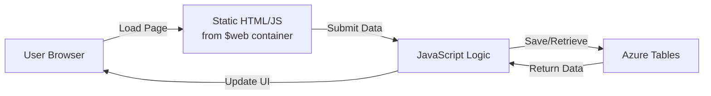
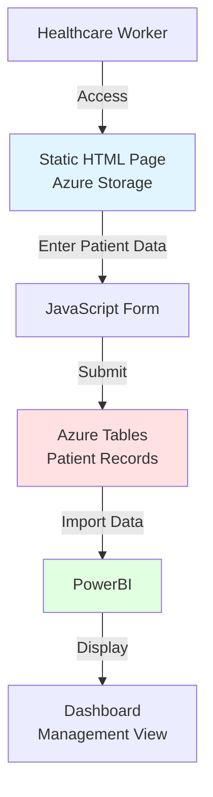

# Static Website Hosting on Azure Storage

## Overview

Azure Storage Accounts provide built-in support for hosting static websites directly from blob storage. This feature enables you to serve HTML, CSS, JavaScript, and other static files without needing a web server, making it a cost-effective and scalable solution for simple web applications.

## What is Static Website Hosting?

**Definition**: A feature of Azure Storage that allows you to serve static web content directly from a special container called `$web`.

**Key Characteristics**:
- No web server required (serverless)
- Automatic HTTPS support
- Custom domain support
- CDN integration available
- Cost-effective (pay only for storage and bandwidth)
- Highly available and scalable
- Global distribution possible

**What You Can Host**:
- ✅ HTML pages
- ✅ CSS stylesheets
- ✅ JavaScript files
- ✅ Images, fonts, and media
- ✅ Single Page Applications (SPAs)
- ✅ Documentation sites
- ❌ Server-side code (PHP, Python, Node.js)
- ❌ Dynamic content requiring a backend
- ❌ Applications requiring compilation

---

## Enabling Static Website Hosting

### Step 1: Enable the Feature

**Azure Portal**:
1. Navigate to your Storage Account
2. In the left menu, select **Static website** (under Data management)
3. Set **Static website** to **Enabled**
4. Enter **Index document name**: `index.html`
5. Enter **Error document path**: `error.html` (optional)
6. Click **Save**

**Azure CLI**:
```bash
az storage blob service-properties update \
  --account-name <storage-account-name> \
  --static-website \
  --index-document index.html \
  --404-document error.html
```

> [!NOTE]
> Enabling static website hosting automatically creates a special container named `$web` in your storage account.

---

### Step 2: Get the Website URL

After enabling static website hosting, Azure provides two endpoints:

**Primary Endpoint**:
```
https://<storage-account-name>.z13.web.core.windows.net/
```

**Secondary Endpoint** (if geo-redundant):
```
https://<storage-account-name>-secondary.z13.web.core.windows.net/
```

> [!TIP]
> The `z13` in the URL represents the Azure region. Different regions have different zone numbers.

---

### Step 3: Upload Website Files

**Required Files**:
- `index.html` - Default page (homepage)
- `error.html` - Error page (404, 403, etc.) - Optional but recommended

**Azure Portal Method**:
1. Navigate to Storage Account → **Containers**
2. Select the **$web** container
3. Click **Upload**
4. Select your HTML, CSS, JavaScript, and image files
5. Click **Upload**

**Azure CLI Method**:
```bash
# Upload index.html
az storage blob upload \
  --account-name <storage-account-name> \
  --container-name '$web' \
  --name index.html \
  --file ./index.html

# Upload error.html
az storage blob upload \
  --account-name <storage-account-name> \
  --container-name '$web' \
  --name error.html \
  --file ./error.html

# Upload entire directory
az storage blob upload-batch \
  --account-name <storage-account-name> \
  --destination '$web' \
  --source ./website-files
```

---

## Folder Structure

### Basic Structure

```
$web/
├── index.html          # Homepage
├── error.html          # Error page
├── about.html          # About page
├── css/
│   └── styles.css      # Stylesheets
├── js/
│   └── app.js          # JavaScript
└── images/
    └── logo.png        # Images
```

### Accessing Files

**Homepage**:
```
https://mystorageacct.z13.web.core.windows.net/
→ Serves index.html
```

**Subdirectories**:
```
https://mystorageacct.z13.web.core.windows.net/about.html
https://mystorageacct.z13.web.core.windows.net/css/styles.css
https://mystorageacct.z13.web.core.windows.net/images/logo.png
```

**Directory Index**:
```
https://mystorageacct.z13.web.core.windows.net/blog/
→ Serves blog/index.html (if it exists)
```

---

## Integration with Azure Tables

One powerful pattern is combining static website hosting with Azure Tables for data storage, eliminating the need for a traditional backend server.

### Architecture Pattern



### Example: Simple Data Entry Application

**index.html**:
```html
<!DOCTYPE html>
<html>
<head>
    <title>Data Entry App</title>
    <script src="https://cdn.jsdelivr.net/npm/@azure/data-tables@latest/dist/index.browser.min.js"></script>
</head>
<body>
    <h1>Submit Your Information</h1>
    <form id="dataForm">
        <input type="text" id="name" placeholder="Name" required>
        <input type="email" id="email" placeholder="Email" required>
        <button type="submit">Submit</button>
    </form>

    <script>
        const { TableClient } = AzureDataTables;
        
        // SAS token for table access (read/write permissions)
        const sasToken = "?sv=2021-06-08&ss=t&srt=sco&sp=rwdlacu&se=...";
        const accountName = "mystorageacct";
        const tableName = "userdata";
        
        const tableClient = new TableClient(
            `https://${accountName}.table.core.windows.net`,
            tableName,
            { credential: sasToken }
        );

        document.getElementById('dataForm').addEventListener('submit', async (e) => {
            e.preventDefault();
            
            const entity = {
                partitionKey: "Users",
                rowKey: Date.now().toString(),
                name: document.getElementById('name').value,
                email: document.getElementById('email').value,
                timestamp: new Date().toISOString()
            };

            try {
                await tableClient.createEntity(entity);
                alert('Data saved successfully!');
                e.target.reset();
            } catch (error) {
                alert('Error saving data: ' + error.message);
            }
        });
    </script>
</body>
</html>
```

> [!IMPORTANT]
> In production, never expose SAS tokens directly in client-side code. Use a backend API to generate short-lived tokens or implement Azure AD authentication.

---

## Real-World Use Case: COVID-19 Patient Tracking System

### Business Scenario

During the COVID-19 pandemic in 2019-2020, a fruit processing plant needed to track employee health information for workers isolating in on-site tents. The organization required an immediate solution to monitor:

- Daily infection rates
- Treatment status
- Tent assignments
- Food preferences
- Medication tracking
- Temperature readings

**Challenge**: Traditional development (backend server, database, deployment) would take weeks. The organization needed a solution **immediately**.

**Solution**: Static website + Azure Tables = Deployed in **one day**

---

### Architecture



---

### Implementation Details

#### Frontend (Static HTML)

**patient-form.html**:
```html
<!DOCTYPE html>
<html>
<head>
    <title>COVID-19 Patient Tracking</title>
    <style>
        body {
            font-family: Arial, sans-serif;
            max-width: 600px;
            margin: 50px auto;
            padding: 20px;
        }
        .form-group {
            margin-bottom: 15px;
        }
        label {
            display: block;
            margin-bottom: 5px;
            font-weight: bold;
        }
        input, select, textarea {
            width: 100%;
            padding: 8px;
            border: 1px solid #ddd;
            border-radius: 4px;
        }
        button {
            background-color: #007bff;
            color: white;
            padding: 10px 20px;
            border: none;
            border-radius: 4px;
            cursor: pointer;
        }
        button:hover {
            background-color: #0056b3;
        }
    </style>
</head>
<body>
    <h1>COVID-19 Patient Tracking</h1>
    
    <form id="patientForm">
        <div class="form-group">
            <label>Employee ID:</label>
            <input type="text" id="employeeId" required>
        </div>
        
        <div class="form-group">
            <label>Name:</label>
            <input type="text" id="name" required>
        </div>
        
        <div class="form-group">
            <label>Tent Number:</label>
            <input type="text" id="tentNumber" required>
        </div>
        
        <div class="form-group">
            <label>Infection Status:</label>
            <select id="infectionStatus" required>
                <option value="">Select...</option>
                <option value="Positive">Positive</option>
                <option value="Negative">Negative</option>
                <option value="Awaiting Results">Awaiting Results</option>
            </select>
        </div>
        
        <div class="form-group">
            <label>Treatment Status:</label>
            <select id="treatmentStatus" required>
                <option value="">Select...</option>
                <option value="Under Treatment">Under Treatment</option>
                <option value="Recovered">Recovered</option>
                <option value="Monitoring">Monitoring</option>
            </select>
        </div>
        
        <div class="form-group">
            <label>Temperature (°F):</label>
            <input type="number" id="temperature" step="0.1" required>
        </div>
        
        <div class="form-group">
            <label>Food Preference:</label>
            <select id="foodPreference">
                <option value="Regular">Regular</option>
                <option value="Vegetarian">Vegetarian</option>
                <option value="Vegan">Vegan</option>
                <option value="Halal">Halal</option>
            </select>
        </div>
        
        <div class="form-group">
            <label>Medication:</label>
            <textarea id="medication" rows="3"></textarea>
        </div>
        
        <button type="submit">Save Patient Data</button>
        <button type="button" onclick="searchPatient()">Search Patient</button>
    </form>
    
    <div id="result" style="margin-top: 20px;"></div>

    <script>
        // Azure Tables configuration
        const accountName = "fruitplantcovid";
        const tableName = "patient_records";
        const sasToken = "?sv=2021-06-08&ss=t&srt=sco&sp=rwdlacu&se=...";
        
        // Save patient data
        document.getElementById('patientForm').addEventListener('submit', async (e) => {
            e.preventDefault();
            
            const today = new Date().toISOString().split('T')[0];
            const employeeId = document.getElementById('employeeId').value;
            
            const patientData = {
                PartitionKey: today,                    // Date-based partitioning
                RowKey: employeeId,                     // Employee ID
                Name: document.getElementById('name').value,
                TentNumber: document.getElementById('tentNumber').value,
                InfectionStatus: document.getElementById('infectionStatus').value,
                TreatmentStatus: document.getElementById('treatmentStatus').value,
                Temperature: parseFloat(document.getElementById('temperature').value),
                FoodPreference: document.getElementById('foodPreference').value,
                Medication: document.getElementById('medication').value,
                LastUpdated: new Date().toISOString()
            };
            
            // Save to Azure Tables (simplified - actual implementation uses Azure SDK)
            try {
                await saveToAzureTables(patientData);
                document.getElementById('result').innerHTML = 
                    '<p style="color: green;">✓ Patient data saved successfully!</p>';
                document.getElementById('patientForm').reset();
            } catch (error) {
                document.getElementById('result').innerHTML = 
                    '<p style="color: red;">✗ Error: ' + error.message + '</p>';
            }
        });
        
        // Search patient data
        async function searchPatient() {
            const employeeId = document.getElementById('employeeId').value;
            if (!employeeId) {
                alert('Please enter Employee ID');
                return;
            }
            
            // Query Azure Tables for patient data
            // Implementation details omitted for brevity
            alert('Search functionality - queries Azure Tables by Employee ID');
        }
        
        // Helper function to save data
        async function saveToAzureTables(data) {
            const url = `https://${accountName}.table.core.windows.net/${tableName}${sasToken}`;
            const response = await fetch(url, {
                method: 'POST',
                headers: {
                    'Content-Type': 'application/json',
                    'Accept': 'application/json;odata=nometadata'
                },
                body: JSON.stringify(data)
            });
            
            if (!response.ok) {
                throw new Error('Failed to save data');
            }
        }
    </script>
</body>
</html>
```

---

### Table Structure

**Table Name**: `patient_records`

**Entity Example**:
```python
{
    "PartitionKey": "2024-01-15",           # Date (for efficient daily queries)
    "RowKey": "EMP-12345",                  # Employee ID (unique identifier)
    "Name": "John Doe",
    "TentNumber": "T-05",
    "InfectionStatus": "Positive",
    "TreatmentStatus": "Under Treatment",
    "Temperature": 99.5,
    "FoodPreference": "Vegetarian",
    "Medication": "Paracetamol, Vitamin C",
    "LastUpdated": "2024-01-15T10:30:00Z"
}
```

**Partition Strategy**: Using date as PartitionKey allows efficient queries for:
- All patients on a specific day
- Daily infection rate reports
- Historical tracking by date

---

### PowerBI Integration

After data is collected in Azure Tables, it's imported into PowerBI for analytics and visualization.

**PowerBI Dashboard Features**:
- 📊 Daily infection rate trends
- 🏥 Treatment status distribution (pie charts)
- 📈 Temperature monitoring (line charts)
- 🏕️ Tent occupancy overview
- 🍽️ Food preference summary
- 💊 Medication tracking

**Data Import Process**:
1. PowerBI connects to Azure Storage Account
2. Imports data from `patient_records` table
3. Refreshes automatically (scheduled or real-time)
4. Displays interactive dashboards
5. Management reviews and makes decisions

---

### Benefits of This Approach

**Speed**:
- ✅ Developed and tested in **one day**
- ✅ No backend development required
- ✅ No database server setup
- ✅ Immediate deployment

**Cost**:
- ✅ Minimal infrastructure costs
- ✅ Pay only for storage and bandwidth
- ✅ No server hosting fees
- ✅ Scales automatically with usage

**Simplicity**:
- ✅ Simple HTML + JavaScript
- ✅ No complex frameworks
- ✅ Easy to update and maintain
- ✅ Non-technical staff can use

**Reliability**:
- ✅ Azure's 99.9% SLA
- ✅ Automatic backups
- ✅ No server downtime
- ✅ Global availability

---

## Use Cases for Static Website Hosting

### 1. Documentation Sites

**Example**: Technical documentation, API references, user guides

**Benefits**:
- Version control with Git
- Automated deployment from CI/CD
- Fast global delivery with CDN
- No server maintenance

---

### 2. Single Page Applications (SPAs)

**Example**: React, Vue, Angular applications

**Deployment**:
```bash
# Build React app
npm run build

# Upload to $web container
az storage blob upload-batch \
  --account-name mystorageacct \
  --destination '$web' \
  --source ./build
```

---

### 3. Landing Pages and Marketing Sites

**Example**: Product launches, event registrations, promotional campaigns

**Benefits**:
- Quick deployment
- Cost-effective
- Handles traffic spikes
- Easy A/B testing

---

### 4. Internal Tools and Dashboards

**Example**: Employee directories, simple CRUD applications, data entry forms

**Pattern**: Static HTML + Azure Tables (as shown in COVID-19 example)

---

## Limitations and Considerations

### What Static Websites Cannot Do

❌ **Server-Side Processing**:
- No PHP, Python, Node.js, or other server-side languages
- No server-side rendering (SSR)
- No dynamic content generation

❌ **Authentication**:
- No built-in user authentication
- Must use client-side auth (Azure AD, OAuth)

❌ **Database Queries**:
- Cannot directly query SQL databases
- Must use APIs or Azure Tables with SAS tokens

❌ **File Uploads**:
- Cannot process file uploads server-side
- Must use client-side uploads to blob storage with SAS tokens

---

### Workarounds

**Need Server-Side Logic?**
→ Use Azure Functions as a serverless backend

**Need Authentication?**
→ Use Azure AD B2C or third-party auth providers

**Need Database Access?**
→ Create API endpoints with Azure Functions or App Service

**Need File Processing?**
→ Upload to blob storage, trigger Azure Functions for processing

---

## Best Practices

### Security

- ✅ Use HTTPS (enabled by default)
- ✅ Implement Content Security Policy (CSP) headers
- ✅ Never expose storage account keys in client code
- ✅ Use short-lived SAS tokens for data access
- ✅ Implement Azure AD authentication for sensitive apps

### Performance

- ✅ Enable Azure CDN for global distribution
- ✅ Optimize images and assets
- ✅ Minify CSS and JavaScript
- ✅ Use browser caching headers
- ✅ Implement lazy loading for images

### Deployment

- ✅ Automate deployments with CI/CD pipelines
- ✅ Use version control (Git)
- ✅ Test in staging environment first
- ✅ Implement blue-green deployments
- ✅ Monitor with Application Insights

### Cost Optimization

- ✅ Use lifecycle policies to clean up old versions
- ✅ Compress assets (gzip)
- ✅ Use CDN to reduce bandwidth costs
- ✅ Monitor usage and optimize

---

## Summary

Static website hosting on Azure Storage is a powerful, cost-effective solution for hosting web applications that don't require server-side processing. Key takeaways:

1. **Serverless**: No web server required, just upload files
2. **Cost-Effective**: Pay only for storage and bandwidth
3. **Scalable**: Handles traffic spikes automatically
4. **Fast Deployment**: Can be set up in minutes
5. **Integration**: Combine with Azure Tables for simple data storage

**Perfect For**:
- ✅ Documentation sites
- ✅ Single Page Applications
- ✅ Landing pages
- ✅ Simple internal tools
- ✅ Rapid prototyping

**Not Suitable For**:
- ❌ Complex server-side logic
- ❌ Real-time applications
- ❌ Applications requiring compilation
- ❌ Heavy database operations

**Real-World Success**: The COVID-19 patient tracking system demonstrates how static websites + Azure Tables can deliver production-ready applications in record time.

---

## Related Concepts

- [Azure Storage Accounts](01-StorageAccounts.md)
- [Blob Containers and Access Levels](02-BlobContainers.md)
- [Azure Tables](05-AzureTables.md)
- [Python SDK Guide](07-PythonSDK.md)
- [Real-World Use Cases](04-UseCases.md)
